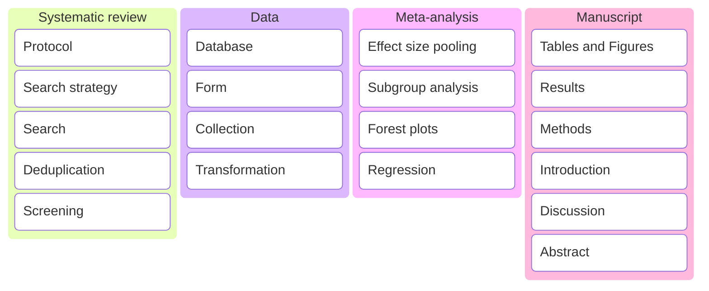
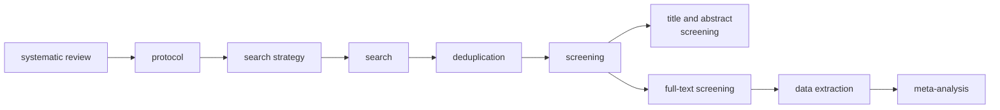

What is the optimal graft choice for anterior cruciate ligament reconstruction surgery?

	 
	  Network Meta-Analysis 

	
 
<hline></hline>

1 Department of Anatomy, Jagiellonian University, Kraków, Poland   
2 Whiting College of Engineering, Johns Hopkins University, Baltimore, MD, United States   
3 Harvard Dataverse, Harvard University, Cambridge, MA, United States

Table of Contents

    

    
- [Search strategy](#search-strategy)
- [Search](#search)
- [Deduplication](#deduplication)
- [Screening](#screening)
 

Kanban

Flowchart

