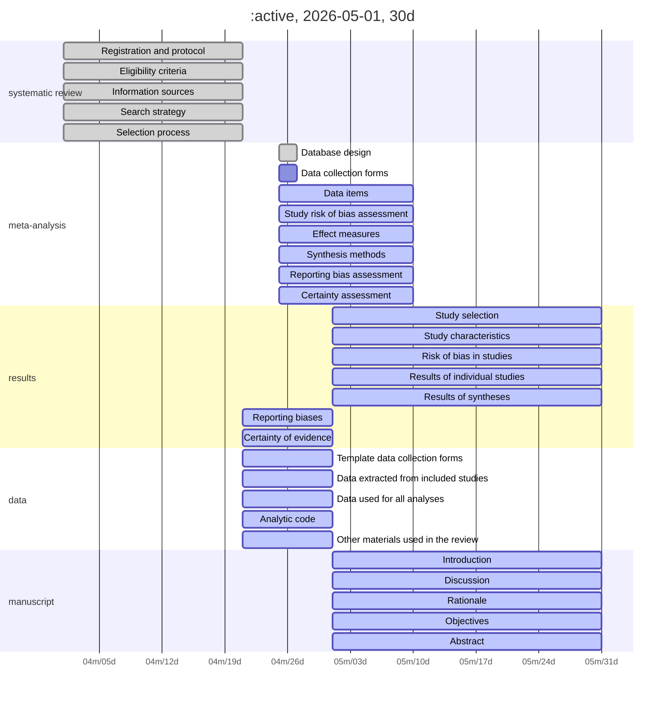

    
Roadmap

```mermaid

gantt 

title PRISMA 2020 Checklist
dateFormat YYYY-MM-DD
axisFormat %mm/%dd

section systematic review
    Registration and protocol :done,  2026-04-01, 20d
    Eligibility criteria :done, 2026-04-01, 20d
    Information sources :done, 2026-04-01, 20d
    Search strategy :done, 2026-04-01, 20d
    Selection process :done, 2026-04-01, 20d

section meta-analysis 
    Database design :done, 2026-04-25, 2d
    Data collection forms :started 2026-04-25, 2026-04-27
    Data items :active, 2026-04-25, 15d
    Study risk of bias assessment :active, 2026-04-25, 15d
    Effect measures :active, 2026-04-25, 15d
    Synthesis methods :active, 2026-04-25, 15d
    Reporting bias assessment :active, 2026-04-25, 15d
    Certainty assessment :active, 2026-04-25, 15d

section results
    Study selection :active, 2026-05-01, 30d
    Study characteristics :active, 2026-05-01, 30d
    Risk of bias in studies :active, 2026-05-01, 30d
    Results of individual studies :active, 2026-05-01, 30d
    Results of syntheses :active, 2026-05-01, 30d
    Reporting biases :active, 2026-04-21, 10d
    Certainty of evidence :active, 2026-04-21, 10d

section data
    Template data collection forms :active, 2026-04-21, 10d
    Data extracted from included studies :active, 2026-04-21, 10d
    Data used for all analyses :active, 2026-04-21, 10d
    Analytic code :active, 2026-04-21, 10d
    Other materials used in the review :active, 2026-04-21, 10d
    
section manuscript
    Introduction :active, 2026-05-01, 30d
    Discussion :active, 2026-05-01, 30d
    Rationale :active, 2026-05-01, 30d
    Objectives :active, 2026-05-01, 30d
    Abstract :active, 2026-05-01, 30d
    Title :active, 2026-05-01, 30d

```

