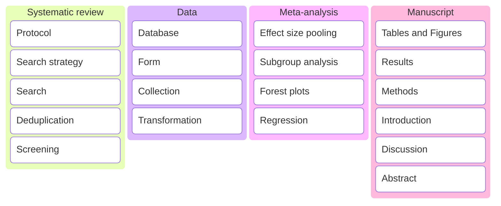
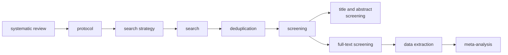

<!-- Notes:

Read this and follow the steps to organize and stuff.
https://medium.com/@caneuenschwander/how-to-turn-a-messy-jupyter-notebook-into-a-professional-python-project-f34d5ee7f88b

-->

    What is the optimal graft choice for anterior cruciate ligament reconstruction surgery? 
     
      
	Thesis  
    
<i>In fulfillment for the award of the degree of:</i> 

    
doctor of philosophy

  
    1 Department of Anatomy,
Jagiellonian University, Kraków, Poland   2 Whiting
College of Engineering, Johns Hopkins University, Baltimore, MD, United
States   3 Harvard Dataverse, Harvard University,
Cambridge, MA, United States  

    
Table of Contents
  
    

- [Systematic Review](#systematic-review)
    - [Search strategy](#search-strategy)
    - [Search](#search)
    - [Deduplication](#deduplication)
    - [Screening](#screening)
- [Data Collection](#data-collection)

    
Kanban
  

    
Flowchart

  

    
Checklist

<table style="width:100%;">
<colgroup>
<col style="width: 21%" />
<col style="width: 6%" />
<col style="width: 59%" />
<col style="width: 12%" />
</colgroup>
<thead>
<tr>
<th style="text-align: center;"><strong>Section/Topic</strong></th>
<th style="text-align: center;"><strong>Item #</strong></th>
<th style="text-align: center;"><strong>Checklist Item</strong></th>
<th style="text-align: center;"><strong>Reported on Page #</strong></th>
</tr>
</thead>
<tbody>
<tr>
<td><strong>TITLE</strong></td>
<td></td>
<td></td>
<td></td>
</tr>
<tr>
<td><blockquote>

Title

</blockquote></td>
<td>1</td>
<td>Identify the report as a systematic review <em>incorporating a
network meta-analysis (or related form of meta-analysis).</em></td>
<td></td>
</tr>
<tr>
<td></td>
<td></td>
<td></td>
<td></td>
</tr>
<tr>
<td><strong>ABSTRACT</strong></td>
<td></td>
<td></td>
<td></td>
</tr>
<tr>
<td><blockquote>

Structured summary

</blockquote></td>
<td>2</td>
<td>
Provide a structured summary including, as applicable:

<blockquote>

<strong>Background:</strong> main objectives

<strong>Methods:</strong> data sources; study eligibility criteria,
participants, and interventions; study appraisal; and <em>synthesis
methods, such as network meta-analysis.</em>

<strong>Results:</strong> number of studies and participants
identified; summary estimates with corresponding confidence/credible
intervals; <em>treatment rankings may also be discussed. Authors may
choose to summarize pairwise comparisons against a chosen treatment
included in their analyses for brevity.</em>

<strong>Discussion/Conclusions:</strong> limitations; conclusions and
implications of findings.

<strong>Other:</strong> primary source of funding; systematic review
registration number with registry name.

</blockquote></td>
<td></td>
</tr>
<tr>
<td></td>
<td></td>
<td></td>
<td></td>
</tr>
<tr>
<td><strong>INTRODUCTION</strong></td>
<td></td>
<td></td>
<td></td>
</tr>
<tr>
<td><blockquote>

Rationale

</blockquote></td>
<td>3</td>
<td>Describe the rationale for the review in the context of what is
already known<em>, including mention of why a network meta-analysis has
been conducted.</em></td>
<td></td>
</tr>
<tr>
<td><blockquote>

Objectives

</blockquote></td>
<td>4</td>
<td>Provide an explicit statement of questions being addressed, with
reference to participants, interventions, comparisons, outcomes, and
study design (PICOS).</td>
<td></td>
</tr>
<tr>
<td></td>
<td></td>
<td></td>
<td></td>
</tr>
<tr>
<td><strong>METHODS</strong></td>
<td></td>
<td></td>
<td></td>
</tr>
<tr>
<td><blockquote>

Protocol and registration

</blockquote></td>
<td>5</td>
<td>Indicate whether a review protocol exists and if and where it can be
accessed (e.g., Web address); and, if available, provide registration
information, including registration number.</td>
<td></td>
</tr>
<tr>
<td><blockquote>

Eligibility criteria

</blockquote></td>
<td>6</td>
<td>Specify study characteristics (e.g., PICOS, length of follow-up) and
report characteristics (e.g., years considered, language, publication
status) used as criteria for eligibility, giving rationale. <em>Clearly
describe eligible treatments included in the treatment network, and note
whether any have been clustered or merged into the same node (with
justification).</em></td>
<td></td>
</tr>
<tr>
<td><blockquote>

Information sources

</blockquote></td>
<td>7</td>
<td>Describe all information sources (e.g., databases with dates of
coverage, contact with study authors to identify additional studies) in
the search and date last searched.</td>
<td></td>
</tr>
<tr>
<td><blockquote>

Search

</blockquote></td>
<td>8</td>
<td>Present full electronic search strategy for at least one database,
including any limits used, such that it could be repeated.</td>
<td></td>
</tr>
<tr>
<td><blockquote>

Study selection

</blockquote></td>
<td>9</td>
<td>State the process for selecting studies (i.e., screening,
eligibility, included in systematic review, and, if applicable, included
in the meta-analysis).</td>
<td></td>
</tr>
<tr>
<td><blockquote>

Data collection process

</blockquote></td>
<td>10</td>
<td>Describe method of data extraction from reports (e.g., piloted
forms, independently, in duplicate) and any processes for obtaining and
confirming data from investigators.</td>
<td></td>
</tr>
<tr>
<td><blockquote>

Data items

</blockquote></td>
<td>11</td>
<td>List and define all variables for which data were sought (e.g.,
PICOS, funding sources) and any assumptions and simplifications
made.</td>
<td></td>
</tr>
<tr>
<td><blockquote>

<strong>Geometry of the network</strong>

</blockquote></td>
<td><strong>S1</strong></td>
<td>Describe methods used to explore the geometry of the treatment
network under study and potential biases related to it. This should
include how the evidence base has been graphically summarized for
presentation, and what characteristics were compiled and used to
describe the evidence base to readers.</td>
<td></td>
</tr>
<tr>
<td><blockquote>

Risk of bias within individual studies

</blockquote></td>
<td>12</td>
<td>Describe methods used for assessing risk of bias of individual
studies (including specification of whether this was done at the study
or outcome level), and how this information is to be used in any data
synthesis.</td>
<td></td>
</tr>
<tr>
<td><blockquote>

Summary measures

</blockquote></td>
<td>13</td>
<td>State the principal summary measures (e.g., risk ratio, difference
in means). <em>Also describe the use of additional summary measures
assessed, such as treatment rankings and surface under the cumulative
ranking curve (SUCRA) values, as well as modified approaches used to
present summary findings from meta-analyses.</em></td>
<td></td>
</tr>
<tr>
<td><blockquote>

Planned methods of analysis

</blockquote></td>
<td>14</td>
<td>
Describe the methods of handling data and combining results of
studies for each network meta-analysis. This should include, but not be
limited to:

<ul>
<li>
<em>Handling of multi-arm trials;</em>
</li>
<li>
<em>Selection of variance structure;</em>
</li>
<li>
<em>Selection of prior distributions in Bayesian analyses;
and</em>
</li>
<li>
<em>Assessment of model fit.</em>
</li>
</ul></td>
<td></td>
</tr>
<tr>
<td><blockquote>

<strong>Assessment of Inconsistency</strong>

</blockquote></td>
<td><strong>S2</strong></td>
<td>Describe the statistical methods used to evaluate the agreement of
direct and indirect evidence in the treatment network(s) studied.
Describe efforts taken to address its presence when found.</td>
<td></td>
</tr>
<tr>
<td><blockquote>

Risk of bias across studies

</blockquote></td>
<td>15</td>
<td>Specify any assessment of risk of bias that may affect the
cumulative evidence (e.g., publication bias, selective reporting within
studies).</td>
<td></td>
</tr>
<tr>
<td><blockquote>

Additional analyses

</blockquote></td>
<td>16</td>
<td>
Describe methods of additional analyses if done, indicating which
were pre-specified. This may include, but not be limited to, the
following:

<ul>
<li>
Sensitivity or subgroup analyses;
</li>
<li>
Meta-regression analyses;
</li>
<li>
<em>Alternative formulations of the treatment network;
and</em>
</li>
<li>
<em>Use of alternative prior distributions for Bayesian analyses
(if applicable).</em>
</li>
</ul></td>
<td></td>
</tr>
<tr>
<td></td>
<td></td>
<td></td>
<td></td>
</tr>
<tr>
<td><strong>RESULTS†</strong></td>
<td></td>
<td></td>
<td></td>
</tr>
<tr>
<td><blockquote>

Study selection

</blockquote></td>
<td>17</td>
<td>Give numbers of studies screened, assessed for eligibility, and
included in the review, with reasons for exclusions at each stage,
ideally with a flow diagram.</td>
<td></td>
</tr>
<tr>
<td><blockquote>

<strong>Presentation of network structure</strong>

</blockquote></td>
<td><strong>S3</strong></td>
<td>Provide a network graph of the included studies to enable
visualization of the geometry of the treatment network.</td>
<td></td>
</tr>
<tr>
<td><blockquote>

<strong>Summary of network geometry</strong>

</blockquote></td>
<td><strong>S4</strong></td>
<td>Provide a brief overview of characteristics of the treatment
network. This may include commentary on the abundance of trials and
randomized patients for the different interventions and pairwise
comparisons in the network, gaps of evidence in the treatment network,
and potential biases reflected by the network structure.</td>
<td></td>
</tr>
<tr>
<td><blockquote>

Study characteristics

</blockquote></td>
<td>18</td>
<td>For each study, present characteristics for which data were
extracted (e.g., study size, PICOS, follow-up period) and provide the
citations.</td>
<td></td>
</tr>
<tr>
<td><blockquote>

Risk of bias within studies

</blockquote></td>
<td>19</td>
<td>Present data on risk of bias of each study and, if available, any
outcome level assessment.</td>
<td></td>
</tr>
<tr>
<td><blockquote>

Results of individual studies

</blockquote></td>
<td>20</td>
<td>For all outcomes considered (benefits or harms), present, for each
study: 1) simple summary data for each intervention group, and 2) effect
estimates and confidence intervals. <em>Modified approaches may be
needed to deal with information from larger networks.</em></td>
<td></td>
</tr>
<tr>
<td><blockquote>

Synthesis of results

</blockquote></td>
<td>21</td>
<td>Present results of each meta-analysis done, including
confidence/credible intervals. <em>In larger networks, authors may focus
on comparisons versus a particular comparator (e.g. placebo or standard
care), with full findings presented in an appendix. League tables and
forest plots may be considered to summarize pairwise comparisons.</em>
If additional summary measures were explored (such as treatment
rankings), these should also be presented.</td>
<td></td>
</tr>
<tr>
<td><blockquote>

<strong>Exploration for inconsistency</strong>

</blockquote></td>
<td><strong>S5</strong></td>
<td>Describe results from investigations of inconsistency. This may
include such information as measures of model fit to compare consistency
and inconsistency models, <em>P</em> values from statistical tests, or
summary of inconsistency estimates from different parts of the treatment
network.</td>
<td></td>
</tr>
<tr>
<td><blockquote>

Risk of bias across studies

</blockquote></td>
<td>22</td>
<td>Present results of any assessment of risk of bias across studies for
the evidence base being studied.</td>
<td></td>
</tr>
<tr>
<td><blockquote>

Results of additional analyses

</blockquote></td>
<td>23</td>
<td>Give results of additional analyses, if done (e.g., sensitivity or
subgroup analyses, meta-regression analyses<em>, alternative network
geometries studied, alternative choice of prior distributions for
Bayesian analyses,</em> and so forth).</td>
<td></td>
</tr>
<tr>
<td></td>
<td></td>
<td></td>
<td></td>
</tr>
<tr>
<td><strong>DISCUSSION</strong></td>
<td></td>
<td></td>
<td></td>
</tr>
<tr>
<td><blockquote>

Summary of evidence

</blockquote></td>
<td>24</td>
<td>Summarize the main findings, including the strength of evidence for
each main outcome; consider their relevance to key groups (e.g.,
healthcare providers, users, and policy-makers).</td>
<td></td>
</tr>
<tr>
<td><blockquote>

Limitations

</blockquote></td>
<td>25</td>
<td>Discuss limitations at study and outcome level (e.g., risk of bias),
and at review level (e.g., incomplete retrieval of identified research,
reporting bias). <em>Comment on the validity of the assumptions, such as
transitivity and consistency. Comment on any concerns regarding network
geometry (e.g., avoidance of certain comparisons).</em></td>
<td></td>
</tr>
<tr>
<td><blockquote>

Conclusions

</blockquote></td>
<td>26</td>
<td>Provide a general interpretation of the results in the context of
other evidence, and implications for future research.</td>
<td></td>
</tr>
<tr>
<td></td>
<td></td>
<td></td>
<td></td>
</tr>
<tr>
<td><strong>FUNDING</strong></td>
<td></td>
<td></td>
<td></td>
</tr>
<tr>
<td><blockquote>

Funding

</blockquote></td>
<td>27</td>
<td>Describe sources of funding for the systematic review and other
support (e.g., supply of data); role of funders for the systematic
review. This should also include information regarding whether funding
has been received from manufacturers of treatments in the network and/or
whether some of the authors are content experts with professional
conflicts of interest that could affect use of treatments in the
network.</td>
<td></td>
</tr>
</tbody>
</table>

PICOS = population, intervention, comparators, outcomes, study design.

\* Text in italics indicates wording specific to reporting of network
meta-analyses that has been added to guidance from the PRISMA statement.

† Authors may wish to plan for use of appendices to present all relevant
information in full detail for items in this section.

<table>
<colgroup>
<col style="width: 2%" />
<col style="width: 30%" />
<col style="width: 30%" />
<col style="width: 30%" />
<col style="width: 6%" />
</colgroup>
<thead>
<tr>
<th style="text-align: left;"></th>
<th style="text-align: center;">pubmed</th>
<th style="text-align: center;">embase</th>
<th style="text-align: center;">web of science</th>
<th></th>
</tr>
</thead>
<tbody>
<tr>
<td style="text-align: left;">patellar</td>
<td style="text-align: center;"><a
href="https://raw.githubusercontent.com/dong-wkim/network_meta-analysis/refs/heads/master/systematic_review/search//pubmed/pm_bptb.csv">pm_bptb</a> (<em>n</em>
= 190)</td>
<td style="text-align: center;"><a
href="https://raw.githubusercontent.com/dong-wkim/network_meta-analysis/refs/heads/master/systematic_review/search//embase/em_bptb.csv">em_bptb</a> (<em>n</em>
= 73)</td>
<td style="text-align: center;"><a
href="https://raw.githubusercontent.com/dong-wkim/network_meta-analysis/refs/heads/master/systematic_review/search//wos/wos_bptb.csv">wos_bptb</a> (<em>n</em>
= 186)</td>
<td></td>
</tr>
<tr>
<td style="text-align: left;">hamstring</td>
<td style="text-align: center;"><a
href="https://raw.githubusercontent.com/dong-wkim/network_meta-analysis/refs/heads/master/systematic_review/search//pubmed/pm_ht.csv">pm_ht</a> (<em>n</em>
= 202)</td>
<td style="text-align: center;"><a
href="https://raw.githubusercontent.com/dong-wkim/network_meta-analysis/refs/heads/master/systematic_review/search//embase/em_ht.csv">em_ht</a> (<em>n</em>
= 97)</td>
<td style="text-align: center;"><a
href="https://raw.githubusercontent.com/dong-wkim/network_meta-analysis/refs/heads/master/systematic_review/search//wos/wos_ht.csv">wos_ht</a> (<em>n</em>
=253)</td>
<td></td>
</tr>
<tr>
<td style="text-align: left;">quadriceps</td>
<td style="text-align: center;"><a
href="https://raw.githubusercontent.com/dong-wkim/network_meta-analysis/refs/heads/master/systematic_review/search//pubmed/pm_qt.csv">pm_qt</a> (<em>n</em>
= 165)</td>
<td style="text-align: center;"><a
href="https://raw.githubusercontent.com/dong-wkim/network_meta-analysis/refs/heads/master/systematic_review/search//embase/em_qt.csv">em_qt</a> (<em>n</em>
= 114)</td>
<td style="text-align: center;"><a
href="https://raw.githubusercontent.com/dong-wkim/network_meta-analysis/refs/heads/master/systematic_review/search//wos/wos_qt.csv">wos_qt</a> (<em>n</em>
= 70)</td>
<td></td>
</tr>
<tr>
<td style="text-align: left;">peroneus longus</td>
<td style="text-align: center;"><a
href="https://raw.githubusercontent.com/dong-wkim/network_meta-analysis/refs/heads/master/systematic_review/search//pubmed/pm_plt.csv">pm_plt</a> (<em>n</em>
= 2)</td>
<td style="text-align: center;"><a
href="https://raw.githubusercontent.com/dong-wkim/network_meta-analysis/refs/heads/master/systematic_review/search//embase/em_plt.csv">em_plt</a> (<em>n</em>
= 25)</td>
<td style="text-align: center;"><a
href="https://raw.githubusercontent.com/dong-wkim/network_meta-analysis/refs/heads/master/systematic_review/search//wos/wos_plt.csv">wos_plt</a> (<em>n</em>
= 4)</td>
<td></td>
</tr>
<tr>
<td style="text-align: left;">Achilles</td>
<td style="text-align: center;"><a
href="https://raw.githubusercontent.com/dong-wkim/network_meta-analysis/refs/heads/master/systematic_review/search//pubmed/pm_at.csv">pm_at</a> (<em>n</em>
= 7)</td>
<td style="text-align: center;"><a
href="https://raw.githubusercontent.com/dong-wkim/network_meta-analysis/refs/heads/master/systematic_review/search//embase/em_at.csv">em_at</a> (<em>n</em>
= 5)</td>
<td style="text-align: center;"><a
href="https://raw.githubusercontent.com/dong-wkim/network_meta-analysis/refs/heads/master/systematic_review/search//wos/wos_at.csv">wos_at</a> (<em>n</em>
= 10)</td>
<td></td>
</tr>
<tr>
<td style="text-align: left;">tibialis</td>
<td style="text-align: center;"><a
href="https://raw.githubusercontent.com/dong-wkim/network_meta-analysis/refs/heads/master/systematic_review/search//pubmed/pm_ta.csv">pm_ta</a> (<em>n</em>
= 7)</td>
<td style="text-align: center;"><a
href="https://raw.githubusercontent.com/dong-wkim/network_meta-analysis/refs/heads/master/systematic_review/search//embase/em_ta.csv">em_ta</a> (<em>n</em>
= 3)</td>
<td style="text-align: center;"><a
href="https://raw.githubusercontent.com/dong-wkim/network_meta-analysis/refs/heads/master/systematic_review/search//wos/wos_ta.csv">wos_ta</a> (<em>n</em>
= 8)</td>
<td></td>
</tr>
</tbody>
</table>

------------------------------------------------------------------------

<h1 align="center" style="font-family:Times New Roman;font-variant:small-caps;">Systematic Review</h1>

Define directory structure and store paths as global variables.

    ./research/
    ├── ./research/systematic_review/
    |   |   
    │   ├── ./research/systematic_review/protocol/  
    |   |   |
    │   │   ├── ./research/systematic_review/protocol/prospero  
    │   │   └── ./research/systematic_review/protocol/cochrane  
    |   |
    │   ├── ./research/systematic_review/search_strategy/  
    |   |   |
    │   │   ├── ./research/systematic_review/search_strategy/pubmed  
    │   │   ├── ./research/systematic_review/search_strategy/embase  
    │   │   └── ./research/systematic_review/search_strategy/wos  
    |   |
    │   ├── ./research/systematic_review/search/  
    |   |   |
    │   │   ├── ./research/systematic_review/search/pubmed
    │   │   ├── ./research/systematic_review/search/embase
    │   │   └── ./research/systematic_review/search/wos
    |   |
    │   ├── ./research/systematic_review/deduplication/
    |   |   |
    │   │   ├── ./research/systematic_review/deduplication/doi
    │   │   ├── ./research/systematic_review/deduplication/key
    │   │   └── ./research/systematic_review/deduplication/id
    |   |
    │   └── ./research/systematic_review/screening/
    |       |
    │       ├── ./research/systematic_review/screening/title_abstract_screening
    │       ├── ./research/systematic_review/screening/PDF
    │       └── ./research/systematic_review/screening/full-text_screening
    |
    ├── ./research/data
    ├── ./research/meta-analysis
    ├── ./research/manuscript
    ├── ./research/README.ipynb
    ├── ./research/docs
    └── ./research/src

Install `PyPI` modules in `requirements.txt`.

    %pip install -q pandas mermaid-py biopython

    !cd .venv; Scripts/Activate.ps1 
    !pip install -r requirements.txt

Exclude certain files from syncing with remote github repository with
`gitignore` file.

    ignore = f""".venv/
    */*.gsheet
    */*.gdoc"""

    gitignore = ['.venv/', '.gsheet', '.gdoc']
    ignore = "\n".join(gitignore)
    with open(f"./.gitignore", "w") as f:
        f.write(ignore)

Import the necessary modules.

    import subprocess
    import sys
    import os
    import pandas as pd
    from Bio import Entrez, Medline
    import ssl
    import certifi
    import re
    from pathlib import Path

Set absolute directory paths for important sub-project folders as
variables in the global environment for use in scripts downstream and
make them in order to start the project.

    root = os.getcwd()
    folders = {
    "systematic_review": f"{root}/systematic_review",
        "protocol": f"{root}/systematic_review/protocol",
            "prospero": f"{root}/systematic_review/protocol/prospero",
            "cochrane": f"{root}/systematic_review/protocol/cochrane",
        "search_strategy": f"{root}/systematic_review/search_strategy",
            "search_strategy_pubmed": f"{root}/systematic_review/search_strategy/pubmed/",
            "search_strategy_embase": f"{root}/systematic_review/search_strategy/embase/",
            "search_strategy_wos": f"{root}/systematic_review/search_strategy/wos/",
        "search": f"{root}/systematic_review/search",
            "search_pubmed": f"{root}/systematic_review/search/pubmed/",
            "search_embase": f"{root}/systematic_review/search/embase/",
            "search_wos": f"{root}/systematic_review/search/wos/",
        "deduplication": f"{root}/systematic_review/deduplication/",
        "screening": f"{root}/systematic_review/screening/",
            "title_abstract": f"{root}/systematic_review/screening/title_abstract_screening", 
            "pdf": f"{root}/systematic_review/screening/PDF",
            "full_text": f"{root}/systematic_review/screening/full_text_screening", 
    "meta-analysis": f"{root}/meta-analysis",
    "manuscript": f"{root}/manuscript",    

    }

    for var, f in folders.items():
        directory = Path(f)
        globals()[f"{var}"] = directory
        os.makedirs(directory, exist_ok = True)

[top](#toc) | [next](#search)  
[search strategy](#search-strategy) | [search](#search) |
[deduplication](#deduplication) | [screening](#screening)

	Search Strategy 

------------------------------------------------------------------------

**Search strategies** were developed for randomized controlled trials:
`pm_bptb.txt`, `pm_ht.txt`, `pm_qt.txt`, `pm_plt.txt`, `pm_at.txt` and
`pm_ta.txt` corresponding to PubMed search strategies for patellar,
hamstring, quadriceps, peroneus longus, achilles and tibialis anterior
and posterior tendones, respectively. From the protocol that was
developed, extract key terms from the eligibility criteria for inclusion
and exclusion of studies in order to develop a *search strategy*.

The search strategies were 'translated' via regular expressions from
PubMed syntax to Embase and Web of Science syntax, store them into the
global environment, and save them as plain text files for importing and
use as queries for search.

------------------------------------------------------------------------

    acl = f"""("anterior cruciate ligament"[mh] OR "anterior cruciate ligament reconstruction"[tiab])"""
    rct = f"""("randomized controlled trial"[pt] OR "randomized controlled trial"[tiab] OR "randomised controlled trial"[tiab])"""
    reviews = f"""("review"[pt] OR "review"[tiab] OR "systematic review"[pt] OR "systematic review"[tiab] OR "meta-analysis"[pt] OR "meta-analysis"[tiab])"""
    outcomes = f"""("ikdc"[tiab] OR "lysholm"[tiab] OR "tegner"[tiab] OR (("instrumental laxity"[tiab] OR "kt-1000"[tiab] OR "kt-2000"[tiab] OR "rolimeter"[tiab]) OR "pivot shift"[tiab] OR "lachman"[tiab]) OR ("graft failure"[tiab] OR "graft rupture"[tiab]))"""

    bptb = f"""("bone-patellar tendon-bone"[tiab] OR "patellar tendon"[tiab] OR "bptb"[tiab])"""
    ht = f"""("hamstring tendon"[tiab] OR "semitendinosus"[tiab] OR "gracilis"[tiab])"""
    qt = f"""("quadriceps"[tiab] OR "qt"[tiab])"""
    plt = f"""("peroneus longus"[tiab] OR "fibularis longus"[tiab])"""
    at = f"""("achilles"[tiab])"""
    ta = f"""("tibialis anterior"[tiab] OR "tibialis posterior"[tiab])"""

    subgroups = {"bptb": bptb, 
                 "ht": ht, 
                 "qt": qt, 
                 "plt": plt, 
                 "at": at, 
                 "ta": ta}

    queries = {}

    # Create pm_bptb, etc.
    for x, y in subgroups.items():
        globals()[f"pm_{x}"] = f"{acl} AND {rct} AND {y} NOT {reviews}"
        with open(f"{search_strategy}/pubmed/pm_{x}.txt", 'w') as f:
            f.write(f"{acl} AND {rct} AND {y}")
        #globals()[f"reviews_pm_{x}"] = f"{acl} AND {rct} AND {y}"
        with open(f"{search_strategy}/pubmed/reviews_pm_{x}.txt", 'w') as f:
            f.write(f"{acl} AND {reviews} AND {y} AND {outcomes}")

    pm_queries = {
        "bptb": pm_bptb,
        "ht": pm_ht,
        "qt": pm_qt,
        "plt": pm_plt,
        "at": pm_at,
        "ta": pm_ta
    }

    # Create em_bptb, etc.
    for x, y in pm_queries.items():
        query = re.sub(r"\[(.*?)\]",":\\1", y)
        query = re.sub(r"\:tiab",":ti,ab", query)
        query = re.sub(r"\:mh","/exp", query)
        query = re.sub(r"\:pt",":it,ti,ab", query)
        query = re.sub(r'"',"'", query)
        globals()[f"em_{x}"] = query
        with open(f"{search_strategy}/embase/em_{x}.txt", 'w') as f:
            f.write(query)

    # Create wos_bptb, etc.
    for x, y in pm_queries.items():
        query = re.sub(r'"(.*?)"\[(.*?)\]','\\2="\\1"', y)
        query = re.sub(r'tiab="(.*?)"','(TI=(\\1) OR AB=(\\1))', query)
        query = re.sub(r'mh="(.*?)"','(TMIC=(\\1))', query)
        query = re.sub(r'pt="(.*?)"','(TS=(\\1))', query)
        globals()[f"wos_{x}"] = query

        with open(f"{search_strategy}/wos/wos_{x}.txt", 'w') as f:
            f.write(query)

    import ipywidgets as widgets
    from IPython.display import display, clear_output

    entries = []

    term_input = widgets.Text(
        placeholder="Search term",
        layout=widgets.Layout(width="75%")
    )

    field_tag = widgets.Dropdown(
        options=[
            ("MeSH term", "mh"),
            ("Title", "ti"),
            ("Title / Abstract", "tiab"),
            ("Publication Type", "pt"),
        ],
        value="mh",
        layout=widgets.Layout(width="15%")
    )

    boolean = widgets.Dropdown(
        options=["OR", "AND", "NOT", ""],
        value="",
        layout=widgets.Layout(width="10%")
    )

    filename_input = widgets.Text(
        placeholder="File name",
        layout=widgets.Layout(width="75%")
    )

    add_button = widgets.Button(description="Add")
    delete_button = widgets.Button(description="Delete")
    clear_button = widgets.Button(description="Clear")
    save_button = widgets.Button(description="Save")

    output = widgets.Output()

    def build_query(entries):
        parts = []
        current_or_group = []

        for entry in entries:
            term = entry["term"].strip()
            field = entry["field"]
            op = entry["boolean"]

            if not term:
                continue

            current_or_group.append(f'"{term}"[{field}]')

            if op == "OR":
                continue

            parts.append("(" + " OR ".join(current_or_group) + ")")
            current_or_group = []

            if op in ("AND", "NOT"):
                parts.append(op)

        if current_or_group:
            parts.append("(" + " OR ".join(current_or_group) + ")")

        return " ".join(parts)

    def refresh_output(message=""):
        with output:
            clear_output()
            if message:
                print(message)
                print()

            print("Entries:")
            if entries:
                for i, entry in enumerate(entries, start=1):
                    op_label = entry["boolean"] if entry["boolean"] != "" else "END"
                    print(f'{i}. "{entry["term"]}" [{entry["field"]}] -> {op_label}')
            else:
                print("[none]")

            print("\nCurrent query:")
            query = build_query(entries)
            print(query if query else "[empty]")

    def add_entry(_):
        term = term_input.value.strip()
        field = field_tag.value
        op = boolean.value

        if not term:
            refresh_output("Please enter a term.")
            return

        entries.append({
            "term": term,
            "field": field,
            "boolean": op
        })

        term_input.value = ""
        refresh_output(f'Added: "{term}"[{field}] -> {op if op else "END"}')

    def delete_last_entry(_):
        if not entries:
            refresh_output("Nothing to delete.")
            return

        removed = entries.pop()
        refresh_output(
            f'Removed: "{removed["term"]}"[{removed["field"]}] -> {removed["boolean"] if removed["boolean"] else "END"}'
        )

    def clear_all_entries(_):
        entries.clear()
        refresh_output("Cleared all entries.")

    def save_query(_):
        query = build_query(entries)
        filename = filename_input.value.strip() or "default_strategy"
        filepath = f"{filename}.txt"

        with open(filepath, "w", encoding="utf-8") as f:
            f.write(query)

        refresh_output(f"Saved query to {filepath}")

    add_button.on_click(add_entry)
    delete_button.on_click(delete_last_entry)
    clear_button.on_click(clear_all_entries)
    save_button.on_click(save_query)

    entry_row = widgets.HBox(
        [term_input, field_tag, boolean],
        layout=widgets.Layout(align_items="center", gap="10px")
    )

    controls = widgets.VBox([
        filename_input,
        entry_row,
        widgets.HBox([add_button, delete_button, clear_button, save_button]),
        output
    ])
    display(controls)
    refresh_output("Ready.")

    {"model_id":"825bfabe1d2d437e97552bd5664fc70d","version_major":2,"version_minor":0}

<form method="POST" action="/submit">
    <label for="term" align="left" style="font-family:Times New Roman;"></label>
    <input type="text" id="term" name="term" style="width:50%"></input> 
    <select id="field_tag" name="field_tag" width="50%" style="font-family:Times New Roman;">
        <option value = "[mh]">MeSH term</option>
        <option value = "[ti]">Title</option>
        <option value = "[tiab]">Title / Abstract</option>
        <option value = "[pt]">Publication Type</option>
    </select> 
    <select id="boolean" name="boolean" width="20%" style="font-family:Times New Roman;"> 
        <option value="OR">OR</option> 
        <option value="AND">AND</option> 
        <option value="NOT">NOT</option> 
    </select> 
    <button type="submit" style="font-family:Times New Roman;">Add </button>

</form>

    filename = input("Enter the file name of the search strategy: ")
    file = f"{search_strategy}/pubmed/{filename}.txt"

    parts = []
    string = []

    while True:
        term = input("Enter the search string: ")
        field = input("Enter the field type: ")
        string.append(f"'{term}'[{field}]")
        boolean = input("Enter the Boolean operator (e.g., OR, AND, NOT): ")
        
        if boolean == "OR":
            continue

        parts.append("(" + " OR ".join(string) + ")")
        string = []

        if boolean == "":
            break
            
        parts.append(boolean)
        
    query = " ".join(parts) # query = search strategy FROM HERE
    with open(file, "w") as f:
        f.write(query)

    with open(file, "r") as f:
        query = f.read()

    query = f"{query}"

    Enter the file name of the search strategy:  
    Enter the search string:  
    Enter the field type:  
    Enter the Boolean operator (e.g., OR, AND, NOT):  

[previous](#search-strategy) | [top](#toc) | [next](#deduplication)  
[search strategy](#search-strategy) | [search](#search) |
[deduplication](#deduplication) | [screening](#screening)

 

Search 

------------------------------------------------------------------------

A script to either create a search strategy using the terms, field tags,
and Boolean operators and save them as plain text files or load already
written and saved plain text files for import into the API search
scripts. This uses the search strategies (e.g., `pm_bptb.txt`, search
strategy in plain text written in PubMed syntax for bone-patellar
tendon-bone (BPTB) subgroup search) and pulls data from PubMed to output
PMIDs (`pmid_pm_bptb.txt`) and search results in XML (`pm_bptb.xml`) and
parses this into CSV files (`pm_bptb.csv`).

    ssl._create_default_https_context = lambda: ssl.create_default_context(
        cafile=certifi.where()
    )
    # create search strategy using structured inputs

    question = input("Do you already have a search strategy file saved?")
    filename = input("Enter the file name of the search strategy: ")
    file = f"{search_strategy}/pubmed/{filename}.txt"

    if question == "no":
        parts = []
        string = []
        while True:
            term = input("Enter the search string: ")
            field = input("Enter the field type: ")
            string.append(f"'{term}'[{field}]")
            boolean = input("Enter the Boolean operator (e.g., OR, AND, NOT): ")
            
            if boolean == "OR":
                continue
        
            parts.append("(" + " OR ".join(string) + ")")
            string = []
        
            if boolean == "":
                break
                
            parts.append(boolean)
            
        query = " ".join(parts) # query = search strategy FROM HERE
        with open(file, "w") as f:
            f.write(query)
        
    with open(file, "r") as f:
        query = f.read()

    query = f"{query}"

    # use NCBI's e-utitilies to pull PMIDs using e-search.

    Entrez.email = "dkim246@jhmi.edu"
    Entrez.api_key = 'bb1c481d8e167acd16f3616593c18b3aab08'

    handle = Entrez.esearch(db= "pubmed", 
                            term = query, 
                            usehistory = "y", 
                            retmax = 2000,
                            retmode = "xml")

    pmid = Entrez.read(handle)

    pmid = pmid['IdList']
    pmid = ",".join(pmid) # list to string
    #with open(f"./data/pmid_{filename}.txt", 'w') as f:
    #    f.write(pmid)
    os.makedirs(f"{search}/pubmed/pmid/", exist_ok = True)
    with open(f"{search}/pubmed/pmid/{filename}.txt", 'w') as f:
        f.write(pmid)
    handle.close()

    # ncbi e-summary
    handle = Entrez.esummary(db= "pubmed", 
                             id = pmid, 
                             retmode = "xml", 
                             usehistory = "y", 
                             retmax = 2000)

    xml = handle.read()
    #xml_file = f"./data/{filename}.xml"
    os.makedirs(f"{search}/pubmed/xml/", exist_ok = True)
    xml_file = f"{search}/pubmed/xml/{filename}.xml"
    with open(xml_file, "wb") as f:
        f.write(xml)   
    handle.close()

    import xml.etree.ElementTree as ET

    tree = ET.parse(f"{xml_file}")
    root = tree.getroot()

    docsum = root[0]

    def xml_parse(docsum):
        df = {}
        df["pmid"] = docsum.find("Id").text
        for item in docsum.findall("Item"):
            key = item.attrib.get("Name")
            if item.attrib.get("Type") == "List":
                values = [sub.text for sub in item.findall("Item") if sub.text]
                df[key] = values
            else:
                df[key] = item.text
        return df
    records = [xml_parse(doc) for doc in root.findall(".//DocSum")]
    df = pd.DataFrame(records)

    os.makedirs(f"{search}/pubmed/", exist_ok = True)
    csv_file = f"{search}/pubmed/{filename}.csv"
    df.to_csv(csv_file, encoding = "utf-8")

    # using e-fetch, the abstracts are pulled

    handle = Entrez.efetch(
        db="pubmed",
        id=pmid,
        rettype="medline",
        retmode="text"
    )

    text = list(Medline.parse(handle))
    data = pd.DataFrame(text)
    data_csv = data.map(lambda x: ", ".join(map(str, x)) if isinstance(x, list) else x)
    os.makedirs(f"{search}/pubmed/medline/", exist_ok = True)
    data_csv.to_csv(f"{search}/pubmed/medline/{filename.replace("pm","md")}.csv", index=False)
    globals()[f"{filename.replace("pm","md")}"] = data
    handle.close()

    abstracts = pd.DataFrame(text)[["PMID", "AB"]]
    abstracts.rename(columns = {"PMID":"pmid", "AB":"abstract"}, inplace = True)
    df = df.merge(abstracts, on = "pmid", how = "left")
    df['year'] = df['PubDate'].str[:4]
    globals()[f"{filename}"] = df
    csv_file = f"{search}/pubmed/{filename}.csv"
    df.to_csv(csv_file, encoding = "utf-8")
    num = len(df)
    print(f"Number of records found: {num}")
    data.info()

    Do you already have a search strategy file saved? yes
    Enter the file name of the search strategy:  pm_ta

    Number of records found: 9
    <class 'pandas.DataFrame'>
    RangeIndex: 9 entries, 0 to 8
    Data columns (total 41 columns):
     #   Column  Non-Null Count  Dtype 
    ---  ------  --------------  ----- 
     0   PMID    9 non-null      str   
     1   OWN     9 non-null      str   
     2   STAT    9 non-null      str   
     3   LR      9 non-null      str   
     4   IS      9 non-null      str   
     5   DP      9 non-null      str   
     6   TI      9 non-null      str   
     7   LID     8 non-null      str   
     8   AB      9 non-null      str   
     9   CI      7 non-null      object
     10  FAU     9 non-null      object
     11  AU      9 non-null      object
     12  AD      9 non-null      object
     13  LA      9 non-null      object
     14  GR      2 non-null      object
     15  PT      9 non-null      object
     16  DEP     8 non-null      str   
     17  PL      9 non-null      str   
     18  TA      9 non-null      str   
     19  JT      9 non-null      str   
     20  JID     9 non-null      str   
     21  SB      8 non-null      str   
     22  OTO     5 non-null      object
     23  OT      5 non-null      object
     24  COIS    4 non-null      object
     25  EDAT    9 non-null      str   
     26  MHDA    9 non-null      str   
     27  CRDT    9 non-null      object
     28  PHST    9 non-null      object
     29  AID     8 non-null      object
     30  PST     9 non-null      str   
     31  SO      9 non-null      str   
     32  DCOM    7 non-null      str   
     33  VI      8 non-null      str   
     34  PG      8 non-null      str   
     35  MH      7 non-null      object
     36  PMC     3 non-null      str   
     37  MID     1 non-null      object
     38  PMCR    3 non-null      object
     39  AUID    1 non-null      object
     40  IP      6 non-null      str   
    dtypes: object(17), str(24)
    memory usage: 3.0+ KB

The CSV files from the three databases were now cleaned, prepared, and
transformed; this is otherwise known as 'data wrangling' in Data
Science.

Step 1: import the csv files and read them into the global environment
for each subgroup and concat them into one dataframe per database.  
Step 2: rename the columns for each dataframe.  
Step 3: write them as csv files into the appropriate directory.

    ---
    config:
      theme: light
      curve: step
    ---

    flowchart TD

    A1["pm_bptb"]
    B1["pm_ht"]
    C1["pm_qt"]
    D1["pm_plt"]
    E1["pm_at"]
    F1["pm_ta"]

    A2["em_bptb"]
    B2["em_ht"]
    C2["em_qt"]
    D2["em_plt"]
    E2["em_at"]
    F2["em_ta"]

    A3["wos_bptb"]
    B3["wos_ht"]
    C3["wos_qt"]
    D3["wos_plt"]
    E3["wos_at"]
    F3["wos_ta"]

    G["pubmed"]
    H["embase"]
    I["wos"]

    A1 & B1 & C1 & D1 & E1 & F1 --> G
    A2 & B2 & C2 & D2 & E2 & F2 --> H
    A3 & B3 & C3 & D3 & E3 & F3 --> I

    G & H & I --> J["records"]

    # import the exported csv files into the global environment
    # convert Web of Science exports to csv

    import pandas as pd

    subgroups = {
        "bptb": "patellar",
        "ht": "hamstring",
        "qt": "quadriceps",
        "plt": "peroneus",
        "at": "achilles",
        "ta": "tibialis"}

    # For web of science, there is no CSV export option (go figure), so TSV files were converted in CSV files.
    for x, y in subgroups.items():
        df = pd.read_csv(f"{search}/wos/tsv/wos_{x}.tsv", sep = '\t', encoding = "latin-1")
        df.to_csv(f"{search}/wos/wos_{x}.csv", encoding = "utf-8", sep = ",", index = False)
        globals()[f"wos_{x}"] = df
        
    import pandas as pd 
    search = f"./systematic_review/search"

    databases = {"pm": "pubmed", 
                 "em": "embase", 
                 "wos": "wos"}

    subgroups = {"bptb": "patellar", 
                 "ht": "hamstring", 
                 "qt": "quadriceps", 
                 "plt": "peroneus", 
                 "at": "achilles", 
                 "ta": "tibialis"}

    # Step 1
    for a, b in databases.items():
        dfs = []
        for x, y in subgroups.items():
            df = pd.read_csv(f"{search}/{b}/{a}_{x}.csv", encoding = "utf-8")
            df['source'] = b
            df['subgroup'] = x
            dfs.append(df)
            globals()[f"{a}_{x}"] = df
            data = pd.concat(dfs, ignore_index = True)
            data.insert(0, "id", range(1, len(data) + 1))
            data.to_csv(f"{search}/{b}/{b}.csv", encoding = "utf-8", index = False)
            globals()[f"{b}"] = data

    databases = {"pm": "pubmed", 
                 "em": "embase", 
                 "wos": "wos"}

    subgroups = {"bptb": "patellar", 
                 "ht": "hamstring", 
                 "qt": "quadriceps", 
                 "plt": "peroneus", 
                 "at": "achilles", 
                 "ta": "tibialis"}

    # Step 2: Rename columns
    embase.rename(columns = {
    	"Title" : "title",
    	"Original Title" : "original_title",
    	"Author Names" : "authors",
    	"Author Addresses" : "author_addresses",
    	"Correspondence Address" : "correspondence_address",
    	"Editors" : "editors",
    	"AiP/IP Entry Date" : "aip/ip_entry_date",
    	"Full Record Entry Date" : "full_record_entry_date",
    	"Source" : "journal_full",
    	"Source title" : "journal",
    	"Publication Year" : "year",
    	"Volume" : "volume",
    	"Issue" : "issue",
    	"First Page" : "first_page",
    	"Last Page" : "last_page",
    	"Date of Publication" : "date",
    	"Publication Type" : "study_design",
    	"Conference Name" : "conference_name",
    	"Conference Location" : "conference_location",
    	"Conference Date" : "conference_date",
    	"Conference Editors" : "conference_editors",
    	"ISSN" : "issn",
    	"ISBN" : "isbn",
    	"Name" : "name",
    	"Location" : "location",
    	"Date" : "date",
    	"Editors" : "editors",
    	"Book Publisher" : "book_publisher",
    	"Abstract" : "abstract",
    	"Original Abstract" : "original_abstract",
    	"Author Keywords" : "author_keywords",
    	"Emtree Drug Index Terms (Major Focus)" : "emtree_drug_index_terms_(major_focus)",
    	"Emtree Drug Index Terms" : "emtree_drug_index_terms",
    	"Emtree Medical Index Terms (Major Focus)" : "emtree_medical_index_terms_(major_focus)",
    	"Emtree Medical Index Terms" : "emtree_medical_index_terms",
    	"Drug Tradenames" : "drug_tradenames",
    	"Drug Manufacturer" : "drug_manufacturer",
    	"Device Tradenames" : "device_tradenames",
    	"Device Manufacturer" : "device_manufacturer",
    	"CAS Registry Numbers" : "cas_registry_numbers",
    	"Molecular Sequence Numbers" : "molecular_sequence_numbers",
    	"Embase Classification" : "embase_classification",
    	"Clinical Trial Numbers" : "clinical_trial_numbers",
    	"Article Language" : "language",
    	"Summary Language" : "summary_language",
    	"Embase Accession ID" : "embase_accession_id",
    	"Medline PMID" : "pmid",
    	"PUI" : "pui",
    	"DOI" : "doi",
    	"Full Text Link" : "full_text_link",
    	"Embase Link" : "embase_link",
    	"Open IJRL Link" : "open_ijrl_link",
    	"Copyright" : "copyright",
    	"source" : "source",
    	"subgroup" : "subgroup"
    }, inplace = True)

    pubmed.rename(columns = {
    	"id" : "id",
    	"pmid" : "pmid",
    	"PubDate" : "date",
    	"EPubDate" : "epubdate",
    	"Source" : "journal_abbr",
    	"AuthorList" : "authors",
    	"LastAuthor" : "last_author",
    	"Title" : "title",
    	"Volume" : "volume",
    	"Issue" : "issue",
    	"Pages" : "pages",
    	"LangList" : "language",
    	"NlmUniqueID" : "nlmuniqueid",
    	"ISSN" : "issn",
    	"ESSN" : "essn",
    	"PubTypeList" : "study_design",
    	"RecordStatus" : "recordstatus",
    	"PubStatus" : "pubstatus",
    	"Articlelds" : "articlelds",
    	"DOI" : "doi",
    	"History" : "history",
    	"References" : "references",
    	"HasAbstract" : "hasabstract",
    	"PmcRefCount" : "pmcrefcount",
    	"FullJournalName" : "journal",
    	"ELocationID" : "elocationid",
    	"SO" : "so",
    	"abstract" : "abstract",
    	"source" : "source",
    	"subgroup" : "subgroup"
    }, inplace = True)

    wos.rename(columns = {
        "id": "id",
    	"PT" : "study_design",
    	"AU" : "authors",
    	"BA" : "book_authors",
    	"BE" : "book_editors",
    	"GP" : "book_group_authors",
    	"AF" : "authors_full",
    	"BF" : "book_author_full_names",
    	"CA" : "group_authors",
    	"TI" : "title",
    	"SO" : "journal",
    	"SE" : "book_series_title",
    	"BS" : "book_series_subtitle",
    	"LA" : "language",
    	"DT" : "document_type",
    	"CT" : "conference_title",
    	"CY" : "conference_date",
    	"CL" : "conference_location",
    	"SP" : "conference_sponsor",
    	"HO" : "conference_host",
    	"DE" : "author_keywords",
    	"ID" : "keywords_plus",
    	"AB" : "abstract",
    	"C1" : "addresses",
    	"C3" : "affiliations",
    	"RP" : "reprint_addresses",
    	"EM" : "email_addresses",
    	"RI" : "researcher_ids",
    	"OI" : "orcids",
    	"FU" : "funding_orgs",
    	"FP" : "funding_name_preferred",
    	"FX" : "funding_text",
    	"CR" : "cited_references",
    	"NR" : "cited_reference_count",
    	"TC" : "times_cited, wos_core",
    	"Z9" : "times_cited, all_databases",
    	"U1" : "180_day_usage_count",
    	"U2" : "since_2013_usage_count",
    	"PU" : "publisher",
    	"PI" : "publisher_city",
    	"PA" : "publisher_address",
    	"SN" : "issn",
    	"EI" : "eissn",
    	"BN" : "isbn",
    	"J9" : "journal_9",
    	"JI" : "journal_abbr",
    	"PD" : "date",
    	"PY" : "year",
    	"VL" : "volume",
    	"IS" : "issue",
    	"PN" : "part_number",
    	"SU" : "supplement",
    	"SI" : "special_issue",
    	"MA" : "meeting_abstract",
    	"BP" : "start_page",
    	"EP" : "end_page",
    	"AR" : "article_number",
    	"DI" : "doi",
    	"DL" : "doi_link",
    	"D2" : "book_doi",
    	"EA" : "early_access_date",
    	"PG" : "number_of_pages",
    	"WC" : "wos_categories",
    	"WE" : "web_of_science_index",
    	"SC" : "research_areas",
    	"GA" : "ids_number",
    	"PM" : "pmid",
    	"OA" : "open_access_designations",
    	"HC" : "highly_cited_status",
    	"HP" : "hot_paper_status",
    	"DA" : "date_of_export",
    	"UT" : "ut (unique_wos_id)",
    	"source" : "source",
        "subgroup": "subgroup"
    }, inplace = True)

    # Step 3: write the CSV files
    pubmed.to_csv(f"{search}/pubmed.csv", encoding = "utf-8")
    embase.to_csv(f"{search}/embase.csv", encoding = "utf-8")
    wos.to_csv(f"{search}/wos.csv", encoding = "latin-1")

    databases = {
        'pubmed': pubmed, 
        'embase': embase,
        'wos': wos
    }

    for text, var in databases.items():
        df = pd.DataFrame({
            "id": var["id"],
            "pmid": var["pmid"],
            "source": var["source"],
            "subgroup": var["subgroup"],
            "doi": var["doi"],
            "authors": var["authors"],
            "journal": var["journal"],
            "title": var["title"],
            "abstract": var["abstract"],
            "year": var["year"],
            "language": var["language"]
        })
        df['pmid'] = round(df['pmid'],0)
        df['pmid'] = df['pmid'].astype(str)
        df['language'] = df['language'].str.replace(r"[\'\[\]]","", regex = True)
        globals()[f"{text}"] = df

    wos.info()

    <class 'pandas.DataFrame'>
    RangeIndex: 531 entries, 0 to 530
    Data columns (total 11 columns):
     #   Column    Non-Null Count  Dtype
    ---  ------    --------------  -----
     0   id        531 non-null    int64
     1   pmid      516 non-null    str  
     2   source    531 non-null    str  
     3   subgroup  531 non-null    str  
     4   doi       524 non-null    str  
     5   authors   531 non-null    str  
     6   journal   531 non-null    str  
     7   title     531 non-null    str  
     8   abstract  521 non-null    str  
     9   year      531 non-null    int64
     10  language  531 non-null    str  
    dtypes: int64(2), str(9)
    memory usage: 45.8 KB

    wos['authors'] = wos['authors'].str.replace(r"[\'\[\].,]","", regex = True)
    wos['authors'] = wos['authors'].str.replace(r";",",", regex = True)

    pubmed['authors'] = pubmed['authors'].str.replace(r"[\'\[\]]","", regex = True)
    pubmed['journal'] = pubmed['journal'].str.replace(r"[\'\[,\]]","", regex = True)
    pubmed['journal'] = pubmed['journal'].str.replace(r"\(.*?\)","", regex=True)
    pubmed['journal'] = pubmed['journal'].str.capitalize()
    pubmed.head()

       id      pmid  source subgroup                           doi  \
    0   1  41562143  pubmed     bptb             10.1002/ksa.70275   
    1   2  41536854  pubmed     bptb  10.1016/j.lanepe.2025.101561   
    2   3  41522461  pubmed     bptb     10.1177/23259671251401596   
    3   4  40308075  pubmed     bptb     10.1177/03635465251328609   
    4   5  39886263  pubmed     bptb     10.1177/23259671241302348   

                                                 authors  \
    0  Vendrig T, Keizer MNJ, Brouwer RW, Houdijk H, ...   
    1  Sonnery-Cottet B, Carrozzo A, Poilvache H, Fay...   
    2  Johns WL, Voskeridjian A, Miltenberg B, Muchin...   
    3  Rao N, Triana J, Avila A, Campbell KA, Alaia M...   
    4  Lucidi GA, Agostinone P, Di Paolo S, Dal Fabbr...   

                                                 journal  \
    0  Knee surgery sports traumatology arthroscopy :...   
    1                 The lancet regional health. europe   
    2             Orthopaedic journal of sports medicine   
    3            The american journal of sports medicine   
    4             Orthopaedic journal of sports medicine   

                                                   title  \
    0  Similar dynamic tibiofemoral movements during ...   
    1  Anterior cruciate ligament reconstruction comb...   
    2  Regional Anesthesia Utilizing Liposomal Bupiva...   
    3  Postoperative Pain and Opioid Usage With Combi...   
    4  Long-term Outcomes After Anterior Cruciate Lig...   

                                                abstract  year language  
    0  PURPOSE: Dynamic tibiofemoral movements follow...  2026  English  
    1  BACKGROUND: Anterior Cruciate Ligament (ACL) r...  2026  English  
    2  BACKGROUND: Perioperative nerve blocks are com...  2026  English  
    3  BACKGROUND: Efforts to decrease pain, improve ...  2025  English  
    4  BACKGROUND: In recent years, lateral extra-art...  2025  English  

    embase['authors'] = embase['authors'].dropna()
    embase['authors'] = embase['authors'].fillna("")
    embase['doi'] = embase['doi'].fillna("")
    embase['pmid'] = embase['pmid'].fillna("")
    embase['pmid'] = round(embase['pmid'],0)
    embase['pmid'] = embase['pmid'].astype(str).replace(r"\.0","",regex=True)
    embase['authors'] = embase['authors'].str.replace(r"[\'\[\].]","", regex = True)
    pubmed['journal'] = pubmed['journal'].str.replace(r"\(.*?\)","", regex=True)
    embase['journal'] = embase['journal'].str.replace(r"[\'\[,\]]","", regex = True)
    embase['journal'] = embase['journal'].str.capitalize()

    embase.info()
    embase.head()

    <class 'pandas.DataFrame'>
    RangeIndex: 317 entries, 0 to 316
    Data columns (total 11 columns):
     #   Column    Non-Null Count  Dtype
    ---  ------    --------------  -----
     0   id        317 non-null    int64
     1   pmid      317 non-null    str  
     2   source    317 non-null    str  
     3   subgroup  317 non-null    str  
     4   doi       317 non-null    str  
     5   authors   317 non-null    str  
     6   journal   317 non-null    str  
     7   title     317 non-null    str  
     8   abstract  315 non-null    str  
     9   year      317 non-null    int64
     10  language  317 non-null    str  
    dtypes: int64(2), str(9)
    memory usage: 27.4 KB

       id      pmid  source subgroup                        doi  \
    0   1  41562143  embase     bptb          10.1002/ksa.70275   
    1   2            embase     bptb  10.1177/23259671251401596   
    2   3            embase     bptb                              
    3   4  40308075  embase     bptb  10.1177/03635465251328609   
    4   5            embase     bptb   10.1177/2325967125S00004   

                                                 authors  \
    0  Vendrig T, Keizer MNJ, Brouwer RW, Houdijk H, ...   
    1  Johns WL, Voskeridjian A, Miltenberg B, Muchin...   
    2                                                      
    3  Rao N, Triana J, Avila A, Campbell KA, Alaia M...   
    4  Miltenberg B, Voskeridjian A, Dodson C, Ciccot...   

                                                 journal  \
    0  Knee surgery sports traumatology arthroscopy :...   
    1             Orthopaedic journal of sports medicine   
    2                                 Clinicaltrials.gov   
    3            The american journal of sports medicine   
    4             Orthopaedic journal of sports medicine   

                                                   title  \
    0  Similar dynamic tibiofemoral movements during ...   
    1  Regional Anesthesia Utilizing Liposomal Bupiva...   
    2  Extended Post-Operative Oral Tranexamic Acid D...   
    3  Postoperative Pain and Opioid Usage With Combi...   
    4  Liposomal Bupivacaine-Based Regional Anesthesi...   

                                                abstract  year language  
    0  PURPOSE: Dynamic tibiofemoral movements follow...  2026  English  
    1  Background: Perioperative nerve blocks are com...  2026  English  
    2  Brief SummaryThis is a prospective, multi-cent...  2025  English  
    3  BACKGROUND: Efforts to decrease pain, improve ...  2025  English  
    4  Objectives: Femoral nerve blockade (FNB), addu...  2025  English  

    wos['journal'] = wos['journal'].str.replace(r"[\'\[,\]]","", regex = True)
    wos['journal'] = wos['journal'].str.capitalize()
    wos.head()

       id        pmid source subgroup                        doi  \
    0   1  41758993.0    wos     bptb          10.1002/ksa.70354   
    1   2  41733021.0    wos     bptb  10.1177/03635465261415842   
    2   3  41717284.0    wos     bptb         10.1002/jeo2.70665   
    3   4  41562143.0    wos     bptb          10.1002/ksa.70275   
    4   5  41522461.0    wos     bptb  10.1177/23259671251401596   

                                                 authors  \
    0  Boer BC, Brouwer RW, Heuvel JO, de Vries AJ, v...   
    1  Petit CB, Hussain ZB, Read PJ, Mcpherson AL, P...   
    2  Heinz M, Lettner J, Topkarci YB, Królikowska ...   
    3  Vendrig T, Keizer MNJ, Brouwer RW, Houdijk H, ...   
    4  Johns WL, Voskeridjian A, Miltenberg B, Muchin...   

                                            journal  \
    0  Knee surgery sports traumatology arthroscopy   
    1           American journal of sports medicine   
    2          Journal of experimental orthopaedics   
    3  Knee surgery sports traumatology arthroscopy   
    4        Orthopaedic journal of sports medicine   

                                                   title  \
    0  Quadriceps tendon autograft is not inferior to...   
    1  Graft Failure Rates in Bone-Patellar Tendon-Bo...   
    2  Hamstring autografts favour knee extension str...   
    3  Similar dynamic tibiofemoral movements during ...   
    4  Regional Anesthesia Utilizing Liposomal Bupiva...   

                                                abstract  year language  
    0  Purpose: To evaluate the effectiveness of quad...  2026  English  
    1  Background: Anterior cruciate ligament reconst...  2026  English  
    2  Purpose Quadriceps tendon (QT), hamstring tend...  2026  English  
    3  Purpose: Dynamic tibiofemoral movements follow...  2026  English  
    4  Background: Perioperative nerve blocks are com...  2026  English  

Finally, create a `records.csv` file, representing the search results of
all database searches.

    records = pd.concat([pubmed, embase, wos], ignore_index = True)

    records['first_author'] = records['authors'].str.replace(r"[\'\[\],.;]","", regex = True).str.split().str[0]
    records['authors'] = records['authors'].str.replace(r"[\'\[\].;]","", regex = True)
    records['short_title'] = records['title'].str.replace(r'[\[\]\s,.;-]','',regex = True).str.lower().str[:60]
    records['title+author+year'] = records['first_author'] + '+' + records['short_title'] + '+' + records['year'].astype(str)
    records['title+year'] = records['short_title'] + '+' + records['year'].astype(str)
    records['language'] = records['language'].str.replace(r"[\'\[\]]","", regex = True)
    records["pmid"] = pd.to_numeric(records["pmid"], errors="coerce").astype("Int64")
    records["subgroup"] = records["subgroup"].str.upper()
    records["doi_url"] = f"https://doi.org/" + records["doi"]
    records["pmid_url"] = "https://pubmed.ncbi.nlm.nih.gov/" + records["pmid"].astype(str) + "/"
    records["study"] = records['first_author'] + " (" + records['year'].astype(str) + ")"
    records = records[["id", "study", "subgroup", "authors", "first_author", "title", "short_title", "abstract", "year", "language", "journal", "source", "doi", "doi_url", "pmid", "pmid_url", "title+author+year", "title+year"]]
    records.sort_values(by = ['subgroup', 'year', 'authors'])
    records.to_csv(f"{search}/records.csv", encoding= "utf-8")
    records.to_csv(f"{deduplication}/records.csv", encoding = "utf-8")
    records.head(10)

       id                  study subgroup  \
    0   1         Vendrig (2026)     BPTB   
    1   2  Sonnery-Cottet (2026)     BPTB   
    2   3           Johns (2026)     BPTB   
    3   4             Rao (2025)     BPTB   
    4   5          Lucidi (2025)     BPTB   
    5   6    Martorell-de (2025)     BPTB   
    6   7          Martin (2024)     BPTB   
    7   8       Obradović (2023)     BPTB   
    8   9            Jack (2023)     BPTB   
    9  10              de (2022)     BPTB   

                                                 authors    first_author  \
    0  Vendrig T, Keizer MNJ, Brouwer RW, Houdijk H, ...         Vendrig   
    1  Sonnery-Cottet B, Carrozzo A, Poilvache H, Fay...  Sonnery-Cottet   
    2  Johns WL, Voskeridjian A, Miltenberg B, Muchin...           Johns   
    3  Rao N, Triana J, Avila A, Campbell KA, Alaia M...             Rao   
    4  Lucidi GA, Agostinone P, Di Paolo S, Dal Fabbr...          Lucidi   
    5  Martorell-de Fortuny L, Torres-Claramunt R, Sá...    Martorell-de   
    6  Martin RK, Marmura H, Wastvedt S, Pareek A, Pe...          Martin   
    7  Obradović M, Ninković S, Gvozdenović N, Tošić ...       Obradović   
    8  Jack RA 2nd, Lambert BS, Hedt CA, Delgado D, G...            Jack   
    9  de Souza Borges JH, Oliveira M, Junior PL, de ...              de   

                                                   title  \
    0  Similar dynamic tibiofemoral movements during ...   
    1  Anterior cruciate ligament reconstruction comb...   
    2  Regional Anesthesia Utilizing Liposomal Bupiva...   
    3  Postoperative Pain and Opioid Usage With Combi...   
    4  Long-term Outcomes After Anterior Cruciate Lig...   
    5  Patellar bone defect grafting does not reduce ...   
    6  External validation of the Norwegian anterior ...   
    7  Tubularization of Bone-Tendon-Bone Grafts: Eff...   
    8  Blood Flow Restriction Therapy Preserves Lower...   
    9  Is contralateral autogenous patellar tendon gr...   

                                             short_title  \
    0  similardynamictibiofemoralmovementsduringjumpl...   
    1  anteriorcruciateligamentreconstructioncombined...   
    2  regionalanesthesiautilizingliposomalbupivacain...   
    3  postoperativepainandopioidusagewithcombinedadd...   
    4  longtermoutcomesafteranteriorcruciateligamentr...   
    5  patellarbonedefectgraftingdoesnotreduceanterio...   
    6  externalvalidationofthenorwegiananteriorcrucia...   
    7  tubularizationofbonetendonbonegrafts:effectson...   
    8  bloodflowrestrictiontherapypreserveslowerextre...   
    9  iscontralateralautogenouspatellartendongraftab...   

                                                abstract  year language  \
    0  PURPOSE: Dynamic tibiofemoral movements follow...  2026  English   
    1  BACKGROUND: Anterior Cruciate Ligament (ACL) r...  2026  English   
    2  BACKGROUND: Perioperative nerve blocks are com...  2026  English   
    3  BACKGROUND: Efforts to decrease pain, improve ...  2025  English   
    4  BACKGROUND: In recent years, lateral extra-art...  2025  English   
    5  PURPOSE: Donor site morbidity is the main draw...  2025  English   
    6  PURPOSE: A machine learning-based anterior cru...  2024  English   
    7  Background and Objectives: The study addresses...  2023  English   
    8  BACKGROUND: Muscle atrophy is common after an ...  2023  English   
    9  AIM: The aim of this study was to compare the ...  2022  English   

                                                 journal  source  \
    0  Knee surgery sports traumatology arthroscopy :...  pubmed   
    1                 The lancet regional health. europe  pubmed   
    2             Orthopaedic journal of sports medicine  pubmed   
    3            The american journal of sports medicine  pubmed   
    4             Orthopaedic journal of sports medicine  pubmed   
    5  Knee surgery sports traumatology arthroscopy :...  pubmed   
    6  Knee surgery sports traumatology arthroscopy :...  pubmed   
    7                                          Medicina   pubmed   
    8                                      Sports health  pubmed   
    9                                           The knee  pubmed   

                                doi                                       doi_url  \
    0             10.1002/ksa.70275             https://doi.org/10.1002/ksa.70275   
    1  10.1016/j.lanepe.2025.101561  https://doi.org/10.1016/j.lanepe.2025.101561   
    2     10.1177/23259671251401596     https://doi.org/10.1177/23259671251401596   
    3     10.1177/03635465251328609     https://doi.org/10.1177/03635465251328609   
    4     10.1177/23259671241302348     https://doi.org/10.1177/23259671241302348   
    5             10.1002/ksa.12449             https://doi.org/10.1002/ksa.12449   
    6             10.1002/ksa.12031             https://doi.org/10.1002/ksa.12031   
    7      10.3390/medicina59101764      https://doi.org/10.3390/medicina59101764   
    8     10.1177/19417381221101006     https://doi.org/10.1177/19417381221101006   
    9    10.1016/j.knee.2022.03.015    https://doi.org/10.1016/j.knee.2022.03.015   

           pmid                                   pmid_url  \
    0  41562143  https://pubmed.ncbi.nlm.nih.gov/41562143/   
    1  41536854  https://pubmed.ncbi.nlm.nih.gov/41536854/   
    2  41522461  https://pubmed.ncbi.nlm.nih.gov/41522461/   
    3  40308075  https://pubmed.ncbi.nlm.nih.gov/40308075/   
    4  39886263  https://pubmed.ncbi.nlm.nih.gov/39886263/   
    5  39194385  https://pubmed.ncbi.nlm.nih.gov/39194385/   
    6  38226736  https://pubmed.ncbi.nlm.nih.gov/38226736/   
    7  37893482  https://pubmed.ncbi.nlm.nih.gov/37893482/   
    8  35762124  https://pubmed.ncbi.nlm.nih.gov/35762124/   
    9  35468330  https://pubmed.ncbi.nlm.nih.gov/35468330/   

                                       title+author+year  \
    0  Vendrig+similardynamictibiofemoralmovementsdur...   
    1  Sonnery-Cottet+anteriorcruciateligamentreconst...   
    2  Johns+regionalanesthesiautilizingliposomalbupi...   
    3  Rao+postoperativepainandopioidusagewithcombine...   
    4  Lucidi+longtermoutcomesafteranteriorcruciateli...   
    5  Martorell-de+patellarbonedefectgraftingdoesnot...   
    6  Martin+externalvalidationofthenorwegiananterio...   
    7  Obradović+tubularizationofbonetendonbonegrafts...   
    8  Jack+bloodflowrestrictiontherapypreserveslower...   
    9  de+iscontralateralautogenouspatellartendongraf...   

                                              title+year  
    0  similardynamictibiofemoralmovementsduringjumpl...  
    1  anteriorcruciateligamentreconstructioncombined...  
    2  regionalanesthesiautilizingliposomalbupivacain...  
    3  postoperativepainandopioidusagewithcombinedadd...  
    4  longtermoutcomesafteranteriorcruciateligamentr...  
    5  patellarbonedefectgraftingdoesnotreduceanterio...  
    6  externalvalidationofthenorwegiananteriorcrucia...  
    7  tubularizationofbonetendonbonegrafts:effectson...  
    8  bloodflowrestrictiontherapypreserveslowerextre...  
    9  iscontralateralautogenouspatellartendongraftab...  

    records['year'] = records['year'].astype(str)

    records['pmid'] = round(records['pmid'],0)
    records['pmid'] = records['pmid'].astype(str)
    records['first_author'] = records['first_author'].astype(str)
    records['year'] = records['year'].astype(str)
    records.rename(columns = {"id":"source_id"}, inplace = True)
    records["id"] = range(1,len(records)+1)
    records = records[["id", "source_id", "study", "subgroup", "authors", "first_author", "title", "short_title", "abstract", "year", "language", "journal", "source", "doi", "doi_url", "pmid", "pmid_url",  "title+author+year", "title+year"]]
    records[records['source']=='embase'].head()
    records.info()
    records.head()

    <class 'pandas.DataFrame'>
    RangeIndex: 1483 entries, 0 to 1482
    Data columns (total 19 columns):
     #   Column             Non-Null Count  Dtype
    ---  ------             --------------  -----
     0   id                 1483 non-null   int64
     1   source_id          1483 non-null   int64
     2   study              1394 non-null   str  
     3   subgroup           1483 non-null   str  
     4   authors            1483 non-null   str  
     5   first_author       1394 non-null   str  
     6   title              1483 non-null   str  
     7   short_title        1483 non-null   str  
     8   abstract           1468 non-null   str  
     9   year               1483 non-null   str  
     10  language           1483 non-null   str  
     11  journal            1483 non-null   str  
     12  source             1483 non-null   str  
     13  doi                1428 non-null   str  
     14  doi_url            1428 non-null   str  
     15  pmid               1322 non-null   str  
     16  pmid_url           1322 non-null   str  
     17  title+author+year  1394 non-null   str  
     18  title+year         1483 non-null   str  
    dtypes: int64(2), str(17)
    memory usage: 220.3 KB

       id  source_id                  study subgroup  \
    0   1          1         Vendrig (2026)     BPTB   
    1   2          2  Sonnery-Cottet (2026)     BPTB   
    2   3          3           Johns (2026)     BPTB   
    3   4          4             Rao (2025)     BPTB   
    4   5          5          Lucidi (2025)     BPTB   

                                                 authors    first_author  \
    0  Vendrig T, Keizer MNJ, Brouwer RW, Houdijk H, ...         Vendrig   
    1  Sonnery-Cottet B, Carrozzo A, Poilvache H, Fay...  Sonnery-Cottet   
    2  Johns WL, Voskeridjian A, Miltenberg B, Muchin...           Johns   
    3  Rao N, Triana J, Avila A, Campbell KA, Alaia M...             Rao   
    4  Lucidi GA, Agostinone P, Di Paolo S, Dal Fabbr...          Lucidi   

                                                   title  \
    0  Similar dynamic tibiofemoral movements during ...   
    1  Anterior cruciate ligament reconstruction comb...   
    2  Regional Anesthesia Utilizing Liposomal Bupiva...   
    3  Postoperative Pain and Opioid Usage With Combi...   
    4  Long-term Outcomes After Anterior Cruciate Lig...   

                                             short_title  \
    0  similardynamictibiofemoralmovementsduringjumpl...   
    1  anteriorcruciateligamentreconstructioncombined...   
    2  regionalanesthesiautilizingliposomalbupivacain...   
    3  postoperativepainandopioidusagewithcombinedadd...   
    4  longtermoutcomesafteranteriorcruciateligamentr...   

                                                abstract  year language  \
    0  PURPOSE: Dynamic tibiofemoral movements follow...  2026  English   
    1  BACKGROUND: Anterior Cruciate Ligament (ACL) r...  2026  English   
    2  BACKGROUND: Perioperative nerve blocks are com...  2026  English   
    3  BACKGROUND: Efforts to decrease pain, improve ...  2025  English   
    4  BACKGROUND: In recent years, lateral extra-art...  2025  English   

                                                 journal  source  \
    0  Knee surgery sports traumatology arthroscopy :...  pubmed   
    1                 The lancet regional health. europe  pubmed   
    2             Orthopaedic journal of sports medicine  pubmed   
    3            The american journal of sports medicine  pubmed   
    4             Orthopaedic journal of sports medicine  pubmed   

                                doi                                       doi_url  \
    0             10.1002/ksa.70275             https://doi.org/10.1002/ksa.70275   
    1  10.1016/j.lanepe.2025.101561  https://doi.org/10.1016/j.lanepe.2025.101561   
    2     10.1177/23259671251401596     https://doi.org/10.1177/23259671251401596   
    3     10.1177/03635465251328609     https://doi.org/10.1177/03635465251328609   
    4     10.1177/23259671241302348     https://doi.org/10.1177/23259671241302348   

           pmid                                   pmid_url  \
    0  41562143  https://pubmed.ncbi.nlm.nih.gov/41562143/   
    1  41536854  https://pubmed.ncbi.nlm.nih.gov/41536854/   
    2  41522461  https://pubmed.ncbi.nlm.nih.gov/41522461/   
    3  40308075  https://pubmed.ncbi.nlm.nih.gov/40308075/   
    4  39886263  https://pubmed.ncbi.nlm.nih.gov/39886263/   

                                       title+author+year  \
    0  Vendrig+similardynamictibiofemoralmovementsdur...   
    1  Sonnery-Cottet+anteriorcruciateligamentreconst...   
    2  Johns+regionalanesthesiautilizingliposomalbupi...   
    3  Rao+postoperativepainandopioidusagewithcombine...   
    4  Lucidi+longtermoutcomesafteranteriorcruciateli...   

                                              title+year  
    0  similardynamictibiofemoralmovementsduringjumpl...  
    1  anteriorcruciateligamentreconstructioncombined...  
    2  regionalanesthesiautilizingliposomalbupivacain...  
    3  postoperativepainandopioidusagewithcombinedadd...  
    4  longtermoutcomesafteranteriorcruciateligamentr...  

[previous](#search) | [top](#toc) | [next](#screening)  
[search strategy](#search-strategy) | [search](#search) |
[deduplication](#deduplication) | [screening](#screening)

 

Deduplication 

input file(s): `records.csv`, output file(s): `doi_deduplicated.csv`,
`pmid_deduplicated.csv`, \`key\_de

    import pandas as pd
    import mermaid
    import os

    input_file_name = f"{deduplication}/" + input('Enter file name: ') + '.csv'
    df = pd.read_csv(input_file_name) # A (records)
    cols_input = input('Enter the column for which to deduplicate based on: ')
    cols = [c.strip() for c in cols_input.split(',')]
    folder = '_'.join(cols)
    os.makedirs(f"{deduplication}/{folder}/", exist_ok = True)

    output_file = f"{deduplication}/{folder}/{folder}_deduplicated"
    output_file_name = f"{output_file}.csv"
    output_for_recycle = f"{deduplication}/{folder}_deduplicated.csv"
    prisma_file_name = f"{output_file}.mmd"

    nulls_mask = df[cols].isnull().any(axis=1)
    df_nulls = df[nulls_mask] # B
    df_non_nulls = df[~nulls_mask] # C

    duplicates_mask = df_non_nulls.duplicated(subset = cols, keep = False)
    df_non_duplicates = df_non_nulls[~duplicates_mask] # D
    df_duplicates = df_non_nulls[duplicates_mask] # E
    #df_duplicates.groupby(cols, as_index=False).agg(agg_map)
    df_kept = df_duplicates.drop_duplicates(subset = cols, keep = 'first')
    #df_kept = df_duplicates.groupby(cols, as_index=False).agg(lambda s: list(dict.fromkeys(s.dropna())) if s.name in ['subgroup', 'source'] else s.dropna().iloc[0] if len(s.dropna()) else pd.NA)
    #df_kept = df_duplicates.groupby(cols, as_index=False).agg(lambda s: list(dict.fromkeys(s.dropna())) if s.name == 'subgroup' else s.dropna().iloc[0] if len(s.dropna()) else pd.NA)
    df_removed = df_duplicates[~df_duplicates.index.isin(df_kept.index)]
    #df_kept = df_duplicates.groupby(cols, as_index=False).agg(lambda s: '; '.join(dict.fromkeys(s.dropna().astype(str).str.strip())) if s.name == 'subgroup' and s.dropna().astype(str).str.strip().nunique() > 1 else (s.dropna().astype(str).str.strip().iloc[0] if len(s.dropna().astype(str).str.strip()) else pd.NA))
    df_unique = df_non_nulls.drop_duplicates(subset = cols, keep = 'first') # df of unique
    df_deduplicated = pd.concat([df_non_duplicates, df_kept, df_nulls], ignore_index=True) # df of unique + df of non-duplicates

    results = {"records": len(df),  
    "nulls": len(df_nulls), 
    "non_nulls": len(df_non_nulls), 
    "non_duplicates": len(df_non_duplicates), 
    "duplicates": len(df_duplicates), 
    "removed": len(df_removed), 
    "kept": len(df_kept),
    "unique": len(df_unique),
    "deduplicated": len(df_deduplicated)
    }

    # output_file_name = deduplication/doi/doi_deduplicated.csv
    df_nulls.to_csv(output_file_name.replace('deduplicated','nulls'), index = False)
    df_deduplicated.to_csv(output_file_name, index = False)
    df_removed.to_csv(output_file_name.replace('deduplicated','duplicates_removed'), index = False)
    df_deduplicated.to_csv(output_for_recycle, index = False)

    graph_text = f"""---
    config:
    theme: neutral
    curve: stepBefore
    ---
    graph TD;
    A["`**records** (*n* = {results['records']})`"];
    B["`null (*n* = {results['nulls']})`"];
    C["`non-null (*n* = {results['non_nulls']})`"];
    D["`non-duplicates (*n* = {results['non_duplicates']})`"];
    E["`duplicates (*n* = {results['duplicates']})`"];
    F["`duplicates kept (*n* = {results['kept']})`"];
    G["`duplicates removed (*n* = {results['removed']})`"];
    H["`unique (*n* = {results['unique']})`"];
    I["`deduplicated (*n* = {results['deduplicated']})`"];

    A --> B & C;
    C --> D & E;
    E --> F & G;
    D & F --> H
    B & H --> I"""

    with open(prisma_file_name, "w") as f:
        f.write(graph_text)

    !mmdc -i "{prisma_file_name}" -o "{output_file}"_light.svg
    !mmdc -i "{prisma_file_name}" -o "{output_file}"_dark.svg -t dark -b transparent
    print(results)

    Enter file name:  title+author+year_deduplicated
    Enter the column for which to deduplicate based on:  title+year

    Generating single mermaid chart
    Generating single mermaid chart
    {'records': 780, 'nulls': 0, 'non_nulls': 780, 'non_duplicates': 727, 'duplicates': 53, 'removed': 29, 'kept': 24, 'unique': 751, 'deduplicated': 751}

[top](#toc) | [search strategy](#search-strategy) | [search](#search) |
[deduplication](#deduplication) | [screening](#screening) | [data
collection](#data-collection) |

	Screening 

------------------------------------------------------------------------

Screening filter \#1: Language

    df = pd.read_csv(f"{deduplication}/title+year_deduplicated.csv", encoding = "utf-8")
    df.to_csv(f"{screening}/screening.csv", encoding = "utf-8")
    df.sort_values(by = ['subgroup', 'year', 'authors'])

    dict = {"language": "English"}
    import pandas as pd
    import os

    for x, y in dict.items():
        mask = df[x].astype(str).str.contains(y, case=False, na=False)
        true = df[mask]
        false = df[~mask]
        folder = f"{title_abstract}/{x}"
        os.makedirs(folder, exist_ok = True)
        file = f"{y}"
        true.to_csv(f"{folder}/{file}.csv", encoding = "utf-8")
        false.to_csv(f"{folder}/non_{file}.csv", encoding = "utf-8")
        print(f"Number of records that contain '{y}' in column {x}: ",len(true))
        print(f"Number of records that don't contain '{y}' in column '{x}': ",len(false))
        

    ---------------------------------------------------------------------------
    OSError                                   Traceback (most recent call last)
    Cell In[85], line 2
          1 screening = pd.read_csv(f"{deduplication}/title+year_deduplicated.csv", encoding = "utf-8")
    ----> 2 screening.to_csv(f"{screening}/screening.csv", encoding = "utf-8")
          3 screening.sort_values(by = ['subgroup', 'year', 'authors'])
          4 df = screening
          5 

    File G:\My Drive\.venv\Lib\site-packages\pandas\core\generic.py:3988, in NDFrame.to_csv(self, path_or_buf, sep, na_rep, float_format, columns, header, index, index_label, mode, encoding, compression, quoting, quotechar, lineterminator, chunksize, date_format, doublequote, escapechar, decimal, errors, storage_options)
       3984             float_format=float_format,
       3985             decimal=decimal,
       3986         )
       3987 
    -> 3988         return DataFrameRenderer(formatter).to_csv(
       3989             path_or_buf,
       3990             lineterminator=lineterminator,
       3991             sep=sep,

    File G:\My Drive\.venv\Lib\site-packages\pandas\io\formats\format.py:1025, in DataFrameRenderer.to_csv(self, path_or_buf, encoding, sep, columns, index_label, mode, compression, quoting, quotechar, lineterminator, chunksize, date_format, doublequote, escapechar, errors, storage_options)
       1004     created_buffer = False
       1006 csv_formatter = CSVFormatter(
       1007     path_or_buf=path_or_buf,
       1008     lineterminator=lineterminator,
       (...)   1023     formatter=self.fmt,
       1024 )
    -> 1025 csv_formatter.save()
       1027 if created_buffer:
       1028     assert isinstance(path_or_buf, StringIO)

    File G:\My Drive\.venv\Lib\site-packages\pandas\io\formats\csvs.py:251, in CSVFormatter.save(self)
        247 """
        248 Create the writer & save.
        249 """
        250 # apply compression and byte/text conversion
    --> 251 with get_handle(
        252     self.filepath_or_buffer,
        253     self.mode,
        254     encoding=self.encoding,
        255     errors=self.errors,
        256     compression=self.compression,
        257     storage_options=self.storage_options,
        258 ) as handles:
        259     # Note: self.encoding is irrelevant here
        260     # error: Argument "quoting" to "writer" has incompatible type "int";
        261     # expected "Literal[0, 1, 2, 3]"
        262     self.writer = csvlib.writer(
        263         handles.handle,
        264         lineterminator=self.lineterminator,
       (...)    269         quotechar=self.quotechar,
        270     )
        272     self._save()

    File G:\My Drive\.venv\Lib\site-packages\pandas\io\common.py:793, in get_handle(path_or_buf, mode, encoding, compression, memory_map, is_text, errors, storage_options)
        791 # Only for write methods
        792 if "r" not in mode and is_path:
    --> 793     check_parent_directory(str(handle))
        795 if compression:
        796     if compression != "zstd":
        797         # compression libraries do not like an explicit text-mode

    File G:\My Drive\.venv\Lib\site-packages\pandas\io\common.py:652, in check_parent_directory(path)
        650 parent = Path(path).parent
        651 if not parent.is_dir():
    --> 652     raise OSError(rf"Cannot save file into a non-existent directory: '{parent}'")

    OSError: Cannot save file into a non-existent directory: '     Unnamed: 0   id                study                    subgroup  \
    0             4    5  Martorell-de (2025)                        BPTB   
    1             6    7     Obradović (2023)                        BPTB   
    2            35   36        Biswal (2016)                        BPTB   
    3            36   37    Iliopoulos (2017)                        BPTB   
    4            46   47       Valentí (2014)                        BPTB   
    ..          ...  ...                  ...                         ...   
    745         657   32                  NaN              ['BPTB', 'QT']   
    746         634    9                  NaN              ['BPTB', 'QT']   
    747         638   13                  NaN        ['BPTB', 'HT', 'QT']   
    748         818  193                  NaN               ['QT', 'PLT']   
    749        1100  158     Andersson (2009)  ['BPTB', "['BPTB', 'HT']"]   

                                                   authors  first_author  \
    0    Martorell-de Fortuny L, Torres-Claramunt R, Sá...  Martorell-de   
    1    Obradović M, Ninković S, Gvozdenović N, Tošić ...     Obradović   
    2    Biswal UK, Balaji G, Nema S, Poduval M, Menon ...        Biswal   
    3    Iliopoulos E, Galanis N, Zafeiridis A, Iosifid...    Iliopoulos   
    4    Valentí Azcárate A, Lamo-Espinosa J, Aquerreta...       Valentí   
    ..                                                 ...           ...   
    745                                                NaN           NaN   
    746                                                NaN           NaN   
    747                                                NaN           NaN   
    748                                                NaN           NaN   
    749              Andersson D, Samuelsson K, Karlsson J     Andersson   

                                                     title  \
    0    Patellar bone defect grafting does not reduce ...   
    1    Tubularization of Bone-Tendon-Bone Grafts: Eff...   
    2    Correlation of tunnel widening and tunnel posi...   
    3    Anatomic single-bundle anterior cruciate ligam...   
    4    Comparison between two different platelet-rich...   
    ..                                                 ...   
    745  Postoperative Blood Flow Restriction Training ...   
    746  Prospective Evaluation of Post-operative Pain ...   
    747  Reduced Knee Flexion Strength 18 Years After A...   
    748  Reducing the Burden of Post-traumatic Knee Ost...   
    749  Treatment of Anterior Cruciate Ligament Injuri...   

                                               short_title  \
    0    patellarbonedefectgraftingdoesnotreduceanterio...   
    1    tubularizationofbonetendonbonegrafts:effectson...   
    2    correlationoftunnelwideningandtunnelpositionin...   
    3    anatomicsinglebundleanteriorcruciateligamentre...   
    4    comparisonbetweentwodifferentplateletrichplasm...   
    ..                                                 ...   
    745  postoperativebloodflowrestrictiontrainingfollo...   
    746  prospectiveevaluationofpostoperativepainmanage...   
    747  reducedkneeflexionstrength18yearsafteraclrecon...   
    748  reducingtheburdenofposttraumatickneeosteoarthr...   
    749  treatmentofanteriorcruciateligamentinjurieswit...   

                                                  abstract  year language  \
    0    PURPOSE: Donor site morbidity is the main draw...  2025  English   
    1    Background and Objectives: The study addresses...  2023  English   
    2    OBJECTIVE: To study the correlation between tu...  2016  English   
    3    PURPOSE: Anterior cruciate ligament (ACL) inju...  2017  English   
    4    INTRODUCTION: To compare the clinical, analyti...  2014  English   
    ..                                                 ...   ...      ...   
    745  Brief SummaryThe purpose of this study is to e...  2019  English   
    746  Brief SummaryThe goal of this randomized clini...  2024  English   
    747  Brief SummaryBackground: Bone-patellar tendon-...  2023  English   
    748  Brief SummaryFROM RISK FACTORS TO THE PREVENTI...  2025  English   
    749  Purpose: The primary aim was to investigate an...  2009  English   

                                                   journal  source  \
    0    Knee surgery sports traumatology arthroscopy :...  pubmed   
    1                                            Medicina   pubmed   
    2    European journal of orthopaedic surgery & trau...  pubmed   
    3    Knee surgery sports traumatology arthroscopy :...  pubmed   
    4                                               Injury  pubmed   
    ..                                                 ...     ...   
    745                                 Clinicaltrials.gov  embase   
    746                                 Clinicaltrials.gov  embase   
    747                                 Clinicaltrials.gov  embase   
    748                                 Clinicaltrials.gov  embase   
    749  Arthroscopy-the journal of arthroscopic and re...     wos   

                                   doi  \
    0                10.1002\ksa.12449   
    1         10.3390\medicina59101764   
    2        10.1007\s00590-016-1809-4   
    3        10.1007\s00167-016-4229-4   
    4    10.1016\S0020-1383(14)70008-7   
    ..                             ...   
    745                            NaN   
    746                            NaN   
    747                            NaN   
    748                            NaN   
    749   10.1016\j.arthro.2009.04.066   

                                               doi_url        pmid  \
    0                https:\doi.org\10.1002\ksa.12449  39194385.0   
    1         https:\doi.org\10.3390\medicina59101764  37893482.0   
    2        https:\doi.org\10.1007\s00590-016-1809-4  27376940.0   
    3        https:\doi.org\10.1007\s00167-016-4229-4  27371291.0   
    4    https:\doi.org\10.1016\S0020-1383(14)70008-7  25384473.0   
    ..                                             ...         ...   
    745                               https:\doi.org\         NaN   
    746                               https:\doi.org\         NaN   
    747                               https:\doi.org\         NaN   
    748                               https:\doi.org\         NaN   
    749   https:\doi.org\10.1016\j.arthro.2009.04.066  19501297.0   

                                          pmid_url  \
    0    https:\pubmed.ncbi.nlm.nih.gov\39194385\   
    1    https:\pubmed.ncbi.nlm.nih.gov\37893482\   
    2    https:\pubmed.ncbi.nlm.nih.gov\27376940\   
    3    https:\pubmed.ncbi.nlm.nih.gov\27371291\   
    4    https:\pubmed.ncbi.nlm.nih.gov\25384473\   
    ..                                         ...   
    745                                        NaN   
    746                                        NaN   
    747                                        NaN   
    748                                        NaN   
    749  https:\pubmed.ncbi.nlm.nih.gov\19501297\   

                                         title+author+year  \
    0    Martorell-de+patellarbonedefectgraftingdoesnot...   
    1    Obradović+tubularizationofbonetendonbonegrafts...   
    2    Biswal+correlationoftunnelwideningandtunnelpos...   
    3    Iliopoulos+anatomicsinglebundleanteriorcruciat...   
    4    Valentí+comparisonbetweentwodifferentplateletr...   
    ..                                                 ...   
    745                                                NaN   
    746                                                NaN   
    747                                                NaN   
    748                                                NaN   
    749  Andersson+treatmentofanteriorcruciateligamenti...   

                                                title+year  
    0    patellarbonedefectgraftingdoesnotreduceanterio...  
    1    tubularizationofbonetendonbonegrafts:effectson...  
    2    correlationoftunnelwideningandtunnelpositionin...  
    3    anatomicsinglebundleanteriorcruciateligamentre...  
    4    comparisonbetweentwodifferentplateletrichplasm...  
    ..                                                 ...  
    745  postoperativebloodflowrestrictiontrainingfollo...  
    746  prospectiveevaluationofpostoperativepainmanage...  
    747  reducedkneeflexionstrength18yearsafteraclrecon...  
    748  reducingtheburdenofposttraumatickneeosteoarthr...  
    749  treatmentofanteriorcruciateligamentinjurieswit...  

    [750 rows x 19 columns]'

    df.info()

    <class 'pandas.DataFrame'>
    RangeIndex: 1346 entries, 0 to 1345
    Data columns (total 28 columns):
     #   Column           Non-Null Count  Dtype 
    ---  ------           --------------  ----- 
     0   pmid             1346 non-null   str   
     1   PubDate          1346 non-null   str   
     2   EPubDate         980 non-null    str   
     3   Source           1346 non-null   str   
     4   AuthorList       1346 non-null   object
     5   LastAuthor       1345 non-null   str   
     6   Title            1346 non-null   str   
     7   Volume           1315 non-null   str   
     8   Issue            1228 non-null   str   
     9   Pages            1290 non-null   str   
     10  language         1346 non-null   object
     11  NlmUniqueID      1346 non-null   str   
     12  ISSN             1223 non-null   str   
     13  ESSN             1119 non-null   str   
     14  PubTypeList      1346 non-null   object
     15  RecordStatus     1346 non-null   str   
     16  PubStatus        1039 non-null   str   
     17  ArticleIds       1346 non-null   object
     18  DOI              1282 non-null   str   
     19  History          1346 non-null   object
     20  References       1346 non-null   object
     21  HasAbstract      1346 non-null   str   
     22  PmcRefCount      1346 non-null   str   
     23  FullJournalName  1346 non-null   str   
     24  ELocationID      1069 non-null   str   
     25  SO               1346 non-null   str   
     26  abstract         1322 non-null   str   
     27  year             1346 non-null   str   
    dtypes: object(6), str(22)
    memory usage: 294.6+ KB

Screening filter \#2: Randomized controlled trials

    # Screen for 'randomized' in a newly made 'title and abstract' column
    df = true
    df['tiab'] = df['title'] + " " + df['abstract']
    dict = {"tiab": "random"}
    for x, y in dict.items():
        mask = df[x].astype(str).str.contains(y, case=False, na=False)
        true = df[mask]
        false = df[~mask]
        folder = f"{title_abstract}/{x}"
        os.makedirs(folder, exist_ok = True)
        file = f"{y}"
        true.to_csv(f"{folder}/{file}.csv", encoding = "utf-8")
        false.to_csv(f"{folder}/non_{file}.csv", encoding = "utf-8")
        print(f"Number of records that contain '{y}' in column {x}: ",len(true))
        print(f"Number of records that don't contain '{y}' in column '{x}': ",len(false))

    Number of records that contain 'random' in column tiab:  174
    Number of records that don't contain 'random' in column 'tiab':  1127

Screening filter \#3: Clinical trials (unpublished and without results)

    # Screen out unpublished clinical trials from "clinicaltrials.gov" (only published RCTs, from peer-reviewed journals included)
    df = true
    dict = {"journal": "clinicaltrials.gov"}
    for x, y in dict.items():
        mask = df[x].astype(str).str.contains(y, case=False, na=False)
        true = df[mask]
        false = df[~mask]
        folder = f"{title_abstract}/{x}"
        os.makedirs(folder, exist_ok = True)
        file = f"{y}"
        true.to_csv(f"{folder}/{file}.csv", encoding = "utf-8")
        false.to_csv(f"{folder}/non_{file}.csv", encoding = "utf-8")
        print(f"Number of records that contain '{y}' in column {x}: ",len(true))
        print(f"Number of records that don't contain '{y}' in column '{x}': ",len(false))

    Number of records that contain 'clinicaltrials.gov' in column journal:  0
    Number of records that don't contain 'clinicaltrials.gov' in column 'journal':  174

------------------------------------------------------------------------

[top](#toc) | [search strategy](#search-strategy) | [search](#search) |
[deduplication](#deduplication) | [screening](#screening) | [data
collection](#data-collection) |

<h1 align="center" style="font-family:Times New Roman;font-variant:small-caps;">Data Collection</h1>

	patellar 

    patellar = tiab[tiab["subgroup"] == "bptb"]
    patellar.to_csv(f"{title_abstract}/patellar.csv", encoding = "utf-8")
