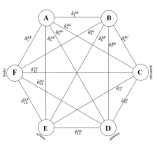
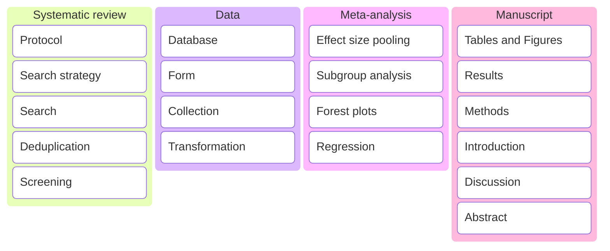
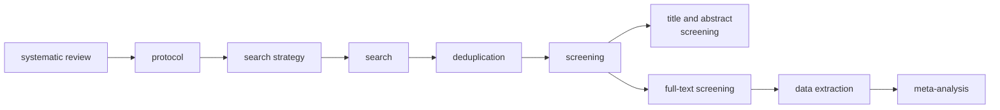

    What is the optimal graft choice for anterior cruciate ligament reconstruction surgery? 
     
     
	Thesis  
    
<i>In fulfillment for the award of the degree of:</i> 

    
doctor of philosophy

 

	
 

1 Department of Anatomy, Jagiellonian University, Kraków, Poland   
2 Whiting College of Engineering, Johns Hopkins University, Baltimore, MD, United States   
3 Harvard Dataverse, Harvard University, Cambridge, MA, United States

    
Table of Contents
  
    

    
- [Search strategy](#search-strategy)
- [Search](#search)
- [Deduplication](#deduplication)
- [Screening](#screening)
 

    
Kanban
  

    
Flowchart

  

    
Checklist

<table style="width:100%;">
<colgroup>
<col style="width: 21%" />
<col style="width: 6%" />
<col style="width: 59%" />
<col style="width: 12%" />
</colgroup>
<thead>
<tr>
<th style="text-align: center;"><strong>Section/Topic</strong></th>
<th style="text-align: center;"><strong>Item #</strong></th>
<th style="text-align: center;"><strong>Checklist Item</strong></th>
<th style="text-align: center;"><strong>Reported on Page #</strong></th>
</tr>
</thead>
<tbody>
<tr>
<td><strong>TITLE</strong></td>
<td></td>
<td></td>
<td></td>
</tr>
<tr>
<td><blockquote>

Title

</blockquote></td>
<td>1</td>
<td>Identify the report as a systematic review <em>incorporating a
network meta-analysis (or related form of meta-analysis).</em></td>
<td></td>
</tr>
<tr>
<td></td>
<td></td>
<td></td>
<td></td>
</tr>
<tr>
<td><strong>ABSTRACT</strong></td>
<td></td>
<td></td>
<td></td>
</tr>
<tr>
<td><blockquote>

Structured summary

</blockquote></td>
<td>2</td>
<td>
Provide a structured summary including, as applicable:

<blockquote>

<strong>Background:</strong> main objectives

<strong>Methods:</strong> data sources; study eligibility criteria,
participants, and interventions; study appraisal; and <em>synthesis
methods, such as network meta-analysis.</em>

<strong>Results:</strong> number of studies and participants
identified; summary estimates with corresponding confidence/credible
intervals; <em>treatment rankings may also be discussed. Authors may
choose to summarize pairwise comparisons against a chosen treatment
included in their analyses for brevity.</em>

<strong>Discussion/Conclusions:</strong> limitations; conclusions and
implications of findings.

<strong>Other:</strong> primary source of funding; systematic review
registration number with registry name.

</blockquote></td>
<td></td>
</tr>
<tr>
<td></td>
<td></td>
<td></td>
<td></td>
</tr>
<tr>
<td><strong>INTRODUCTION</strong></td>
<td></td>
<td></td>
<td></td>
</tr>
<tr>
<td><blockquote>

Rationale

</blockquote></td>
<td>3</td>
<td>Describe the rationale for the review in the context of what is
already known<em>, including mention of why a network meta-analysis has
been conducted.</em></td>
<td></td>
</tr>
<tr>
<td><blockquote>

Objectives

</blockquote></td>
<td>4</td>
<td>Provide an explicit statement of questions being addressed, with
reference to participants, interventions, comparisons, outcomes, and
study design (PICOS).</td>
<td></td>
</tr>
<tr>
<td></td>
<td></td>
<td></td>
<td></td>
</tr>
<tr>
<td><strong>METHODS</strong></td>
<td></td>
<td></td>
<td></td>
</tr>
<tr>
<td><blockquote>

Protocol and registration

</blockquote></td>
<td>5</td>
<td>Indicate whether a review protocol exists and if and where it can be
accessed (e.g., Web address); and, if available, provide registration
information, including registration number.</td>
<td></td>
</tr>
<tr>
<td><blockquote>

Eligibility criteria

</blockquote></td>
<td>6</td>
<td>Specify study characteristics (e.g., PICOS, length of follow-up) and
report characteristics (e.g., years considered, language, publication
status) used as criteria for eligibility, giving rationale. <em>Clearly
describe eligible treatments included in the treatment network, and note
whether any have been clustered or merged into the same node (with
justification).</em></td>
<td></td>
</tr>
<tr>
<td><blockquote>

Information sources

</blockquote></td>
<td>7</td>
<td>Describe all information sources (e.g., databases with dates of
coverage, contact with study authors to identify additional studies) in
the search and date last searched.</td>
<td></td>
</tr>
<tr>
<td><blockquote>

Search

</blockquote></td>
<td>8</td>
<td>Present full electronic search strategy for at least one database,
including any limits used, such that it could be repeated.</td>
<td></td>
</tr>
<tr>
<td><blockquote>

Study selection

</blockquote></td>
<td>9</td>
<td>State the process for selecting studies (i.e., screening,
eligibility, included in systematic review, and, if applicable, included
in the meta-analysis).</td>
<td></td>
</tr>
<tr>
<td><blockquote>

Data collection process

</blockquote></td>
<td>10</td>
<td>Describe method of data extraction from reports (e.g., piloted
forms, independently, in duplicate) and any processes for obtaining and
confirming data from investigators.</td>
<td></td>
</tr>
<tr>
<td><blockquote>

Data items

</blockquote></td>
<td>11</td>
<td>List and define all variables for which data were sought (e.g.,
PICOS, funding sources) and any assumptions and simplifications
made.</td>
<td></td>
</tr>
<tr>
<td><blockquote>

<strong>Geometry of the network</strong>

</blockquote></td>
<td><strong>S1</strong></td>
<td>Describe methods used to explore the geometry of the treatment
network under study and potential biases related to it. This should
include how the evidence base has been graphically summarized for
presentation, and what characteristics were compiled and used to
describe the evidence base to readers.</td>
<td></td>
</tr>
<tr>
<td><blockquote>

Risk of bias within individual studies

</blockquote></td>
<td>12</td>
<td>Describe methods used for assessing risk of bias of individual
studies (including specification of whether this was done at the study
or outcome level), and how this information is to be used in any data
synthesis.</td>
<td></td>
</tr>
<tr>
<td><blockquote>

Summary measures

</blockquote></td>
<td>13</td>
<td>State the principal summary measures (e.g., risk ratio, difference
in means). <em>Also describe the use of additional summary measures
assessed, such as treatment rankings and surface under the cumulative
ranking curve (SUCRA) values, as well as modified approaches used to
present summary findings from meta-analyses.</em></td>
<td></td>
</tr>
<tr>
<td><blockquote>

Planned methods of analysis

</blockquote></td>
<td>14</td>
<td>
Describe the methods of handling data and combining results of
studies for each network meta-analysis. This should include, but not be
limited to:

<ul>
<li>
<em>Handling of multi-arm trials;</em>
</li>
<li>
<em>Selection of variance structure;</em>
</li>
<li>
<em>Selection of prior distributions in Bayesian analyses;
and</em>
</li>
<li>
<em>Assessment of model fit.</em>
</li>
</ul></td>
<td></td>
</tr>
<tr>
<td><blockquote>

<strong>Assessment of Inconsistency</strong>

</blockquote></td>
<td><strong>S2</strong></td>
<td>Describe the statistical methods used to evaluate the agreement of
direct and indirect evidence in the treatment network(s) studied.
Describe efforts taken to address its presence when found.</td>
<td></td>
</tr>
<tr>
<td><blockquote>

Risk of bias across studies

</blockquote></td>
<td>15</td>
<td>Specify any assessment of risk of bias that may affect the
cumulative evidence (e.g., publication bias, selective reporting within
studies).</td>
<td></td>
</tr>
<tr>
<td><blockquote>

Additional analyses

</blockquote></td>
<td>16</td>
<td>
Describe methods of additional analyses if done, indicating which
were pre-specified. This may include, but not be limited to, the
following:

<ul>
<li>
Sensitivity or subgroup analyses;
</li>
<li>
Meta-regression analyses;
</li>
<li>
<em>Alternative formulations of the treatment network;
and</em>
</li>
<li>
<em>Use of alternative prior distributions for Bayesian analyses
(if applicable).</em>
</li>
</ul></td>
<td></td>
</tr>
<tr>
<td></td>
<td></td>
<td></td>
<td></td>
</tr>
<tr>
<td><strong>RESULTS†</strong></td>
<td></td>
<td></td>
<td></td>
</tr>
<tr>
<td><blockquote>

Study selection

</blockquote></td>
<td>17</td>
<td>Give numbers of studies screened, assessed for eligibility, and
included in the review, with reasons for exclusions at each stage,
ideally with a flow diagram.</td>
<td></td>
</tr>
<tr>
<td><blockquote>

<strong>Presentation of network structure</strong>

</blockquote></td>
<td><strong>S3</strong></td>
<td>Provide a network graph of the included studies to enable
visualization of the geometry of the treatment network.</td>
<td></td>
</tr>
<tr>
<td><blockquote>

<strong>Summary of network geometry</strong>

</blockquote></td>
<td><strong>S4</strong></td>
<td>Provide a brief overview of characteristics of the treatment
network. This may include commentary on the abundance of trials and
randomized patients for the different interventions and pairwise
comparisons in the network, gaps of evidence in the treatment network,
and potential biases reflected by the network structure.</td>
<td></td>
</tr>
<tr>
<td><blockquote>

Study characteristics

</blockquote></td>
<td>18</td>
<td>For each study, present characteristics for which data were
extracted (e.g., study size, PICOS, follow-up period) and provide the
citations.</td>
<td></td>
</tr>
<tr>
<td><blockquote>

Risk of bias within studies

</blockquote></td>
<td>19</td>
<td>Present data on risk of bias of each study and, if available, any
outcome level assessment.</td>
<td></td>
</tr>
<tr>
<td><blockquote>

Results of individual studies

</blockquote></td>
<td>20</td>
<td>For all outcomes considered (benefits or harms), present, for each
study: 1) simple summary data for each intervention group, and 2) effect
estimates and confidence intervals. <em>Modified approaches may be
needed to deal with information from larger networks.</em></td>
<td></td>
</tr>
<tr>
<td><blockquote>

Synthesis of results

</blockquote></td>
<td>21</td>
<td>Present results of each meta-analysis done, including
confidence/credible intervals. <em>In larger networks, authors may focus
on comparisons versus a particular comparator (e.g. placebo or standard
care), with full findings presented in an appendix. League tables and
forest plots may be considered to summarize pairwise comparisons.</em>
If additional summary measures were explored (such as treatment
rankings), these should also be presented.</td>
<td></td>
</tr>
<tr>
<td><blockquote>

<strong>Exploration for inconsistency</strong>

</blockquote></td>
<td><strong>S5</strong></td>
<td>Describe results from investigations of inconsistency. This may
include such information as measures of model fit to compare consistency
and inconsistency models, <em>P</em> values from statistical tests, or
summary of inconsistency estimates from different parts of the treatment
network.</td>
<td></td>
</tr>
<tr>
<td><blockquote>

Risk of bias across studies

</blockquote></td>
<td>22</td>
<td>Present results of any assessment of risk of bias across studies for
the evidence base being studied.</td>
<td></td>
</tr>
<tr>
<td><blockquote>

Results of additional analyses

</blockquote></td>
<td>23</td>
<td>Give results of additional analyses, if done (e.g., sensitivity or
subgroup analyses, meta-regression analyses<em>, alternative network
geometries studied, alternative choice of prior distributions for
Bayesian analyses,</em> and so forth).</td>
<td></td>
</tr>
<tr>
<td></td>
<td></td>
<td></td>
<td></td>
</tr>
<tr>
<td><strong>DISCUSSION</strong></td>
<td></td>
<td></td>
<td></td>
</tr>
<tr>
<td><blockquote>

Summary of evidence

</blockquote></td>
<td>24</td>
<td>Summarize the main findings, including the strength of evidence for
each main outcome; consider their relevance to key groups (e.g.,
healthcare providers, users, and policy-makers).</td>
<td></td>
</tr>
<tr>
<td><blockquote>

Limitations

</blockquote></td>
<td>25</td>
<td>Discuss limitations at study and outcome level (e.g., risk of bias),
and at review level (e.g., incomplete retrieval of identified research,
reporting bias). <em>Comment on the validity of the assumptions, such as
transitivity and consistency. Comment on any concerns regarding network
geometry (e.g., avoidance of certain comparisons).</em></td>
<td></td>
</tr>
<tr>
<td><blockquote>

Conclusions

</blockquote></td>
<td>26</td>
<td>Provide a general interpretation of the results in the context of
other evidence, and implications for future research.</td>
<td></td>
</tr>
<tr>
<td></td>
<td></td>
<td></td>
<td></td>
</tr>
<tr>
<td><strong>FUNDING</strong></td>
<td></td>
<td></td>
<td></td>
</tr>
<tr>
<td><blockquote>

Funding

</blockquote></td>
<td>27</td>
<td>Describe sources of funding for the systematic review and other
support (e.g., supply of data); role of funders for the systematic
review. This should also include information regarding whether funding
has been received from manufacturers of treatments in the network and/or
whether some of the authors are content experts with professional
conflicts of interest that could affect use of treatments in the
network.</td>
<td></td>
</tr>
</tbody>
</table>

PICOS = population, intervention, comparators, outcomes, study design.

\* Text in italics indicates wording specific to reporting of network
meta-analyses that has been added to guidance from the PRISMA statement.

† Authors may wish to plan for use of appendices to present all relevant
information in full detail for items in this section.

