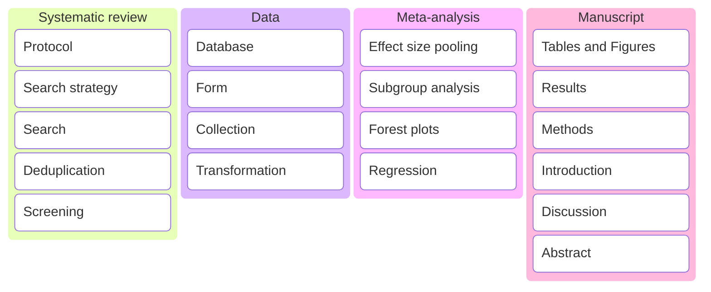
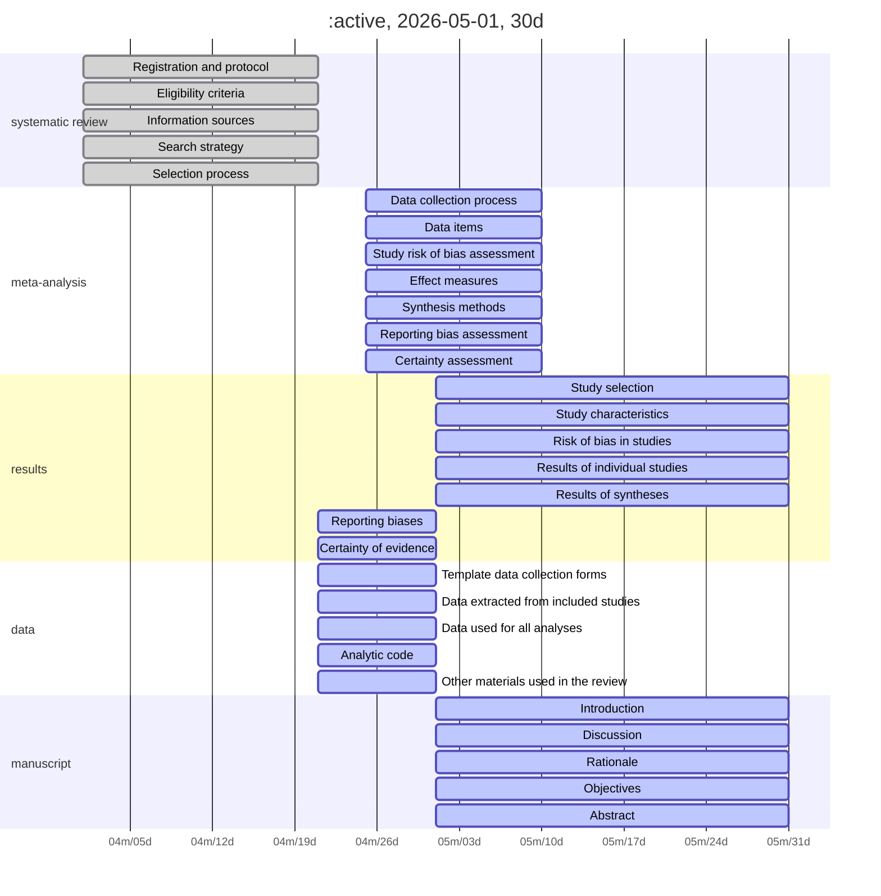
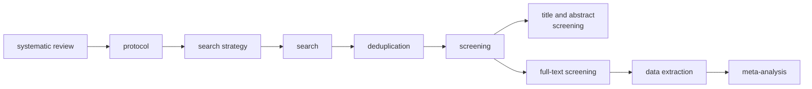

<!-- Notes:

Read this and follow the steps to organize and stuff.
https://medium.com/@caneuenschwander/how-to-turn-a-messy-jupyter-notebook-into-a-professional-python-project-f34d5ee7f88b

-->

    What is the optimal graft choice for anterior cruciate ligament reconstruction surgery? 
     
      
	Thesis  
    
<i>In fulfillment for the award of the degree of:</i> 

    
doctor of philosophy

  
    1 Department of Anatomy,
Jagiellonian University, Kraków, Poland   2 Whiting
College of Engineering, Johns Hopkins University, Baltimore, MD, United
States   3 Harvard Dataverse, Harvard University,
Cambridge, MA, United States  

&lt;div width-100%&gt; 

Table of
Contents

- [Systematic Review](#systematic-review)
  - [Search strategy](#search-strategy)
  - [Search](#search)
  - [Deduplication](#deduplication)
  - [Screening](#screening)
- [Data Collection](#data-collection)

    
Kanban
  

    
Roadmap

    
Flowchart

    
Checklist

<table style="width:100%;">
<colgroup>
<col style="width: 21%" />
<col style="width: 6%" />
<col style="width: 59%" />
<col style="width: 12%" />
</colgroup>
<thead>
<tr>
<th style="text-align: center;"><strong>Section/Topic</strong></th>
<th style="text-align: center;"><strong>Item #</strong></th>
<th style="text-align: center;"><strong>Checklist Item</strong></th>
<th style="text-align: center;"><strong>Reported on Page #</strong></th>
</tr>
</thead>
<tbody>
<tr>
<td><strong>TITLE</strong></td>
<td></td>
<td></td>
<td></td>
</tr>
<tr>
<td><blockquote>

Title

</blockquote></td>
<td>1</td>
<td>Identify the report as a systematic review <em>incorporating a
network meta-analysis (or related form of meta-analysis).</em></td>
<td></td>
</tr>
<tr>
<td></td>
<td></td>
<td></td>
<td></td>
</tr>
<tr>
<td><strong>ABSTRACT</strong></td>
<td></td>
<td></td>
<td></td>
</tr>
<tr>
<td><blockquote>

Structured summary

</blockquote></td>
<td>2</td>
<td>
Provide a structured summary including, as applicable:

<blockquote>

<strong>Background:</strong> main objectives

<strong>Methods:</strong> data sources; study eligibility criteria,
participants, and interventions; study appraisal; and <em>synthesis
methods, such as network meta-analysis.</em>

<strong>Results:</strong> number of studies and participants
identified; summary estimates with corresponding confidence/credible
intervals; <em>treatment rankings may also be discussed. Authors may
choose to summarize pairwise comparisons against a chosen treatment
included in their analyses for brevity.</em>

<strong>Discussion/Conclusions:</strong> limitations; conclusions and
implications of findings.

<strong>Other:</strong> primary source of funding; systematic review
registration number with registry name.

</blockquote></td>
<td></td>
</tr>
<tr>
<td></td>
<td></td>
<td></td>
<td></td>
</tr>
<tr>
<td><strong>INTRODUCTION</strong></td>
<td></td>
<td></td>
<td></td>
</tr>
<tr>
<td><blockquote>

Rationale

</blockquote></td>
<td>3</td>
<td>Describe the rationale for the review in the context of what is
already known<em>, including mention of why a network meta-analysis has
been conducted.</em></td>
<td></td>
</tr>
<tr>
<td><blockquote>

Objectives

</blockquote></td>
<td>4</td>
<td>Provide an explicit statement of questions being addressed, with
reference to participants, interventions, comparisons, outcomes, and
study design (PICOS).</td>
<td></td>
</tr>
<tr>
<td></td>
<td></td>
<td></td>
<td></td>
</tr>
<tr>
<td><strong>METHODS</strong></td>
<td></td>
<td></td>
<td></td>
</tr>
<tr>
<td><blockquote>

Protocol and registration

</blockquote></td>
<td>5</td>
<td>Indicate whether a review protocol exists and if and where it can be
accessed (e.g., Web address); and, if available, provide registration
information, including registration number.</td>
<td></td>
</tr>
<tr>
<td><blockquote>

Eligibility criteria

</blockquote></td>
<td>6</td>
<td>Specify study characteristics (e.g., PICOS, length of follow-up) and
report characteristics (e.g., years considered, language, publication
status) used as criteria for eligibility, giving rationale. <em>Clearly
describe eligible treatments included in the treatment network, and note
whether any have been clustered or merged into the same node (with
justification).</em></td>
<td></td>
</tr>
<tr>
<td><blockquote>

Information sources

</blockquote></td>
<td>7</td>
<td>Describe all information sources (e.g., databases with dates of
coverage, contact with study authors to identify additional studies) in
the search and date last searched.</td>
<td></td>
</tr>
<tr>
<td><blockquote>

Search

</blockquote></td>
<td>8</td>
<td>Present full electronic search strategy for at least one database,
including any limits used, such that it could be repeated.</td>
<td></td>
</tr>
<tr>
<td><blockquote>

Study selection

</blockquote></td>
<td>9</td>
<td>State the process for selecting studies (i.e., screening,
eligibility, included in systematic review, and, if applicable, included
in the meta-analysis).</td>
<td></td>
</tr>
<tr>
<td><blockquote>

Data collection process

</blockquote></td>
<td>10</td>
<td>Describe method of data extraction from reports (e.g., piloted
forms, independently, in duplicate) and any processes for obtaining and
confirming data from investigators.</td>
<td></td>
</tr>
<tr>
<td><blockquote>

Data items

</blockquote></td>
<td>11</td>
<td>List and define all variables for which data were sought (e.g.,
PICOS, funding sources) and any assumptions and simplifications
made.</td>
<td></td>
</tr>
<tr>
<td><blockquote>

<strong>Geometry of the network</strong>

</blockquote></td>
<td><strong>S1</strong></td>
<td>Describe methods used to explore the geometry of the treatment
network under study and potential biases related to it. This should
include how the evidence base has been graphically summarized for
presentation, and what characteristics were compiled and used to
describe the evidence base to readers.</td>
<td></td>
</tr>
<tr>
<td><blockquote>

Risk of bias within individual studies

</blockquote></td>
<td>12</td>
<td>Describe methods used for assessing risk of bias of individual
studies (including specification of whether this was done at the study
or outcome level), and how this information is to be used in any data
synthesis.</td>
<td></td>
</tr>
<tr>
<td><blockquote>

Summary measures

</blockquote></td>
<td>13</td>
<td>State the principal summary measures (e.g., risk ratio, difference
in means). <em>Also describe the use of additional summary measures
assessed, such as treatment rankings and surface under the cumulative
ranking curve (SUCRA) values, as well as modified approaches used to
present summary findings from meta-analyses.</em></td>
<td></td>
</tr>
<tr>
<td><blockquote>

Planned methods of analysis

</blockquote></td>
<td>14</td>
<td>
Describe the methods of handling data and combining results of
studies for each network meta-analysis. This should include, but not be
limited to:

<ul>
<li>
<em>Handling of multi-arm trials;</em>
</li>
<li>
<em>Selection of variance structure;</em>
</li>
<li>
<em>Selection of prior distributions in Bayesian analyses;
and</em>
</li>
<li>
<em>Assessment of model fit.</em>
</li>
</ul></td>
<td></td>
</tr>
<tr>
<td><blockquote>

<strong>Assessment of Inconsistency</strong>

</blockquote></td>
<td><strong>S2</strong></td>
<td>Describe the statistical methods used to evaluate the agreement of
direct and indirect evidence in the treatment network(s) studied.
Describe efforts taken to address its presence when found.</td>
<td></td>
</tr>
<tr>
<td><blockquote>

Risk of bias across studies

</blockquote></td>
<td>15</td>
<td>Specify any assessment of risk of bias that may affect the
cumulative evidence (e.g., publication bias, selective reporting within
studies).</td>
<td></td>
</tr>
<tr>
<td><blockquote>

Additional analyses

</blockquote></td>
<td>16</td>
<td>
Describe methods of additional analyses if done, indicating which
were pre-specified. This may include, but not be limited to, the
following:

<ul>
<li>
Sensitivity or subgroup analyses;
</li>
<li>
Meta-regression analyses;
</li>
<li>
<em>Alternative formulations of the treatment network;
and</em>
</li>
<li>
<em>Use of alternative prior distributions for Bayesian analyses
(if applicable).</em>
</li>
</ul></td>
<td></td>
</tr>
<tr>
<td></td>
<td></td>
<td></td>
<td></td>
</tr>
<tr>
<td><strong>RESULTS†</strong></td>
<td></td>
<td></td>
<td></td>
</tr>
<tr>
<td><blockquote>

Study selection

</blockquote></td>
<td>17</td>
<td>Give numbers of studies screened, assessed for eligibility, and
included in the review, with reasons for exclusions at each stage,
ideally with a flow diagram.</td>
<td></td>
</tr>
<tr>
<td><blockquote>

<strong>Presentation of network structure</strong>

</blockquote></td>
<td><strong>S3</strong></td>
<td>Provide a network graph of the included studies to enable
visualization of the geometry of the treatment network.</td>
<td></td>
</tr>
<tr>
<td><blockquote>

<strong>Summary of network geometry</strong>

</blockquote></td>
<td><strong>S4</strong></td>
<td>Provide a brief overview of characteristics of the treatment
network. This may include commentary on the abundance of trials and
randomized patients for the different interventions and pairwise
comparisons in the network, gaps of evidence in the treatment network,
and potential biases reflected by the network structure.</td>
<td></td>
</tr>
<tr>
<td><blockquote>

Study characteristics

</blockquote></td>
<td>18</td>
<td>For each study, present characteristics for which data were
extracted (e.g., study size, PICOS, follow-up period) and provide the
citations.</td>
<td></td>
</tr>
<tr>
<td><blockquote>

Risk of bias within studies

</blockquote></td>
<td>19</td>
<td>Present data on risk of bias of each study and, if available, any
outcome level assessment.</td>
<td></td>
</tr>
<tr>
<td><blockquote>

Results of individual studies

</blockquote></td>
<td>20</td>
<td>For all outcomes considered (benefits or harms), present, for each
study: 1) simple summary data for each intervention group, and 2) effect
estimates and confidence intervals. <em>Modified approaches may be
needed to deal with information from larger networks.</em></td>
<td></td>
</tr>
<tr>
<td><blockquote>

Synthesis of results

</blockquote></td>
<td>21</td>
<td>Present results of each meta-analysis done, including
confidence/credible intervals. <em>In larger networks, authors may focus
on comparisons versus a particular comparator (e.g. placebo or standard
care), with full findings presented in an appendix. League tables and
forest plots may be considered to summarize pairwise comparisons.</em>
If additional summary measures were explored (such as treatment
rankings), these should also be presented.</td>
<td></td>
</tr>
<tr>
<td><blockquote>

<strong>Exploration for inconsistency</strong>

</blockquote></td>
<td><strong>S5</strong></td>
<td>Describe results from investigations of inconsistency. This may
include such information as measures of model fit to compare consistency
and inconsistency models, <em>P</em> values from statistical tests, or
summary of inconsistency estimates from different parts of the treatment
network.</td>
<td></td>
</tr>
<tr>
<td><blockquote>

Risk of bias across studies

</blockquote></td>
<td>22</td>
<td>Present results of any assessment of risk of bias across studies for
the evidence base being studied.</td>
<td></td>
</tr>
<tr>
<td><blockquote>

Results of additional analyses

</blockquote></td>
<td>23</td>
<td>Give results of additional analyses, if done (e.g., sensitivity or
subgroup analyses, meta-regression analyses<em>, alternative network
geometries studied, alternative choice of prior distributions for
Bayesian analyses,</em> and so forth).</td>
<td></td>
</tr>
<tr>
<td></td>
<td></td>
<td></td>
<td></td>
</tr>
<tr>
<td><strong>DISCUSSION</strong></td>
<td></td>
<td></td>
<td></td>
</tr>
<tr>
<td><blockquote>

Summary of evidence

</blockquote></td>
<td>24</td>
<td>Summarize the main findings, including the strength of evidence for
each main outcome; consider their relevance to key groups (e.g.,
healthcare providers, users, and policy-makers).</td>
<td></td>
</tr>
<tr>
<td><blockquote>

Limitations

</blockquote></td>
<td>25</td>
<td>Discuss limitations at study and outcome level (e.g., risk of bias),
and at review level (e.g., incomplete retrieval of identified research,
reporting bias). <em>Comment on the validity of the assumptions, such as
transitivity and consistency. Comment on any concerns regarding network
geometry (e.g., avoidance of certain comparisons).</em></td>
<td></td>
</tr>
<tr>
<td><blockquote>

Conclusions

</blockquote></td>
<td>26</td>
<td>Provide a general interpretation of the results in the context of
other evidence, and implications for future research.</td>
<td></td>
</tr>
<tr>
<td></td>
<td></td>
<td></td>
<td></td>
</tr>
<tr>
<td><strong>FUNDING</strong></td>
<td></td>
<td></td>
<td></td>
</tr>
<tr>
<td><blockquote>

Funding

</blockquote></td>
<td>27</td>
<td>Describe sources of funding for the systematic review and other
support (e.g., supply of data); role of funders for the systematic
review. This should also include information regarding whether funding
has been received from manufacturers of treatments in the network and/or
whether some of the authors are content experts with professional
conflicts of interest that could affect use of treatments in the
network.</td>
<td></td>
</tr>
</tbody>
</table>

PICOS = population, intervention, comparators, outcomes, study design.

\* Text in italics indicates wording specific to reporting of network
meta-analyses that has been added to guidance from the PRISMA statement.

† Authors may wish to plan for use of appendices to present all relevant
information in full detail for items in this section.

<table>
<colgroup>
<col style="width: 2%" />
<col style="width: 30%" />
<col style="width: 30%" />
<col style="width: 30%" />
<col style="width: 6%" />
</colgroup>
<thead>
<tr>
<th style="text-align: left;"></th>
<th style="text-align: center;">pubmed</th>
<th style="text-align: center;">embase</th>
<th style="text-align: center;">web of science</th>
<th></th>
</tr>
</thead>
<tbody>
<tr>
<td style="text-align: left;">patellar</td>
<td style="text-align: center;"><a
href="https://raw.githubusercontent.com/dong-wkim/network_meta-analysis/refs/heads/master/systematic_review/search//pubmed/pm_bptb.csv">pm_bptb</a> (<em>n</em>
= 190)</td>
<td style="text-align: center;"><a
href="https://raw.githubusercontent.com/dong-wkim/network_meta-analysis/refs/heads/master/systematic_review/search//embase/em_bptb.csv">em_bptb</a> (<em>n</em>
= 73)</td>
<td style="text-align: center;"><a
href="https://raw.githubusercontent.com/dong-wkim/network_meta-analysis/refs/heads/master/systematic_review/search//wos/wos_bptb.csv">wos_bptb</a> (<em>n</em>
= 186)</td>
<td></td>
</tr>
<tr>
<td style="text-align: left;">hamstring</td>
<td style="text-align: center;"><a
href="https://raw.githubusercontent.com/dong-wkim/network_meta-analysis/refs/heads/master/systematic_review/search//pubmed/pm_ht.csv">pm_ht</a> (<em>n</em>
= 202)</td>
<td style="text-align: center;"><a
href="https://raw.githubusercontent.com/dong-wkim/network_meta-analysis/refs/heads/master/systematic_review/search//embase/em_ht.csv">em_ht</a> (<em>n</em>
= 97)</td>
<td style="text-align: center;"><a
href="https://raw.githubusercontent.com/dong-wkim/network_meta-analysis/refs/heads/master/systematic_review/search//wos/wos_ht.csv">wos_ht</a> (<em>n</em>
=253)</td>
<td></td>
</tr>
<tr>
<td style="text-align: left;">quadriceps</td>
<td style="text-align: center;"><a
href="https://raw.githubusercontent.com/dong-wkim/network_meta-analysis/refs/heads/master/systematic_review/search//pubmed/pm_qt.csv">pm_qt</a> (<em>n</em>
= 165)</td>
<td style="text-align: center;"><a
href="https://raw.githubusercontent.com/dong-wkim/network_meta-analysis/refs/heads/master/systematic_review/search//embase/em_qt.csv">em_qt</a> (<em>n</em>
= 114)</td>
<td style="text-align: center;"><a
href="https://raw.githubusercontent.com/dong-wkim/network_meta-analysis/refs/heads/master/systematic_review/search//wos/wos_qt.csv">wos_qt</a> (<em>n</em>
= 70)</td>
<td></td>
</tr>
<tr>
<td style="text-align: left;">peroneus longus</td>
<td style="text-align: center;"><a
href="https://raw.githubusercontent.com/dong-wkim/network_meta-analysis/refs/heads/master/systematic_review/search//pubmed/pm_plt.csv">pm_plt</a> (<em>n</em>
= 2)</td>
<td style="text-align: center;"><a
href="https://raw.githubusercontent.com/dong-wkim/network_meta-analysis/refs/heads/master/systematic_review/search//embase/em_plt.csv">em_plt</a> (<em>n</em>
= 25)</td>
<td style="text-align: center;"><a
href="https://raw.githubusercontent.com/dong-wkim/network_meta-analysis/refs/heads/master/systematic_review/search//wos/wos_plt.csv">wos_plt</a> (<em>n</em>
= 4)</td>
<td></td>
</tr>
<tr>
<td style="text-align: left;">Achilles</td>
<td style="text-align: center;"><a
href="https://raw.githubusercontent.com/dong-wkim/network_meta-analysis/refs/heads/master/systematic_review/search//pubmed/pm_at.csv">pm_at</a> (<em>n</em>
= 7)</td>
<td style="text-align: center;"><a
href="https://raw.githubusercontent.com/dong-wkim/network_meta-analysis/refs/heads/master/systematic_review/search//embase/em_at.csv">em_at</a> (<em>n</em>
= 5)</td>
<td style="text-align: center;"><a
href="https://raw.githubusercontent.com/dong-wkim/network_meta-analysis/refs/heads/master/systematic_review/search//wos/wos_at.csv">wos_at</a> (<em>n</em>
= 10)</td>
<td></td>
</tr>
<tr>
<td style="text-align: left;">tibialis</td>
<td style="text-align: center;"><a
href="https://raw.githubusercontent.com/dong-wkim/network_meta-analysis/refs/heads/master/systematic_review/search//pubmed/pm_ta.csv">pm_ta</a> (<em>n</em>
= 7)</td>
<td style="text-align: center;"><a
href="https://raw.githubusercontent.com/dong-wkim/network_meta-analysis/refs/heads/master/systematic_review/search//embase/em_ta.csv">em_ta</a> (<em>n</em>
= 3)</td>
<td style="text-align: center;"><a
href="https://raw.githubusercontent.com/dong-wkim/network_meta-analysis/refs/heads/master/systematic_review/search//wos/wos_ta.csv">wos_ta</a> (<em>n</em>
= 8)</td>
<td></td>
</tr>
</tbody>
</table>

------------------------------------------------------------------------

<h1 align="center" style="font-family:Times New Roman;font-variant:small-caps;">Systematic Review</h1>

Define directory structure and store paths as <s>global</s> static
webpages (even better).

- [network
  meta-analysis](https://raw.githubusercontent.com/dong-wkim/network_meta-analysis/refs/heads/master//.md)
  - [systematic\_review/](https://raw.githubusercontent.com/dong-wkim/network_meta-analysis/refs/heads/master/systematic_review//systematic_review/.md)
    - [protocol](https://raw.githubusercontent.com/dong-wkim/network_meta-analysis/refs/heads/master/systematic_review/protocol//systematic_review/protocol/.md)
      - [prospero](https://raw.githubusercontent.com/dong-wkim/network_meta-analysis/refs/heads/master/systematic_review/protocol/prospero/systematic_review/protocol/prospero.md)
      - [cochrane](https://raw.githubusercontent.com/dong-wkim/network_meta-analysis/refs/heads/master/systematic_review/protocol/cochrane/systematic_review/protocol/cochrane.md)
    - [search\_strategy](https://raw.githubusercontent.com/dong-wkim/network_meta-analysis/refs/heads/master/systematic_review/search_strategy/systematic_review/search_strategy.md)
      - [pubmed](https://raw.githubusercontent.com/dong-wkim/network_meta-analysis/refs/heads/master/systematic_review/search_strategy/pubmed/systematic_review/search_strategy/pubmed.md)
      - [embase](https://raw.githubusercontent.com/dong-wkim/network_meta-analysis/refs/heads/master/systematic_review/search_strategy/embase/systematic_review/search_strategy/embase.md)
      - [wos](https://raw.githubusercontent.com/dong-wkim/network_meta-analysis/refs/heads/master/systematic_review/search_strategy/wos/systematic_review/search_strategy/wos.md)
    - [search](https://raw.githubusercontent.com/dong-wkim/network_meta-analysis/refs/heads/master/systematic_review/search//systematic_review/search/.md)
      - [pubmed](https://raw.githubusercontent.com/dong-wkim/network_meta-analysis/refs/heads/master/systematic_review/search/pubmed/systematic_review/search/pubmed.md)
      - [embase](https://raw.githubusercontent.com/dong-wkim/network_meta-analysis/refs/heads/master/systematic_review/search/embase/systematic_review/search/embase.md)
      - [wos](https://raw.githubusercontent.com/dong-wkim/network_meta-analysis/refs/heads/master/systematic_review/search/wos/systematic_review/search/wos.md)
    - [deduplication/](https://raw.githubusercontent.com/dong-wkim/network_meta-analysis/refs/heads/master/systematic_review/deduplication//systematic_review/deduplication/.md)
      - [doi](https://raw.githubusercontent.com/dong-wkim/network_meta-analysis/refs/heads/master/systematic_review/deduplication/doi/doi_deduplicated.csv)
      - [title+author+year](https://raw.githubusercontent.com/dong-wkim/network_meta-analysis/refs/heads/master/systematic_review/deduplication/title+author+year/title+author+year_deduplicated.csv)
      - [title+year](https://raw.githubusercontent.com/dong-wkim/network_meta-analysis/refs/heads/master/systematic_review/deduplication/title+year/title+year_deduplicated.csv)
    - [screening/](https://raw.githubusercontent.com/dong-wkim/network_meta-analysis/refs/heads/master/systematic_review/screening//systematic_review/screening/.md)
      - [title\_abstract\_screening](https://raw.githubusercontent.com/dong-wkim/network_meta-analysis/refs/heads/master/systematic_review/screening/title_abstract_screening/systematic_review/screening/title_abstract_screening.md)
      - [PDF](https://raw.githubusercontent.com/dong-wkim/network_meta-analysis/refs/heads/master/systematic_review/screening/PDF/systematic_review/screening/PDF.md)
      - [full-text\_screening](https://raw.githubusercontent.com/dong-wkim/network_meta-analysis/refs/heads/master/systematic_review/screening/full-text_screening/systematic_review/screening/full-text_screening.md)
- [data](https://raw.githubusercontent.com/dong-wkim/network_meta-analysis/refs/heads/master/data/data.md)
- [meta-analysis](https://raw.githubusercontent.com/dong-wkim/network_meta-analysis/refs/heads/master/meta-analysis/meta-analysis.md)
- [manuscript](https://raw.githubusercontent.com/dong-wkim/network_meta-analysis/refs/heads/master/manuscript/manuscript.md)
- [README.ipynb](https://raw.githubusercontent.com/dong-wkim/network_meta-analysis/refs/heads/master/README.ipynb/README.ipynb.md)
- [docs](https://raw.githubusercontent.com/dong-wkim/network_meta-analysis/refs/heads/master/docs/docs.md)
- [src](https://raw.githubusercontent.com/dong-wkim/network_meta-analysis/refs/heads/master/src/src.md)
  \`\`\`

Install `PyPI` modules in `requirements.txt`.

    !pandoc -f docx -t markdown_strict+pipe_tables "PRISMA NMA checklist.docx" -o prisma-nma.md 

    !pandoc -f html -t markdown_strict+pipe_tables prisma-nma.html -o prisma-nma.md 

    !cd .venv; Scripts/Activate.ps1 
    !pip install -r requirements.txt

Exclude certain files from syncing with remote github repository with
`gitignore` file.

    ignore = f""".venv/
    */*.gsheet
    */*.gdoc"""

    gitignore = ['.venv/', '.gsheet', '.gdoc']
    ignore = "\n".join(gitignore)
    with open(f"./.gitignore", "w") as f:
        f.write(ignore)

Import the necessary modules.

    import subprocess
    import sys
    import os
    import pandas as pd
    from Bio import Entrez, Medline
    import ssl
    import certifi
    import re
    from pathlib import Path

Set absolute directory paths for important sub-project folders as
variables in the global environment for use in scripts downstream and
make them in order to start the project.

    root = os.getcwd()
    folders = {
    "systematic_review": f"{root}/systematic_review",
        "protocol": f"{root}/systematic_review/protocol",
            "prospero": f"{root}/systematic_review/protocol/prospero",
            "cochrane": f"{root}/systematic_review/protocol/cochrane",
        "search_strategy": f"{root}/systematic_review/search_strategy",
            "search_strategy_pubmed": f"{root}/systematic_review/search_strategy/pubmed/",
            "search_strategy_embase": f"{root}/systematic_review/search_strategy/embase/",
            "search_strategy_wos": f"{root}/systematic_review/search_strategy/wos/",
        "search": f"{root}/systematic_review/search",
            "search_pubmed": f"{root}/systematic_review/search/pubmed/",
            "search_embase": f"{root}/systematic_review/search/embase/",
            "search_wos": f"{root}/systematic_review/search/wos/",
        "deduplication": f"{root}/systematic_review/deduplication/",
        "screening": f"{root}/systematic_review/screening/",
            "title_abstract": f"{root}/systematic_review/screening/title_abstract_screening", 
            "pdf": f"{root}/systematic_review/screening/PDF",
            "full_text": f"{root}/systematic_review/screening/full_text_screening", 
    "meta-analysis": f"{root}/meta-analysis",
    "manuscript": f"{root}/manuscript",    

    }

    for var, f in folders.items():
        directory = Path(f)
        globals()[f"{var}"] = directory
        os.makedirs(directory, exist_ok = True)

[top](#toc) | [next](#search)  
[search strategy](#search-strategy) | [search](#search) |
[deduplication](#deduplication) | [screening](#screening)

<h2 align="center" style="font-family:Times New Roman;font-variant: small-caps;">Search Strategy</h2>

------------------------------------------------------------------------

**Search strategies** were developed for randomized controlled trials:
`pm_bptb.txt`, `pm_ht.txt`, `pm_qt.txt`, `pm_plt.txt`, `pm_at.txt` and
`pm_ta.txt` corresponding to PubMed search strategies for patellar,
hamstring, quadriceps, peroneus longus, achilles and tibialis anterior
and posterior tendones, respectively. From the protocol that was
developed, extract key terms from the eligibility criteria for inclusion
and exclusion of studies in order to develop a *search strategy*.

The search strategies were 'translated' via regular expressions from
PubMed syntax to Embase and Web of Science syntax, store them into the
global environment, and save them as plain text files for importing and
use as queries for search.

------------------------------------------------------------------------

    acl = f"""("anterior cruciate ligament"[mh] OR "anterior cruciate ligament"[tiab] OR "anterior cruciate ligament reconstruction"[tiab] OR "acl"[tiab])"""
    rct = f"""("randomized controlled trial"[pt] OR "randomized controlled trial"[tiab] OR "randomised controlled trial"[tiab])"""
    reviews = f"""("review"[pt] OR "review"[tiab] OR "systematic review"[pt] OR "systematic review"[tiab] OR "meta-analysis"[pt] OR "meta-analysis"[tiab])"""
    outcomes = f"""("ikdc"[tiab] OR "lysholm"[tiab] OR "tegner"[tiab] OR (("instrumental laxity"[tiab] OR "kt-1000"[tiab] OR "kt-2000"[tiab] OR "rolimeter"[tiab]) OR "pivot shift"[tiab] OR "lachman"[tiab]) OR ("graft failure"[tiab] OR "graft rupture"[tiab]))"""

    bptb = f"""("bone-patellar tendon-bone"[tiab] OR "patellar tendon"[tiab] OR "bptb"[tiab])"""
    ht = f"""("hamstring tendon"[tiab] OR "semitendinosus"[tiab] OR "gracilis"[tiab])"""
    qt = f"""("quadriceps"[tiab] OR "quadriceps tendon"[tiab] OR "qt"[tiab])"""
    plt = f"""("peroneus longus"[tiab] OR "fibularis longus"[tiab])"""
    at = f"""("achilles"[tiab])"""
    ta = f"""("tibialis anterior"[tiab] OR "tibialis posterior"[tiab])"""

    subgroups = {"bptb": bptb, 
                 "ht": ht, 
                 "qt": qt, 
                 "plt": plt, 
                 "at": at, 
                 "ta": ta}

    queries = {}

    # Create pm_bptb, etc.
    for x, y in subgroups.items():
        globals()[f"pm_{x}"] = f"{acl} AND {rct} AND {y} NOT {reviews}"
        with open(f"{search_strategy}/pubmed/pm_{x}.txt", 'w') as f:
            f.write(f"{acl} AND {rct} AND {y}")
        #globals()[f"reviews_pm_{x}"] = f"{acl} AND {rct} AND {y}"
        with open(f"{search_strategy}/pubmed/reviews_pm_{x}.txt", 'w') as f:
            f.write(f"{acl} AND {reviews} AND {y} AND {outcomes}")

    pm_queries = {
        "bptb": pm_bptb,
        "ht": pm_ht,
        "qt": pm_qt,
        "plt": pm_plt,
        "at": pm_at,
        "ta": pm_ta
    }

    # Create em_bptb, etc.
    for x, y in pm_queries.items():
        query = re.sub(r"\[(.*?)\]",":\\1", y)
        query = re.sub(r"\:tiab",":ti,ab", query)
        query = re.sub(r"\:mh","/exp", query)
        query = re.sub(r"\:pt",":it,ti,ab", query)
        query = re.sub(r'"',"'", query)
        globals()[f"em_{x}"] = query
        with open(f"{search_strategy}/embase/em_{x}.txt", 'w') as f:
            f.write(query)

    # Create wos_bptb, etc.
    for x, y in pm_queries.items():
        query = re.sub(r'"(.*?)"\[(.*?)\]','\\2="\\1"', y)
        query = re.sub(r'tiab="(.*?)"','(TI=(\\1) OR AB=(\\1))', query)
        query = re.sub(r'mh="(.*?)"','(TMIC=(\\1))', query)
        query = re.sub(r'pt="(.*?)"','(TS=(\\1))', query)
        globals()[f"wos_{x}"] = query

        with open(f"{search_strategy}/wos/wos_{x}.txt", 'w') as f:
            f.write(query)

    import ipywidgets as widgets
    from IPython.display import display, clear_output

    entries = []

    term_input = widgets.Text(
        placeholder="Search term",
        layout=widgets.Layout(width="75%")
    )

    field_tag = widgets.Dropdown(
        options=[
            ("MeSH term", "mh"),
            ("Title", "ti"),
            ("Title / Abstract", "tiab"),
            ("Publication Type", "pt"),
        ],
        value="mh",
        layout=widgets.Layout(width="15%")
    )

    boolean = widgets.Dropdown(
        options=["OR", "AND", "NOT", ""],
        value="",
        layout=widgets.Layout(width="10%")
    )

    filename_input = widgets.Text(
        placeholder="File name",
        layout=widgets.Layout(width="75%")
    )

    add_button = widgets.Button(description="Add")
    delete_button = widgets.Button(description="Delete")
    clear_button = widgets.Button(description="Clear")
    save_button = widgets.Button(description="Save")

    output = widgets.Output()

    def build_query(entries):
        parts = []
        current_or_group = []

        for entry in entries:
            term = entry["term"].strip()
            field = entry["field"]
            op = entry["boolean"]

            if not term:
                continue

            current_or_group.append(f'"{term}"[{field}]')

            if op == "OR":
                continue

            parts.append("(" + " OR ".join(current_or_group) + ")")
            current_or_group = []

            if op in ("AND", "NOT"):
                parts.append(op)

        if current_or_group:
            parts.append("(" + " OR ".join(current_or_group) + ")")

        return " ".join(parts)

    def refresh_output(message=""):
        with output:
            clear_output()
            if message:
                print(message)
                print()

            print("Entries:")
            if entries:
                for i, entry in enumerate(entries, start=1):
                    op_label = entry["boolean"] if entry["boolean"] != "" else "END"
                    print(f'{i}. "{entry["term"]}" [{entry["field"]}] -> {op_label}')
            else:
                print("[none]")

            print("\nCurrent query:")
            query = build_query(entries)
            print(query if query else "[empty]")

    def add_entry(_):
        term = term_input.value.strip()
        field = field_tag.value
        op = boolean.value

        if not term:
            refresh_output("Please enter a term.")
            return

        entries.append({
            "term": term,
            "field": field,
            "boolean": op
        })

        term_input.value = ""
        refresh_output(f'Added: "{term}"[{field}] -> {op if op else "END"}')

    def delete_last_entry(_):
        if not entries:
            refresh_output("Nothing to delete.")
            return

        removed = entries.pop()
        refresh_output(
            f'Removed: "{removed["term"]}"[{removed["field"]}] -> {removed["boolean"] if removed["boolean"] else "END"}'
        )

    def clear_all_entries(_):
        entries.clear()
        refresh_output("Cleared all entries.")

    def save_query(_):
        query = build_query(entries)
        filename = filename_input.value.strip() or "default_strategy"
        filepath = f"{filename}.txt"

        with open(filepath, "w", encoding="utf-8") as f:
            f.write(query)

        refresh_output(f"Saved query to {filepath}")

    add_button.on_click(add_entry)
    delete_button.on_click(delete_last_entry)
    clear_button.on_click(clear_all_entries)
    save_button.on_click(save_query)

    entry_row = widgets.HBox(
        [term_input, field_tag, boolean],
        layout=widgets.Layout(align_items="center", gap="10px")
    )

    controls = widgets.VBox([
        filename_input,
        entry_row,
        widgets.HBox([add_button, delete_button, clear_button, save_button]),
        output
    ])
    display(controls)
    refresh_output("Ready.")

    {"model_id":"2c05a544c3c546579adf71c4ca272899","version_major":2,"version_minor":0}

<form method="POST" action="/submit">
    <label for="term" align="left" style="font-family:Times New Roman;"></label>
    <input type="text" id="term" name="term" style="width:50%"></input> 
    <select id="field_tag" name="field_tag" width="50%" style="font-family:Times New Roman;">
        <option value = "[mh]">MeSH term</option>
        <option value = "[ti]">Title</option>
        <option value = "[tiab]">Title / Abstract</option>
        <option value = "[pt]">Publication Type</option>
    </select> 
    <select id="boolean" name="boolean" width="20%" style="font-family:Times New Roman;"> 
        <option value="OR">OR</option> 
        <option value="AND">AND</option> 
        <option value="NOT">NOT</option> 
    </select> 
    <button type="submit" style="font-family:Times New Roman;">Add </button>

</form>

    filename = input("Enter the file name of the search strategy: ")
    file = f"{search_strategy}/pubmed/{filename}.txt"

    parts = []
    string = []

    while True:
        term = input("Enter the search string: ")
        field = input("Enter the field type: ")
        string.append(f"'{term}'[{field}]")
        boolean = input("Enter the Boolean operator (e.g., OR, AND, NOT): ")
        
        if boolean == "OR":
            continue

        parts.append("(" + " OR ".join(string) + ")")
        string = []

        if boolean == "":
            break
            
        parts.append(boolean)
        
    query = " ".join(parts) # query = search strategy FROM HERE
    with open(file, "w") as f:
        f.write(query)

    with open(file, "r") as f:
        query = f.read()

    query = f"{query}"

    ---------------------------------------------------------------------------
    KeyboardInterrupt                         Traceback (most recent call last)
    Cell In[38], line 1
    ----> 1 filename = input("Enter the file name of the search strategy: ")
          2 file = f"{search_strategy}/pubmed/{filename}.txt"
          3 
          4 parts = []

    File G:\My Drive\.venv\Lib\site-packages\ipykernel\kernelbase.py:1403, in Kernel.raw_input(self, prompt)
       1401     msg = "raw_input was called, but this frontend does not support input requests."
       1402     raise StdinNotImplementedError(msg)
    -> 1403 return self._input_request(
       1404     str(prompt),
       1405     self._get_shell_context_var(self._shell_parent_ident),
       1406     self.get_parent("shell"),
       1407     password=False,
       1408 )

    File G:\My Drive\.venv\Lib\site-packages\ipykernel\kernelbase.py:1448, in Kernel._input_request(self, prompt, ident, parent, password)
       1445 except KeyboardInterrupt:
       1446     # re-raise KeyboardInterrupt, to truncate traceback
       1447     msg = "Interrupted by user"
    -> 1448     raise KeyboardInterrupt(msg) from None
       1449 except Exception:
       1450     self.log.warning("Invalid Message:", exc_info=True)

    KeyboardInterrupt: Interrupted by user

[previous](#search-strategy) | [top](#toc) | [next](#deduplication)  
[search strategy](#search-strategy) | [search](#search) |
[deduplication](#deduplication) | [screening](#screening)

<!--

Search 

-->
<h2 align="center" style="font-family:Times New Roman;font-variant:small-caps;">Search</h2>

------------------------------------------------------------------------

A script to either create a search strategy using the terms, field tags,
and Boolean operators and save them as plain text files or load already
written and saved plain text files for import into the API search
scripts. This uses the search strategies (e.g., `pm_bptb.txt`, search
strategy in plain text written in PubMed syntax for bone-patellar
tendon-bone (BPTB) subgroup search) and pulls data from PubMed to output
PMIDs (`pmid_pm_bptb.txt`) and search results in XML (`pm_bptb.xml`) and
parses this into CSV files (`pm_bptb.csv`).

    ssl._create_default_https_context = lambda: ssl.create_default_context(
        cafile=certifi.where()
    )
    # create search strategy using structured inputs

    question = input("Do you already have a search strategy file saved?")
    filename = input("Enter the file name of the search strategy: ")
    file = f"{search_strategy}/pubmed/{filename}.txt"

    if question == "no":
        parts = []
        string = []
        while True:
            term = input("Enter the search string: ")
            field = input("Enter the field type: ")
            string.append(f"'{term}'[{field}]")
            boolean = input("Enter the Boolean operator (e.g., OR, AND, NOT): ")
            
            if boolean == "OR":
                continue
        
            parts.append("(" + " OR ".join(string) + ")")
            string = []
        
            if boolean == "":
                break
                
            parts.append(boolean)
            
        query = " ".join(parts) # query = search strategy FROM HERE
        with open(file, "w") as f:
            f.write(query)
        
    with open(file, "r") as f:
        query = f.read()

    query = f"{query}"

    # use NCBI's e-utitilies to pull PMIDs using e-search.

    Entrez.email = "dkim246@jhmi.edu"
    Entrez.api_key = 'bb1c481d8e167acd16f3616593c18b3aab08'

    handle = Entrez.esearch(db= "pubmed", 
                            term = query, 
                            usehistory = "y", 
                            retmax = 2000,
                            retmode = "xml")

    pmid = Entrez.read(handle)

    pmid = pmid['IdList']
    pmid = ",".join(pmid) # list to string
    #with open(f"./data/pmid_{filename}.txt", 'w') as f:
    #    f.write(pmid)
    os.makedirs(f"{search}/pubmed/pmid/", exist_ok = True)
    with open(f"{search}/pubmed/pmid/{filename}.txt", 'w') as f:
        f.write(pmid)
    handle.close()

    # ncbi e-summary
    handle = Entrez.esummary(db= "pubmed", 
                             id = pmid, 
                             retmode = "xml", 
                             usehistory = "y", 
                             retmax = 2000)

    xml = handle.read()
    #xml_file = f"./data/{filename}.xml"
    os.makedirs(f"{search}/pubmed/xml/", exist_ok = True)
    xml_file = f"{search}/pubmed/xml/{filename}.xml"
    with open(xml_file, "wb") as f:
        f.write(xml)   
    handle.close()

    import xml.etree.ElementTree as ET

    tree = ET.parse(f"{xml_file}")
    root = tree.getroot()

    docsum = root[0]

    def xml_parse(docsum):
        df = {}
        df["pmid"] = docsum.find("Id").text
        for item in docsum.findall("Item"):
            key = item.attrib.get("Name")
            if item.attrib.get("Type") == "List":
                values = [sub.text for sub in item.findall("Item") if sub.text]
                df[key] = values
            else:
                df[key] = item.text
        return df
    records = [xml_parse(doc) for doc in root.findall(".//DocSum")]
    df = pd.DataFrame(records)

    os.makedirs(f"{search}/pubmed/", exist_ok = True)
    csv_file = f"{search}/pubmed/{filename}.csv"
    df.to_csv(csv_file, encoding = "utf-8")

    # using e-fetch, the abstracts are pulled

    handle = Entrez.efetch(
        db="pubmed",
        id=pmid,
        rettype="medline",
        retmode="text"
    )

    text = list(Medline.parse(handle))
    data = pd.DataFrame(text)
    data_csv = data.map(lambda x: ", ".join(map(str, x)) if isinstance(x, list) else x)
    os.makedirs(f"{search}/pubmed/medline/", exist_ok = True)
    data_csv.to_csv(f"{search}/pubmed/medline/{filename.replace("pm","md")}.csv", index=False)
    globals()[f"{filename.replace("pm","md")}"] = data
    handle.close()

    abstracts = pd.DataFrame(text)[["PMID", "AB"]]
    abstracts.rename(columns = {"PMID":"pmid", "AB":"abstract"}, inplace = True)
    df = df.merge(abstracts, on = "pmid", how = "left")
    df['year'] = df['PubDate'].str[:4]
    csv_file = f"{search}/pubmed/{filename}.csv"
    df.to_csv(csv_file, encoding = "utf-8")
    num = len(df)
    print(f"Number of records found: {num}")
    data.info()

    Do you already have a search strategy file saved? yes
    Enter the file name of the search strategy:  reviews_pm_bptb

    Number of records found: 207
    <class 'pandas.DataFrame'>
    RangeIndex: 207 entries, 0 to 206
    Data columns (total 49 columns):
     #   Column  Non-Null Count  Dtype 
    ---  ------  --------------  ----- 
     0   PMID    207 non-null    str   
     1   OWN     207 non-null    str   
     2   STAT    207 non-null    str   
     3   DCOM    166 non-null    str   
     4   LR      207 non-null    str   
     5   IS      207 non-null    str   
     6   VI      198 non-null    str   
     7   DP      207 non-null    str   
     8   TI      207 non-null    str   
     9   PG      198 non-null    str   
     10  LID     163 non-null    str   
     11  AB      206 non-null    str   
     12  CI      105 non-null    object
     13  FAU     207 non-null    object
     14  AU      207 non-null    object
     15  AD      202 non-null    object
     16  LA      207 non-null    object
     17  PT      207 non-null    object
     18  DEP     150 non-null    str   
     19  PL      207 non-null    str   
     20  TA      207 non-null    str   
     21  JT      207 non-null    str   
     22  JID     207 non-null    str   
     23  PMC     69 non-null     str   
     24  OTO     95 non-null     object
     25  OT      95 non-null     object
     26  COIS    74 non-null     object
     27  EDAT    207 non-null    str   
     28  MHDA    207 non-null    str   
     29  PMCR    69 non-null     object
     30  CRDT    207 non-null    object
     31  PHST    207 non-null    object
     32  AID     196 non-null    object
     33  PST     207 non-null    str   
     34  SO      207 non-null    str   
     35  IP      184 non-null    str   
     36  AUID    43 non-null     object
     37  CN      3 non-null      object
     38  SB      164 non-null    str   
     39  MH      158 non-null    object
     40  CIN     13 non-null     object
     41  GR      9 non-null      object
     42  TT      5 non-null      str   
     43  EIN     3 non-null      object
     44  RN      8 non-null      object
     45  CON     1 non-null      object
     46  UOF     2 non-null      object
     47  MID     2 non-null      object
     48  RF      17 non-null     str   
    dtypes: object(23), str(26)
    memory usage: 79.4+ KB

The CSV files from the three databases were now cleaned, prepared, and
transformed; this is otherwise known as 'data wrangling' in Data
Science.

Step 1: import the 18 datasets for each subgroup from database search.  
Step 2: rename the columns for each dataset and merge them into 3
separate datasets, one for each database.  
Step 3: merge the datasets, with matching columns into 1 dataset.  
Step 4: clean and prepare the records dataset (as it is the most
important output).  
Step 5: save records as csv files into the appropriate directory.

    ---
    config:
      theme: light
      curve: step
    ---

    flowchart TD

    A01["`**RCT** rct_pm_bptb`"]
    B01["`**RCT** rct_pm_ht`"]
    C01["`**RCT** rct_pm_qt`"]
    D01["`**RCT** rct_pm_plt`"]
    E01["`**RCT** rct_pm_at`"]
    F01["`**RCT** rct_pm_ta`"]

    A02["reviews_pm_bptb"]
    B02["reviews_pm_ht"]
    C02["reviews_pm_qt"]
    D02["reviews_pm_plt"]
    E02["reviews_pm_at"]
    F02["reviews_pm_ta"]

    A1["pm_bptb"]
    B1["pm_ht"]
    C1["pm_qt"]
    D1["pm_plt"]
    E1["pm_at"]
    F1["pm_ta"]

    A2["em_bptb"]
    B2["em_ht"]
    C2["em_qt"]
    D2["em_plt"]
    E2["em_at"]
    F2["em_ta"]

    A3["wos_bptb"]
    B3["wos_ht"]
    C3["wos_qt"]
    D3["wos_plt"]
    E3["wos_at"]
    F3["wos_ta"]

    G["pubmed"]
    H["embase"]
    I["wos"]

     
    A02 & A01 --> A1
    B02 & B01 --> B1
    C02 & C01 --> C1
    D02 & D01 --> D1
    E02 & E01 --> E1
    F02 & F01 --> F1

    A1 & B1 & C1 & D1 & E1 & F1 --> G
    A2 & B2 & C2 & D2 & E2 & F2 --> H
    A3 & B3 & C3 & D3 & E3 & F3 --> I

    G & H & I --> J["records"]

Step 1: import the 18 datasets for each subgroup from database search
and load them into the global environment.

    subgroups = {
        "bptb": "patellar",
        "ht": "hamstring",
        "qt": "quadriceps",
        "plt": "peroneus",
        "at": "achilles",
        "ta": "tibialis"}

    for x, y in subgroups.items():
        df = pd.read_csv(f"{search}/wos/tsv/wos_{x}.tsv", sep = '\t', encoding = "latin-1")
        df.to_csv(f"{search}/wos/wos_{x}.csv", encoding = "utf-8", sep = ",", index = False)
        globals()[f"wos_{x}"] = df

    databases = {"pm": "pubmed", 
                 "em": "embase", 
                 "wos": "wos"}

    subgroups = {"bptb": "patellar", 
                 "ht": "hamstring", 
                 "qt": "quadriceps", 
                 "plt": "peroneus", 
                 "at": "achilles", 
                 "ta": "tibialis"}

    for a, b in databases.items():
        dfs = []
        for x, y in subgroups.items():
            df = pd.read_csv(f"{search}/{b}/{a}_{x}.csv", encoding = "utf-8")
            df['source'] = b
            df['subgroup'] = x
            dfs.append(df)
            globals()[f"{a}_{x}"] = df
            data = pd.concat(dfs, ignore_index = True)
            data.insert(0, "id", range(1, len(data) + 1))
            data.to_csv(f"{search}/{b}/{b}.csv", encoding = "utf-8", index = False)
            globals()[f"{b}"] = data # saving as variables

Step 2: rename the columns for each dataset and merge them into 3
separate datasets, one for each database.

    databases = {"pm": "pubmed", 
                 "em": "embase", 
                 "wos": "wos"}

    subgroups = {"bptb": "patellar", 
                 "ht": "hamstring", 
                 "qt": "quadriceps", 
                 "plt": "peroneus", 
                 "at": "achilles", 
                 "ta": "tibialis"}

    embase.rename(columns = {
    	"Title" : "title",
    	"Original Title" : "original_title",
    	"Author Names" : "authors",
    	"Author Addresses" : "author_addresses",
    	"Correspondence Address" : "correspondence_address",
    	"Editors" : "editors",
    	"AiP/IP Entry Date" : "aip/ip_entry_date",
    	"Full Record Entry Date" : "full_record_entry_date",
    	"Source" : "journal_full",
    	"Source title" : "journal",
    	"Publication Year" : "year",
    	"Volume" : "volume",
    	"Issue" : "issue",
    	"First Page" : "first_page",
    	"Last Page" : "last_page",
    	"Date of Publication" : "date",
    	"Publication Type" : "study_design",
    	"Conference Name" : "conference_name",
    	"Conference Location" : "conference_location",
    	"Conference Date" : "conference_date",
    	"Conference Editors" : "conference_editors",
    	"ISSN" : "issn",
    	"ISBN" : "isbn",
    	"Name" : "name",
    	"Location" : "location",
    	"Date" : "date",
    	"Editors" : "editors",
    	"Book Publisher" : "book_publisher",
    	"Abstract" : "abstract",
    	"Original Abstract" : "original_abstract",
    	"Author Keywords" : "author_keywords",
    	"Emtree Drug Index Terms (Major Focus)" : "emtree_drug_index_terms_(major_focus)",
    	"Emtree Drug Index Terms" : "emtree_drug_index_terms",
    	"Emtree Medical Index Terms (Major Focus)" : "emtree_medical_index_terms_(major_focus)",
    	"Emtree Medical Index Terms" : "emtree_medical_index_terms",
    	"Drug Tradenames" : "drug_tradenames",
    	"Drug Manufacturer" : "drug_manufacturer",
    	"Device Tradenames" : "device_tradenames",
    	"Device Manufacturer" : "device_manufacturer",
    	"CAS Registry Numbers" : "cas_registry_numbers",
    	"Molecular Sequence Numbers" : "molecular_sequence_numbers",
    	"Embase Classification" : "embase_classification",
    	"Clinical Trial Numbers" : "clinical_trial_numbers",
    	"Article Language" : "language",
    	"Summary Language" : "summary_language",
    	"Embase Accession ID" : "embase_accession_id",
    	"Medline PMID" : "pmid",
    	"PUI" : "pui",
    	"DOI" : "doi",
    	"Full Text Link" : "full_text_link",
    	"Embase Link" : "embase_link",
    	"Open URL Link" : "open_url_link",
    	"Copyright" : "copyright",
    	"source" : "source",
    	"subgroup" : "subgroup"
    }, inplace = True)

    pubmed.rename(columns = {
    	"id" : "id",
    	"pmid" : "pmid",
    	"PubDate" : "date",
    	"EPubDate" : "epubdate",
    	"Source" : "journal_abbr",
    	"AuthorList" : "authors",
    	"LastAuthor" : "last_author",
    	"Title" : "title",
    	"Volume" : "volume",
    	"Issue" : "issue",
    	"Pages" : "pages",
    	"LangList" : "language",
    	"NlmUniqueID" : "nlmuniqueid",
    	"ISSN" : "issn",
    	"ESSN" : "essn",
    	"PubTypeList" : "study_design",
    	"RecordStatus" : "recordstatus",
    	"PubStatus" : "pubstatus",
    	"Articlelds" : "articlelds",
    	"DOI" : "doi",
    	"History" : "history",
    	"References" : "references",
    	"HasAbstract" : "hasabstract",
    	"PmcRefCount" : "pmcrefcount",
    	"FullJournalName" : "journal",
    	"ELocationID" : "elocationid",
    	"SO" : "so",
    	"abstract" : "abstract",
    	"source" : "source",
    	"subgroup" : "subgroup"
    }, inplace = True)

    wos.rename(columns = {
        "id": "id",
    	"PT" : "study_design",
    	"AU" : "authors",
    	"BA" : "book_authors",
    	"BE" : "book_editors",
    	"GP" : "book_group_authors",
    	"AF" : "authors_full",
    	"BF" : "book_author_full_names",
    	"CA" : "group_authors",
    	"TI" : "title",
    	"SO" : "journal",
    	"SE" : "book_series_title",
    	"BS" : "book_series_subtitle",
    	"LA" : "language",
    	"DT" : "document_type",
    	"CT" : "conference_title",
    	"CY" : "conference_date",
    	"CL" : "conference_location",
    	"SP" : "conference_sponsor",
    	"HO" : "conference_host",
    	"DE" : "author_keywords",
    	"ID" : "keywords_plus",
    	"AB" : "abstract",
    	"C1" : "addresses",
    	"C3" : "affiliations",
    	"RP" : "reprint_addresses",
    	"EM" : "email_addresses",
    	"RI" : "researcher_ids",
    	"OI" : "orcids",
    	"FU" : "funding_orgs",
    	"FP" : "funding_name_preferred",
    	"FX" : "funding_text",
    	"CR" : "cited_references",
    	"NR" : "cited_reference_count",
    	"TC" : "times_cited, wos_core",
    	"Z9" : "times_cited, all_databases",
    	"U1" : "180_day_usage_count",
    	"U2" : "since_2013_usage_count",
    	"PU" : "publisher",
    	"PI" : "publisher_city",
    	"PA" : "publisher_address",
    	"SN" : "issn",
    	"EI" : "eissn",
    	"BN" : "isbn",
    	"J9" : "journal_9",
    	"JI" : "journal_abbr",
    	"PD" : "date",
    	"PY" : "year",
    	"VL" : "volume",
    	"IS" : "issue",
    	"PN" : "part_number",
    	"SU" : "supplement",
    	"SI" : "special_issue",
    	"MA" : "meeting_abstract",
    	"BP" : "start_page",
    	"EP" : "end_page",
    	"AR" : "article_number",
    	"DI" : "doi",
    	"DL" : "doi_link",
    	"D2" : "book_doi",
    	"EA" : "early_access_date",
    	"PG" : "number_of_pages",
    	"WC" : "wos_categories",
    	"WE" : "web_of_science_index",
    	"SC" : "research_areas",
    	"GA" : "ids_number",
    	"PM" : "pmid",
    	"OA" : "open_access_designations",
    	"HC" : "highly_cited_status",
    	"HP" : "hot_paper_status",
    	"DA" : "date_of_export",
    	"UT" : "ut (unique_wos_id)",
    	"source" : "source",
        "subgroup": "subgroup"
    }, inplace = True)

    # Step 3: write the CSV files
    pubmed.to_csv(f"{search}/pubmed.csv", encoding = "utf-8")
    embase.to_csv(f"{search}/embase.csv", encoding = "utf-8")
    wos.to_csv(f"{search}/wos.csv", encoding = "latin-1")

Step 3: clean and prepare the datasets before merging them into 1
dataset.

    databases = {
        'pubmed': pubmed, 
        'embase': embase,
        'wos': wos
    }

    for text, var in databases.items():
        df = pd.DataFrame({
            "id": var["id"],
            "pmid": var["pmid"],
            "source": var["source"],
            "subgroup": var["subgroup"],
            "doi": var["doi"],
            "authors": var["authors"].str.replace(r"[\['\]]","",regex=True),
            "journal": var["journal"],
            "title": var["title"],
            "abstract": var["abstract"],
            "year": var["year"],
            "language": var["language"]
        })
        df['pmid'] = df['pmid'].astype(str)
        df['language'] = df['language'].str.replace(r"[\'\[\]]","", regex = True)
        df.fillna("")
        globals()[f"{text}"] = df

    # authors
    pubmed["first_author"] = pubmed["authors"].str.replace(r"[\'\[\].;]","", regex = True).str.split(r",\s*").str[0]
    pubmed["second_author"] = pubmed["authors"].str.replace(r"[\'\[\].;]","", regex = True).str.split(r",\s*").str[1]

    embase["authors"] = embase["authors"].str.replace(r"\.", "", regex = True)
    embase["first_author"] = embase["authors"].str.replace(r"[\'\[\].;]","", regex = True).str.split(r",\s*").str[0]
    embase["second_author"] = embase["authors"].str.replace(r"[\'\[\].;]","", regex = True).str.split(r",\s*").str[1]

    wos["authors"] = wos["authors"].str.replace(r",","", regex = True)
    wos["authors"] = wos["authors"].str.replace(r";",",", regex = True)
    wos["first_author"] = wos["authors"].str.replace(r"[\'\[\].;]","", regex = True).str.split(r",\s*").str[0]
    wos["second_author"] = wos["authors"].str.replace(r"[\'\[\].;]","", regex = True).str.split(r",\s*").str[1]

    pubmed.head()

       id      pmid  source subgroup                           doi  \
    0   1  41562143  pubmed     bptb             10.1002/ksa.70275   
    1   2  41536854  pubmed     bptb  10.1016/j.lanepe.2025.101561   
    2   3  41522461  pubmed     bptb     10.1177/23259671251401596   
    3   4  40308075  pubmed     bptb     10.1177/03635465251328609   
    4   5  40052176  pubmed     bptb     10.1177/23259671251320972   

                                                 authors  \
    0  Vendrig T, Keizer MNJ, Brouwer RW, Houdijk H, ...   
    1  Sonnery-Cottet B, Carrozzo A, Poilvache H, Fay...   
    2  Johns WL, Voskeridjian A, Miltenberg B, Muchin...   
    3  Rao N, Triana J, Avila A, Campbell KA, Alaia M...   
    4  Breker AN, Badger GJ, Kiapour AM, Costa MQ, Fl...   

                                                 journal  \
    0  Knee surgery, sports traumatology, arthroscopy...   
    1                 The Lancet regional health. Europe   
    2             Orthopaedic journal of sports medicine   
    3            The American journal of sports medicine   
    4             Orthopaedic journal of sports medicine   

                                                   title  \
    0  Similar dynamic tibiofemoral movements during ...   
    1  Anterior cruciate ligament reconstruction comb...   
    2  Regional Anesthesia Utilizing Liposomal Bupiva...   
    3  Postoperative Pain and Opioid Usage With Combi...   
    4  Effect of Initial Graft Tension on Knee Osteoa...   

                                                abstract  year language  \
    0  PURPOSE: Dynamic tibiofemoral movements follow...  2026  English   
    1  BACKGROUND: Anterior Cruciate Ligament (ACL) r...  2026  English   
    2  BACKGROUND: Perioperative nerve blocks are com...  2026  English   
    3  BACKGROUND: Efforts to decrease pain, improve ...  2025  English   
    4  BACKGROUND: The graft tension applied during a...  2025  English   

           first_author   second_author  
    0         Vendrig T      Keizer MNJ  
    1  Sonnery-Cottet B      Carrozzo A  
    2          Johns WL  Voskeridjian A  
    3             Rao N        Triana J  
    4         Breker AN       Badger GJ  

    pubmed['authors'] = pubmed['authors'].str.replace(r"[\'\[\]]","", regex = True)
    pubmed['journal'] = pubmed['journal'].str.replace(r"[\'\[,\]]","", regex = True)
    pubmed['journal'] = pubmed['journal'].str.replace(r"\(.*?\)","", regex=True)
    pubmed['journal'] = pubmed['journal'].str.capitalize()

    embase['doi'] = embase['doi'].fillna("")
    embase['pmid'] = embase['pmid'].fillna("")
    pubmed['journal'] = pubmed['journal'].str.replace(r"\(.*?\)","", regex=True)
    embase['journal'] = embase['journal'].str.replace(r"[\'\[,\]]","", regex = True)
    embase['journal'] = embase['journal'].str.capitalize()

    wos['journal'] = wos['journal'].str.replace(r"[\'\[\]]","", regex = True)
    wos['journal'] = wos['journal'].str.capitalize()

    records = pd.concat([pubmed, embase, wos], ignore_index = True)

Step 5: Clean and prepare the records dataset for the next stage.

    wos.head()

       id        pmid source subgroup                        doi  \
    0   1  41758993.0    wos     bptb          10.1002/ksa.70354   
    1   2  41733021.0    wos     bptb  10.1177/03635465261415842   
    2   3  41717284.0    wos     bptb         10.1002/jeo2.70665   
    3   4  41562143.0    wos     bptb          10.1002/ksa.70275   
    4   5  41522461.0    wos     bptb  10.1177/23259671251401596   

                                                 authors  \
    0  Boer BC Brouwer RW Heuvel JO de Vries AJ van d...   
    1  Petit CB Hussain ZB Read PJ Mcpherson AL Pradi...   
    2  Heinz M Lettner J Topkarci YB Królikowska A R...   
    3  Vendrig T Keizer MNJ Brouwer RW Houdijk H Hoog...   
    4  Johns WL Voskeridjian A Miltenberg B Muchintal...   

                                            journal  \
    0  Knee surgery sports traumatology arthroscopy   
    1           American journal of sports medicine   
    2          Journal of experimental orthopaedics   
    3  Knee surgery sports traumatology arthroscopy   
    4        Orthopaedic journal of sports medicine   

                                                   title  \
    0  Quadriceps tendon autograft is not inferior to...   
    1  Graft Failure Rates in Bone-Patellar Tendon-Bo...   
    2  Hamstring autografts favour knee extension str...   
    3  Similar dynamic tibiofemoral movements during ...   
    4  Regional Anesthesia Utilizing Liposomal Bupiva...   

                                                abstract  year language  \
    0  Purpose: To evaluate the effectiveness of quad...  2026  English   
    1  Background: Anterior cruciate ligament reconst...  2026  English   
    2  Purpose Quadriceps tendon (QT), hamstring tend...  2026  English   
    3  Purpose: Dynamic tibiofemoral movements follow...  2026  English   
    4  Background: Perioperative nerve blocks are com...  2026  English   

                                            first_author  second_author  
    0  Boer BC Brouwer RW Heuvel JO de Vries AJ van d...            NaN  
    1  Petit CB Hussain ZB Read PJ Mcpherson AL Pradi...            NaN  
    2  Heinz M Lettner J Topkarci YB Królikowska A R...            NaN  
    3  Vendrig T Keizer MNJ Brouwer RW Houdijk H Hoog...            NaN  
    4  Johns WL Voskeridjian A Miltenberg B Muchintal...            NaN  

    # prepare the dataset for deduplication stage
    #records['first_author'] = records['authors'].str.split().str[0]
    #records['authors'] = records['authors'].str.replace(r"[\'\[\].;]","", regex = True)
    #records['authors'] = records['authors'].str.replace(r"de","", regex = True)
    records['short_title'] = records['title'].str.replace(r'[\[\]\s,.;-]','',regex = True).str.lower().str[:60]
    records['title+author+year'] = records['first_author'] + '+' + records['short_title'] + '+' + records['year'].astype(str)
    records['title+year'] = records['short_title'] + '+' + records['year'].astype(str)
    records['language'] = records['language'].str.replace(r"[\'\[\]]","", regex = True)
    #records["pmid"] = pd.to_string(records["pmid"], errors="coerce").astype("Int64")
    records["subgroup"] = records["subgroup"].str.upper()
    records["doi_url"] = f"https://doi.org/" + records["doi"]
    records["pmid_url"] = "https://pubmed.ncbi.nlm.nih.gov/" + records["pmid"].astype(str) + "/"
    records["study"] = records['first_author'] + " (" + records['year'].astype(str) + ")"
    records = records[["id", "study", "subgroup", "authors", "first_author", "title", "short_title", "abstract", "year", "language", "journal", "source", "doi", "doi_url", "pmid", "pmid_url", "title+author+year", "title+year"]]

    records['year'] = records['year'].astype(str)
    records['pmid'] = round(records['pmid'],0)
    records['pmid'] = records['pmid'].astype(str)
    records['first_author'] = records['first_author'].astype(str)
    records['year'] = records['year'].astype(str)
    records.rename(columns = {"id":"source_id"}, inplace = True)
    records["id"] = range(1,len(records)+1)
    records = records[["id", "source_id", "study", "subgroup", "authors", "first_author", "title", "short_title", "abstract", "year", "language", "journal", "source", "doi", "doi_url", "pmid", "pmid_url",  "title+author+year", "title+year"]]
    #authors_split = records['authors'].fillna('').str.split(r',\s*')

    records['first_author'] = authors_split.str[0].str.strip().str.split().str[0]
    records['second_author'] = authors_split.str[1].fillna('').str.strip().str.split().str[0]
    records['num_authors'] = authors_split.str.len()

    records.loc[records['num_authors'] >= 3, 'study'] = (
        records['first_author'] + ' et al. (' + records['year'].astype(str) + ')'
    )

    records = records.sort_values(by = ['subgroup', 'year', 'authors'])
    records["authors"] = records["authors"].fillna("")
    records = records.fillna("")
    records = records.sort_values(by = ['authors'])
    records = records.sort_values(by = ['subgroup'])
    records = records.sort_values(by = ['year'], ascending = False)
    records.to_csv(f"{search}/records.csv", encoding= "utf-8")
    records.to_csv(f"{deduplication}/records.csv", encoding = "utf-8")
    records.head(20)

          id  source_id                  study subgroup  \
    1472  20       1473     Abel et al. (2026)       QT   
    715   19        716  Vendrig et al. (2026)     BPTB   
    1475  48       1476    Heinz et al. (2026)       QT   
    1443   4       1444    Heinz et al. (2026)       HT   
    1435   2       1436  Vendrig et al. (2026)       HT   
    459   29        460    Zhang et al. (2026)       QT   
    885   30        886    Zhang et al. (2026)       QT   
    0     58          1  Vendrig et al. (2026)     BPTB   
    1307  16       1308     Boer et al. (2026)       HT   
    1035  18       1036  Vendrig et al. (2026)     BPTB   
    1327   3       1328      Han et al. (2026)       HT   
    2     40          3    Johns et al. (2026)     BPTB   
    1468  15       1469   Barzyk et al. (2026)       HT   
    1476  28       1477  Vendrig et al. (2026)       QT   
    888   27        889  Vendrig et al. (2026)       QT   
    457   26        458  Vendrig et al. (2026)       QT   
    1001  34       1002  Lawless et al. (2026)      PLT   
    455   24        456   Dennis et al. (2026)       QT   
    1373   6       1374     Abel et al. (2026)       HT   
    716   38        717    Johns et al. (2026)     BPTB   

                                                    authors first_author  \
    1472  Abel R, Nierer D, Glowa A, Hansen N, Wilke C, ...         Abel   
    715   Vendrig T, Keizer MNJ, Brouwer RW, Houdijk H, ...      Vendrig   
    1475  Heinz M, Lettner J, Topkarci YB, Królikowska ...        Heinz   
    1443  Heinz M, Lettner J, Topkarci YB, Królikowska ...        Heinz   
    1435  Vendrig T, Keizer MNJ, Brouwer RW, Houdijk H, ...      Vendrig   
    459   Zhang S, Zhao Y, Li W, Bai R, Shi C, Han J, Zh...        Zhang   
    885   Zhang S, Zhao Y, Li W, Bai R, Shi C, Han J, Zh...        Zhang   
    0     Vendrig T, Keizer MNJ, Brouwer RW, Houdijk H, ...      Vendrig   
    1307  Boer BC, Brouwer RW, Heuvel JO,  Vries AJ, van...         Boer   
    1035  Vendrig T, Keizer MNJ, Brouwer RW, Houdijk H, ...      Vendrig   
    1327  Han JH, Jung M, Chung K, Moon HS, Jung SH, Kim SH          Han   
    2     Johns WL, Voskeridjian A, Miltenberg B, Muchin...        Johns   
    1468  Barzyk P, Fiedler C, Schlag M, Heitner A, Benr...       Barzyk   
    1476  Vendrig T, Keizer MNJ, Brouwer RW, Houdijk H, ...      Vendrig   
    888   Vendrig T, Keizer MNJ, Brouwer RW, Houdijk H, ...      Vendrig   
    457   Vendrig T, Keizer MNJ, Brouwer RW, Houdijk H, ...      Vendrig   
    1001  Lawless AM, Ebert JR, Edwards PK, Malik SS, Da...      Lawless   
    455   Dennis JD, Edison AE, Birchmeier TB, Pietrosim...       Dennis   
    1373  Abel R, Nierer D, Glowa A, Hansen N, Wilke C, ...         Abel   
    716   Johns WL, Voskeridjian A, Miltenberg B, Muchin...        Johns   

                                                      title  \
    1472  Effectiveness of exercise prehabilitation befo...   
    715   Similar dynamic tibiofemoral movements during ...   
    1475  Hamstring autografts favour knee extension str...   
    1443  Hamstring autografts favour knee extension str...   
    1435  Similar dynamic tibiofemoral movements during ...   
    459   Effect of repetitive transcranial magnetic sti...   
    885   Effect of repetitive transcranial magnetic sti...   
    0     Similar dynamic tibiofemoral movements during ...   
    1307  Quadriceps tendon autograft is not inferior to...   
    1035  Similar dynamic tibiofemoral movements during ...   
    1327  Clinical Outcomes of Platelet-Rich Plasma Augm...   
    2     Regional Anesthesia Utilizing Liposomal Bupiva...   
    1468  Effect of blood flow restriction training in e...   
    1476  Similar dynamic tibiofemoral movements during ...   
    888   Similar dynamic tibiofemoral movements during ...   
    457   Similar dynamic tibiofemoral movements during ...   
    1001  A semitendinosus with adjustable button graft ...   
    455   Whole Body Vibration Acutely Decreases Medial ...   
    1373  Effectiveness of exercise prehabilitation befo...   
    716   Regional Anesthesia Utilizing Liposomal Bupiva...   

                                                short_title  \
    1472  effectivenessofexerciseprehabilitationbeforean...   
    715   similardynamictibiofemoralmovementsduringjumpl...   
    1475  hamstringautograftsfavourkneeextensionstrength...   
    1443  hamstringautograftsfavourkneeextensionstrength...   
    1435  similardynamictibiofemoralmovementsduringjumpl...   
    459   effectofrepetitivetranscranialmagneticstimulat...   
    885   effectofrepetitivetranscranialmagneticstimulat...   
    0     similardynamictibiofemoralmovementsduringjumpl...   
    1307  quadricepstendonautograftisnotinferiortobonepa...   
    1035  similardynamictibiofemoralmovementsduringjumpl...   
    1327  clinicaloutcomesofplateletrichplasmaaugmentati...   
    2     regionalanesthesiautilizingliposomalbupivacain...   
    1468  effectofbloodflowrestrictiontraininginearlypos...   
    1476  similardynamictibiofemoralmovementsduringjumpl...   
    888   similardynamictibiofemoralmovementsduringjumpl...   
    457   similardynamictibiofemoralmovementsduringjumpl...   
    1001  asemitendinosuswithadjustablebuttongraftconstr...   
    455   wholebodyvibrationacutelydecreasesmedialtibiof...   
    1373  effectivenessofexerciseprehabilitationbeforean...   
    716   regionalanesthesiautilizingliposomalbupivacain...   

                                                   abstract  year  ...  \
    1472  Objective: To compare the effectiveness of an ...  2026  ...   
    715   PURPOSE: Dynamic tibiofemoral movements follow...  2026  ...   
    1475  Purpose Quadriceps tendon (QT), hamstring tend...  2026  ...   
    1443  Purpose Quadriceps tendon (QT), hamstring tend...  2026  ...   
    1435  Purpose: Dynamic tibiofemoral movements follow...  2026  ...   
    459   BACKGROUND: Insufficient quadriceps activation...  2026  ...   
    885   Background: Insufficient quadriceps activation...  2026  ...   
    0     PURPOSE: Dynamic tibiofemoral movements follow...  2026  ...   
    1307  Purpose: To evaluate the effectiveness of quad...  2026  ...   
    1035  Purpose: Dynamic tibiofemoral movements follow...  2026  ...   
    1327  Background: Anterior cruciate ligament reconst...  2026  ...   
    2     BACKGROUND: Perioperative nerve blocks are com...  2026  ...   
    1468  Introduction Anterior cruciate ligament (ACL) ...  2026  ...   
    1476  Purpose: Dynamic tibiofemoral movements follow...  2026  ...   
    888   PURPOSE: Dynamic tibiofemoral movements follow...  2026  ...   
    457   PURPOSE: Dynamic tibiofemoral movements follow...  2026  ...   
    1001  PURPOSE: To compare donor site morbidity and p...  2026  ...   
    455   Investigating the loading environment of the t...  2026  ...   
    1373  Objective: To compare the effectiveness of an ...  2026  ...   
    716   Background: Perioperative nerve blocks are com...  2026  ...   

                                                    journal  source  \
    1472                                 Scientific reports     wos   
    715   Knee surgery sports traumatology arthroscopy :...  embase   
    1475               Journal of experimental orthopaedics     wos   
    1443               Journal of experimental orthopaedics     wos   
    1435       Knee surgery sports traumatology arthroscopy     wos   
    459                       Bmc musculoskeletal disorders  pubmed   
    885                       Bmc musculoskeletal disorders  embase   
    0     Knee surgery sports traumatology arthroscopy :...  pubmed   
    1307       Knee surgery sports traumatology arthroscopy     wos   
    1035       Knee surgery sports traumatology arthroscopy     wos   
    1327                American journal of sports medicine     wos   
    2                Orthopaedic journal of sports medicine  pubmed   
    1468              Frontiers in sports and active living     wos   
    1476       Knee surgery sports traumatology arthroscopy     wos   
    888   Knee surgery sports traumatology arthroscopy :...  embase   
    457   Knee surgery sports traumatology arthroscopy :...  pubmed   
    1001  Knee surgery sports traumatology arthroscopy :...  embase   
    455   Journal of orthopaedic research : official pub...  pubmed   
    1373                                 Scientific reports     wos   
    716              Orthopaedic journal of sports medicine  embase   

                                 doi                                     doi_url  \
    1472  10.1038/s41598-026-41576-2  https://doi.org/10.1038/s41598-026-41576-2   
    715            10.1002/ksa.70275           https://doi.org/10.1002/ksa.70275   
    1475          10.1002/jeo2.70665          https://doi.org/10.1002/jeo2.70665   
    1443          10.1002/jeo2.70665          https://doi.org/10.1002/jeo2.70665   
    1435           10.1002/ksa.70275           https://doi.org/10.1002/ksa.70275   
    459   10.1186/s12891-025-09478-y  https://doi.org/10.1186/s12891-025-09478-y   
    885   10.1186/s12891-025-09478-y  https://doi.org/10.1186/s12891-025-09478-y   
    0              10.1002/ksa.70275           https://doi.org/10.1002/ksa.70275   
    1307           10.1002/ksa.70354           https://doi.org/10.1002/ksa.70354   
    1035           10.1002/ksa.70275           https://doi.org/10.1002/ksa.70275   
    1327   10.1177/03635465251337766   https://doi.org/10.1177/03635465251337766   
    2      10.1177/23259671251401596   https://doi.org/10.1177/23259671251401596   
    1468  10.3389/fspor.2025.1689257  https://doi.org/10.3389/fspor.2025.1689257   
    1476           10.1002/ksa.70275           https://doi.org/10.1002/ksa.70275   
    888            10.1002/ksa.70275           https://doi.org/10.1002/ksa.70275   
    457            10.1002/ksa.70275           https://doi.org/10.1002/ksa.70275   
    1001           10.1002/ksa.12698           https://doi.org/10.1002/ksa.12698   
    455            10.1002/jor.70166           https://doi.org/10.1002/jor.70166   
    1373  10.1038/s41598-026-41576-2  https://doi.org/10.1038/s41598-026-41576-2   
    716    10.1177/23259671251401596   https://doi.org/10.1177/23259671251401596   

                pmid                                     pmid_url  \
    1472  41803188.0  https://pubmed.ncbi.nlm.nih.gov/41803188.0/   
    715   41562143.0  https://pubmed.ncbi.nlm.nih.gov/41562143.0/   
    1475  41717284.0  https://pubmed.ncbi.nlm.nih.gov/41717284.0/   
    1443  41717284.0  https://pubmed.ncbi.nlm.nih.gov/41717284.0/   
    1435  41562143.0  https://pubmed.ncbi.nlm.nih.gov/41562143.0/   
    459     41507831    https://pubmed.ncbi.nlm.nih.gov/41507831/   
    885   41507831.0  https://pubmed.ncbi.nlm.nih.gov/41507831.0/   
    0       41562143    https://pubmed.ncbi.nlm.nih.gov/41562143/   
    1307  41758993.0  https://pubmed.ncbi.nlm.nih.gov/41758993.0/   
    1035  41562143.0  https://pubmed.ncbi.nlm.nih.gov/41562143.0/   
    1327  41476403.0  https://pubmed.ncbi.nlm.nih.gov/41476403.0/   
    2       41522461    https://pubmed.ncbi.nlm.nih.gov/41522461/   
    1468  41613017.0  https://pubmed.ncbi.nlm.nih.gov/41613017.0/   
    1476  41562143.0  https://pubmed.ncbi.nlm.nih.gov/41562143.0/   
    888   41562143.0  https://pubmed.ncbi.nlm.nih.gov/41562143.0/   
    457     41562143    https://pubmed.ncbi.nlm.nih.gov/41562143/   
    1001  40351242.0  https://pubmed.ncbi.nlm.nih.gov/40351242.0/   
    455     41761462    https://pubmed.ncbi.nlm.nih.gov/41761462/   
    1373  41803188.0  https://pubmed.ncbi.nlm.nih.gov/41803188.0/   
    716                         https://pubmed.ncbi.nlm.nih.gov//   

                                          title+author+year  \
    1472  Abel+effectivenessofexerciseprehabilitationbef...   
    715   Vendrig+similardynamictibiofemoralmovementsdur...   
    1475  Heinz+hamstringautograftsfavourkneeextensionst...   
    1443  Heinz+hamstringautograftsfavourkneeextensionst...   
    1435  Vendrig+similardynamictibiofemoralmovementsdur...   
    459   Zhang+effectofrepetitivetranscranialmagneticst...   
    885   Zhang+effectofrepetitivetranscranialmagneticst...   
    0     Vendrig+similardynamictibiofemoralmovementsdur...   
    1307  Boer+quadricepstendonautograftisnotinferiortob...   
    1035  Vendrig+similardynamictibiofemoralmovementsdur...   
    1327  Han+clinicaloutcomesofplateletrichplasmaaugmen...   
    2     Johns+regionalanesthesiautilizingliposomalbupi...   
    1468  Barzyk+effectofbloodflowrestrictiontrainingine...   
    1476  Vendrig+similardynamictibiofemoralmovementsdur...   
    888   Vendrig+similardynamictibiofemoralmovementsdur...   
    457   Vendrig+similardynamictibiofemoralmovementsdur...   
    1001  Lawless+asemitendinosuswithadjustablebuttongra...   
    455   Dennis+wholebodyvibrationacutelydecreasesmedia...   
    1373  Abel+effectivenessofexerciseprehabilitationbef...   
    716   Johns+regionalanesthesiautilizingliposomalbupi...   

                                                 title+year second_author  \
    1472  effectivenessofexerciseprehabilitationbeforean...        Nierer   
    715   similardynamictibiofemoralmovementsduringjumpl...        Keizer   
    1475  hamstringautograftsfavourkneeextensionstrength...       Lettner   
    1443  hamstringautograftsfavourkneeextensionstrength...       Lettner   
    1435  similardynamictibiofemoralmovementsduringjumpl...        Keizer   
    459   effectofrepetitivetranscranialmagneticstimulat...          Zhao   
    885   effectofrepetitivetranscranialmagneticstimulat...          Zhao   
    0     similardynamictibiofemoralmovementsduringjumpl...        Keizer   
    1307  quadricepstendonautograftisnotinferiortobonepa...       Brouwer   
    1035  similardynamictibiofemoralmovementsduringjumpl...        Keizer   
    1327  clinicaloutcomesofplateletrichplasmaaugmentati...          Jung   
    2     regionalanesthesiautilizingliposomalbupivacain...  Voskeridjian   
    1468  effectofbloodflowrestrictiontraininginearlypos...       Fiedler   
    1476  similardynamictibiofemoralmovementsduringjumpl...        Keizer   
    888   similardynamictibiofemoralmovementsduringjumpl...        Keizer   
    457   similardynamictibiofemoralmovementsduringjumpl...        Keizer   
    1001  asemitendinosuswithadjustablebuttongraftconstr...         Ebert   
    455   wholebodyvibrationacutelydecreasesmedialtibiof...        Edison   
    1373  effectivenessofexerciseprehabilitationbeforean...        Nierer   
    716   regionalanesthesiautilizingliposomalbupivacain...  Voskeridjian   

         num_authors  
    1472           6  
    715            5  
    1475           8  
    1443           8  
    1435           5  
    459            8  
    885            8  
    0              5  
    1307           8  
    1035           5  
    1327           6  
    2             10  
    1468           6  
    1476           5  
    888            5  
    457            5  
    1001           6  
    455            5  
    1373           6  
    716           10  

    [20 rows x 21 columns]

[previous](#search) | [top](#toc) | [next](#screening)  
[search strategy](#search-strategy) | [search](#search) |
[deduplication](#deduplication) | [screening](#screening)

<h2 align="center" style="font-family:Times New Roman;font-variant: small-caps;">Deduplication</h2>

The 'gold-standard' or consensus agreement among researchers seems to
converge on the idea that removal of duplicate records is best performed
in a process that involves three ordered stages. The first is
deduplication based on a unique record identifier, such as a digital
object identifier (DOI) number, PubMed identifier (PMID) number, or
clinicaltrials.gov (NCT) number. Then, as according to as described for
the second stage, the remaining records were deduplicated based on a
concatenated column consisting of the title, author, and year. The title
was standardized by converting to sentence case, and punctuation marks
and white spaces were removed. The character length was decreased to 50.
For the authors column, the last name of the first author was chosen to
be used. For the year of publication, the year was extracted from the
date of publication in the electronic version of the journal and
converted into a string data structure.

input file(s): `records.csv`, output file(s): `doi_deduplicated.csv`,
`pmid_deduplicated.csv`, `title+author+year_deduplicated.csv`, and
`title+year_deduplicated.csv`.

    # %% [markdown]
    # The 'gold-standard' or consensus agreement among researchers seems to converge on the idea that removal of duplicate records is best performed in a process that involves three ordered stages. The first is deduplication based on a unique record identifier, such as a digital object identifier (DOI) number, PubMed identifier (PMID) number, or clinicaltrials.gov (NCT) number. Then, as according to as described for the second stage, the remaining records were deduplicated based on a concatenated column consisting of the title, author, and year. The title was standardized by converting to sentence case, and punctuation marks and white spaces were removed. The character length was decreased to 50. For the authors column, the last name of the first author was chosen to be used. For the year of publication, the year was extracted from the date of publication in the electronic version of the journal and converted into a string data structure. 
    """
    input file(s): `records.csv`, output file(s): `doi_deduplicated.csv`,
    `pmid_deduplicated.csv`, `title+author+year_deduplicated.csv`, and `title+year_deduplicated.csv`.
    """

    import pandas as pd
    import mermaid
    import os

    input_file_name = f"{deduplication}/" + input('Enter file name: ') + '.csv'
    df = pd.read_csv(input_file_name) # A (records)
    cols_input = input('Enter the column for which to deduplicate based on: ')
    cols = [c.strip() for c in cols_input.split(',')]
    folder = '_'.join(cols)
    os.makedirs(f"{deduplication}/{folder}/", exist_ok = True)

    output_file = f"{deduplication}/{folder}/{folder}_deduplicated"
    output_file_name = f"{output_file}.csv"
    output_for_recycle = f"{deduplication}/{folder}_deduplicated.csv"
    prisma_file_name = f"{output_file}.mmd"

    nulls_mask = df[cols].isnull().any(axis=1)
    df_nulls = df[nulls_mask] # B
    df_non_nulls = df[~nulls_mask] # C

    duplicates_mask = df_non_nulls.duplicated(subset = cols, keep = False)
    df_non_duplicates = df_non_nulls[~duplicates_mask] # D
    df_duplicates = df_non_nulls[duplicates_mask] # E
    #df_duplicates.groupby(cols, as_index=False).agg(agg_map)
    df_kept = df_duplicates.drop_duplicates(subset = cols, keep = 'first')
    #df_kept = df_duplicates.groupby(cols, as_index=False).agg(lambda s: list(dict.fromkeys(s.dropna())) if s.name in ['subgroup', 'source'] else s.dropna().iloc[0] if len(s.dropna()) else pd.NA)
    #df_kept = df_duplicates.groupby(cols, as_index=False).agg(lambda s: list(dict.fromkeys(s.dropna())) if s.name == 'subgroup' else s.dropna().iloc[0] if len(s.dropna()) else pd.NA)
    df_removed = df_duplicates[~df_duplicates.index.isin(df_kept.index)]
    #df_kept = df_duplicates.groupby(cols, as_index=False).agg(lambda s: '; '.join(dict.fromkeys(s.dropna().astype(str).str.strip())) if s.name == 'subgroup' and s.dropna().astype(str).str.strip().nunique() > 1 else (s.dropna().astype(str).str.strip().iloc[0] if len(s.dropna().astype(str).str.strip()) else pd.NA))
    df_unique = df_non_nulls.drop_duplicates(subset = cols, keep = 'first') # df of unique
    df_deduplicated = pd.concat([df_non_duplicates, df_kept, df_nulls], ignore_index=True) # df of unique + df of non-duplicates

    results = {"records": len(df),  
    "nulls": len(df_nulls), 
    "non_nulls": len(df_non_nulls), 
    "non_duplicates": len(df_non_duplicates), 
    "duplicates": len(df_duplicates), 
    "removed": len(df_removed), 
    "kept": len(df_kept),
    "unique": len(df_unique),
    "deduplicated": len(df_deduplicated)
    }

    # output_file_name = deduplication/doi/doi_deduplicated.csv
    df_nulls.to_csv(output_file_name.replace('deduplicated','nulls'), index = False)
    df_deduplicated.to_csv(output_file_name, index = False)
    df_removed.to_csv(output_file_name.replace('deduplicated','duplicates_removed'), index = False)
    df_deduplicated.to_csv(output_for_recycle, index = False)

    graph_text = f"""---
    config:
    theme: neutral
    curve: stepBefore
    ---
    graph TD;
    A["`**records** (*n* = {results['records']})`"];
    B["`null (*n* = {results['nulls']})`"];
    C["`non-null (*n* = {results['non_nulls']})`"];
    D["`non-duplicates (*n* = {results['non_duplicates']})`"];
    E["`duplicates (*n* = {results['duplicates']})`"];
    F["`duplicates kept (*n* = {results['kept']})`"];
    G["`duplicates removed (*n* = {results['removed']})`"];
    H["`unique (*n* = {results['unique']})`"];
    I["`deduplicated (*n* = {results['deduplicated']})`"];

    A --> B & C;
    C --> D & E;
    E --> F & G;
    D & F --> H
    B & H --> I"""

    with open(prisma_file_name, "w") as f:
        f.write(graph_text)

    !mmdc -i "{prisma_file_name}" -o "{output_file}"_light.svg
    !mmdc -i "{prisma_file_name}" -o "{output_file}"_dark.svg -t dark -b transparent
    print(results)

    Enter file name:  

    ---------------------------------------------------------------------------
    FileNotFoundError                         Traceback (most recent call last)
    Cell In[33], line 13
          9 import mermaid
         10 import os
         11 
         12 input_file_name = f"{deduplication}/" + input('Enter file name: ') + '.csv'
    ---> 13 df = pd.read_csv(input_file_name) # A (records)
         14 cols_input = input('Enter the column for which to deduplicate based on: ')
         15 cols = [c.strip() for c in cols_input.split(',')]
         16 folder = '_'.join(cols)

    File G:\My Drive\.venv\Lib\site-packages\pandas\io\parsers\readers.py:873, in read_csv(filepath_or_buffer, sep, delimiter, header, names, index_col, usecols, dtype, engine, converters, true_values, false_values, skipinitialspace, skiprows, skipfooter, nrows, na_values, keep_default_na, na_filter, skip_blank_lines, parse_dates, date_format, dayfirst, cache_dates, iterator, chunksize, compression, thousands, decimal, lineterminator, quotechar, quoting, doublequote, escapechar, comment, encoding, encoding_errors, dialect, on_bad_lines, low_memory, memory_map, float_precision, storage_options, dtype_backend)
        861 kwds_defaults = _refine_defaults_read(
        862     dialect,
        863     delimiter,
       (...)    869     dtype_backend=dtype_backend,
        870 )
        871 kwds.update(kwds_defaults)
    --> 873 return _read(filepath_or_buffer, kwds)

    File G:\My Drive\.venv\Lib\site-packages\pandas\io\parsers\readers.py:300, in _read(filepath_or_buffer, kwds)
        297 _validate_names(kwds.get("names", None))
        299 # Create the parser.
    --> 300 parser = TextFileReader(filepath_or_buffer, **kwds)
        302 if chunksize or iterator:
        303     return parser

    File G:\My Drive\.venv\Lib\site-packages\pandas\io\parsers\readers.py:1645, in TextFileReader.__init__(self, f, engine, **kwds)
       1642     self.options["has_index_names"] = kwds["has_index_names"]
       1644 self.handles: IOHandles | None = None
    -> 1645 self._engine = self._make_engine(f, self.engine)

    File G:\My Drive\.venv\Lib\site-packages\pandas\io\parsers\readers.py:1904, in TextFileReader._make_engine(self, f, engine)
       1902     if "b" not in mode:
       1903         mode += "b"
    -> 1904 self.handles = get_handle(
       1905     f,
       1906     mode,
       1907     encoding=self.options.get("encoding", None),
       1908     compression=self.options.get("compression", None),
       1909     memory_map=self.options.get("memory_map", False),
       1910     is_text=is_text,
       1911     errors=self.options.get("encoding_errors", "strict"),
       1912     storage_options=self.options.get("storage_options", None),
       1913 )
       1914 assert self.handles is not None
       1915 f = self.handles.handle

    File G:\My Drive\.venv\Lib\site-packages\pandas\io\common.py:926, in get_handle(path_or_buf, mode, encoding, compression, memory_map, is_text, errors, storage_options)
        921 elif isinstance(handle, str):
        922     # Check whether the filename is to be opened in binary mode.
        923     # Binary mode does not support 'encoding' and 'newline'.
        924     if ioargs.encoding and "b" not in ioargs.mode:
        925         # Encoding
    --> 926         handle = open(
        927             handle,
        928             ioargs.mode,
        929             encoding=ioargs.encoding,
        930             errors=errors,
        931             newline="",
        932         )
        933     else:
        934         # Binary mode
        935         handle = open(handle, ioargs.mode)

    FileNotFoundError: [Errno 2] No such file or directory: 'G:\\My Drive\\network_meta-analysis\\systematic_review\\deduplication/.csv'

[top](#toc) | [search strategy](#search-strategy) | [search](#search) |
[deduplication](#deduplication) | [screening](#screening) | [data
collection](#data-collection) |

<h2 align="center" style="font-family:Times New Roman;font-variant: small-caps;">Screening</h2>

------------------------------------------------------------------------

<h3 align="center" style="font-family:Times New Roman;font-variant:small-caps;">Title abstract screening</h3>

Screening filter \#1: Language

    df = pd.read_csv(f"{deduplication}/title+year_deduplicated.csv", encoding = "utf-8")
                    
    df.to_csv(f"{screening}/screening.csv", encoding = "utf-8")
    df.sort_values(by = ['subgroup', 'year', 'authors'])

    dict = {"language": "English"}
    import pandas as pd
    import os
    print(df['pmid'])
    for x, y in dict.items():
        mask = df[x].astype(str).str.contains(y, case=False, na=False)
        true = df[mask]
        false = df[~mask]
        folder = f"{title_abstract}/{x}"
        os.makedirs(folder, exist_ok = True)
        file = f"{y}"
        true.to_csv(f"{folder}/{file}.csv", encoding = "utf-8")
        false.to_csv(f"{folder}/non_{file}.csv", encoding = "utf-8")
        print(f"Number of records that contain '{y}' in column {x}: ",len(true))
        print(f"Number of records that don't contain '{y}' in column '{x}': ",len(false))

    ---------------------------------------------------------------------------
    NameError                                 Traceback (most recent call last)
    Cell In[1], line 1
    ----> 1 df = pd.read_csv(f"{deduplication}/title+year_deduplicated.csv", encoding = "utf-8")
          2 
          3 df.to_csv(f"{screening}/screening.csv", encoding = "utf-8")
          4 df.sort_values(by = ['subgroup', 'year', 'authors'])

    NameError: name 'pd' is not defined

    df.head()

Screening filter \#2: Randomized controlled trials

    # Screen for 'randomized' in a newly made 'title and abstract' column
    df = true
    df['tiab'] = df['title'] + " " + df['abstract']
    dict = {"tiab": "random"}
    for x, y in dict.items():
        mask = df[x].astype(str).str.contains(y, case=False, na=False)
        true = df[mask]
        false = df[~mask]
        folder = f"{title_abstract}/{x}"
        os.makedirs(folder, exist_ok = True)
        file = f"{y}"
        true.to_csv(f"{folder}/{file}.csv", encoding = "utf-8")
        false.to_csv(f"{folder}/non_{file}.csv", encoding = "utf-8")
        print(f"Number of records that contain '{y}' in column {x}: ",len(true))
        print(f"Number of records that don't contain '{y}' in column '{x}': ",len(false))

    Number of records that contain 'random' in column tiab:  659
    Number of records that don't contain 'random' in column 'tiab':  67

Screening filter \#3: Clinical trials (unpublished and without results)

    # Screen out unpublished clinical trials from "clinicaltrials.gov" (only published RCTs, from peer-reviewed journals included)
    df = true
    dict = {"journal": "clinicaltrials.gov"}
    for x, y in dict.items():
        mask = df[x].astype(str).str.contains(y, case=False, na=False)
        true = df[mask]
        false = df[~mask]
        folder = f"{title_abstract}/{x}"
        os.makedirs(folder, exist_ok = True)
        file = f"{y}"
        true.to_csv(f"{folder}/{file}.csv", encoding = "utf-8")
        false.to_csv(f"{folder}/non_{file}.csv", encoding = "utf-8")
        print(f"Number of records that contain '{y}' in column {x}: ",len(true))
        print(f"Number of records that don't contain '{y}' in column '{x}': ",len(false))

    Number of records that contain 'clinicaltrials.gov' in column journal:  56
    Number of records that don't contain 'clinicaltrials.gov' in column 'journal':  603

    df = false
    df.to_csv(f"{full_text}/full_text_screening.csv", encoding = "utf-8")

------------------------------------------------------------------------

[top](#toc) | [search strategy](#search-strategy) | [search](#search) |
[deduplication](#deduplication) | [screening](#screening) | [data
collection](#data-collection) |

<h3 align="center" style="font-family:Times New Roman;font-variant:small-caps;">Full-text screening</h3>

    import requests
    import pandas as pd

    df = pd.read_csv(f"{full_text}/full_text_screening.csv", encoding = "utf-8")

    doi = df["doi"].fillna("").str.strip()
    print(doi)

    #sci = df["doi"].where(df["year"]==2010).dropna()

    downloads = []
    views = []
    for x in doi:
        base = f"sci.bban.top/pdf" # options = sci-hub.al
        download = f"https://{base}/{x}.pdf?download=true"
        view = f"https://{base}/{x}.pdf"
        downloads.append(download)
        views.append(view)

    df["pdf.download"] = downloads
    df["pdf.view"] = views
    df.to_csv(f"{screening}/PDF/pdf.csv", encoding = "utf-8")
    df.to_csv(f"{screening}/PDF/pdf.csv", encoding = "utf-8")
    df.head()

    0                  10.1002/ksa.12449
    1           10.3390/medicina59101764
    2          10.1007/s00167-016-4229-4
    3      10.1016/S0020-1383(14)70008-7
    4          10.1007/s00264-014-2495-7
                       ...              
    598         10.1177/0363546518815874
    599     10.1371/journal.pone.0319724
    600         10.1177/2325967123S00228
    601                                 
    602                                 
    Name: doi, Length: 603, dtype: str

       Unnamed: 0.1  Unnamed: 0  id                study subgroup  \
    0             0           5   6  Martorell-de (2025)     BPTB   
    1             1           7   8     Obradović (2023)     BPTB   
    2             3          37  38    Iliopoulos (2017)     BPTB   
    3             4          47  48       Valentí (2014)     BPTB   
    4             5          51  52      Kautzner (2015)     BPTB   

                                                 authors  first_author  \
    0  Martorell-de Fortuny L, Torres-Claramunt R, Sá...  Martorell-de   
    1  Obradović M, Ninković S, Gvozdenović N, Tošić ...     Obradović   
    2  Iliopoulos E, Galanis N, Zafeiridis A, Iosifid...    Iliopoulos   
    3  Valentí Azcárate A, Lamo-Espinosa J, Aquerreta...       Valentí   
    4        Kautzner J, Kos P, Hanus M, Trc T, Havlas V      Kautzner   

                                                   title  \
    0  Patellar bone defect grafting does not reduce ...   
    1  Tubularization of Bone-Tendon-Bone Grafts: Eff...   
    2  Anatomic single-bundle anterior cruciate ligam...   
    3  Comparison between two different platelet-rich...   
    4  A comparison of ACL reconstruction using patel...   

                                             short_title  \
    0  patellarbonedefectgraftingdoesnotreduceanterio...   
    1  tubularizationofbonetendonbonegrafts:effectson...   
    2  anatomicsinglebundleanteriorcruciateligamentre...   
    3  comparisonbetweentwodifferentplateletrichplasm...   
    4  acomparisonofaclreconstructionusingpatellarten...   

                                                abstract  ...  source  \
    0  PURPOSE: Donor site morbidity is the main draw...  ...  pubmed   
    1  Background and Objectives: The study addresses...  ...  pubmed   
    2  PURPOSE: Anterior cruciate ligament (ACL) inju...  ...  pubmed   
    3  INTRODUCTION: To compare the clinical, analyti...  ...  pubmed   
    4  PURPOSE: The incidence of an anterior cruciate...  ...  pubmed   

                                 doi  \
    0              10.1002/ksa.12449   
    1       10.3390/medicina59101764   
    2      10.1007/s00167-016-4229-4   
    3  10.1016/S0020-1383(14)70008-7   
    4      10.1007/s00264-014-2495-7   

                                             doi_url        pmid  \
    0              https://doi.org/10.1002/ksa.12449  39194385.0   
    1       https://doi.org/10.3390/medicina59101764  37893482.0   
    2      https://doi.org/10.1007/s00167-016-4229-4  27371291.0   
    3  https://doi.org/10.1016/S0020-1383(14)70008-7  25384473.0   
    4      https://doi.org/10.1007/s00264-014-2495-7  25128968.0   

                                        pmid_url  \
    0  https://pubmed.ncbi.nlm.nih.gov/39194385/   
    1  https://pubmed.ncbi.nlm.nih.gov/37893482/   
    2  https://pubmed.ncbi.nlm.nih.gov/27371291/   
    3  https://pubmed.ncbi.nlm.nih.gov/25384473/   
    4  https://pubmed.ncbi.nlm.nih.gov/25128968/   

                                       title+author+year  \
    0  Martorell-de+patellarbonedefectgraftingdoesnot...   
    1  Obradović+tubularizationofbonetendonbonegrafts...   
    2  Iliopoulos+anatomicsinglebundleanteriorcruciat...   
    3  Valentí+comparisonbetweentwodifferentplateletr...   
    4  Kautzner+acomparisonofaclreconstructionusingpa...   

                                              title+year  \
    0  patellarbonedefectgraftingdoesnotreduceanterio...   
    1  tubularizationofbonetendonbonegrafts:effectson...   
    2  anatomicsinglebundleanteriorcruciateligamentre...   
    3  comparisonbetweentwodifferentplateletrichplasm...   
    4  acomparisonofaclreconstructionusingpatellarten...   

                                                    tiab  \
    0  Patellar bone defect grafting does not reduce ...   
    1  Tubularization of Bone-Tendon-Bone Grafts: Eff...   
    2  Anatomic single-bundle anterior cruciate ligam...   
    3  Comparison between two different platelet-rich...   
    4  A comparison of ACL reconstruction using patel...   

                                            pdf.download  \
    0  https://sci.bban.top/pdf/10.1002/ksa.12449.pdf...   
    1  https://sci.bban.top/pdf/10.3390/medicina59101...   
    2  https://sci.bban.top/pdf/10.1007/s00167-016-42...   
    3  https://sci.bban.top/pdf/10.1016/S0020-1383(14...   
    4  https://sci.bban.top/pdf/10.1007/s00264-014-24...   

                                                pdf.view  
    0     https://sci.bban.top/pdf/10.1002/ksa.12449.pdf  
    1  https://sci.bban.top/pdf/10.3390/medicina59101...  
    2  https://sci.bban.top/pdf/10.1007/s00167-016-42...  
    3  https://sci.bban.top/pdf/10.1016/S0020-1383(14...  
    4  https://sci.bban.top/pdf/10.1007/s00264-014-24...  

    [5 rows x 23 columns]

------------------------------------------------------------------------

[top](#toc) | [search strategy](#search-strategy) | [search](#search) |
[deduplication](#deduplication) | [screening](#screening) | [data
collection](#data-collection) |

<h1 align="center" style="font-family:Times New Roman;font-variant:small-caps;">Data Collection</h1>

	patellar 

    patellar = tiab[tiab["subgroup"] == "bptb"]
    patellar.to_csv(f"{title_abstract}/patellar.csv", encoding = "utf-8")
